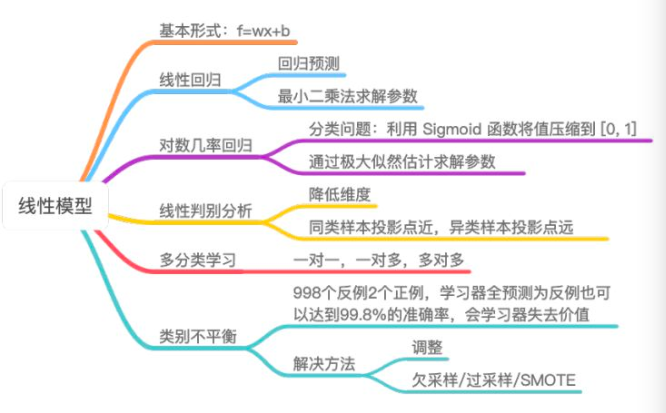
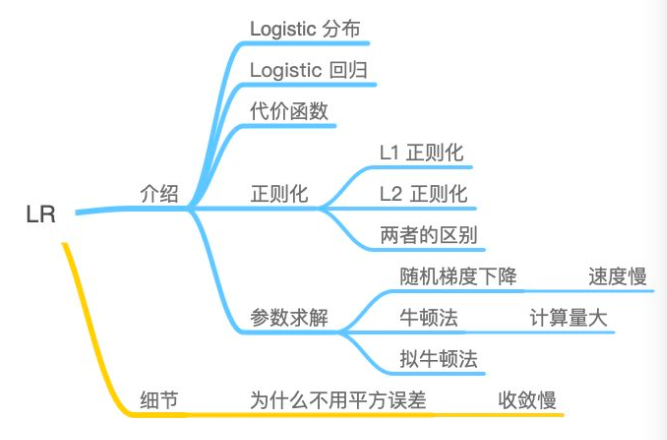
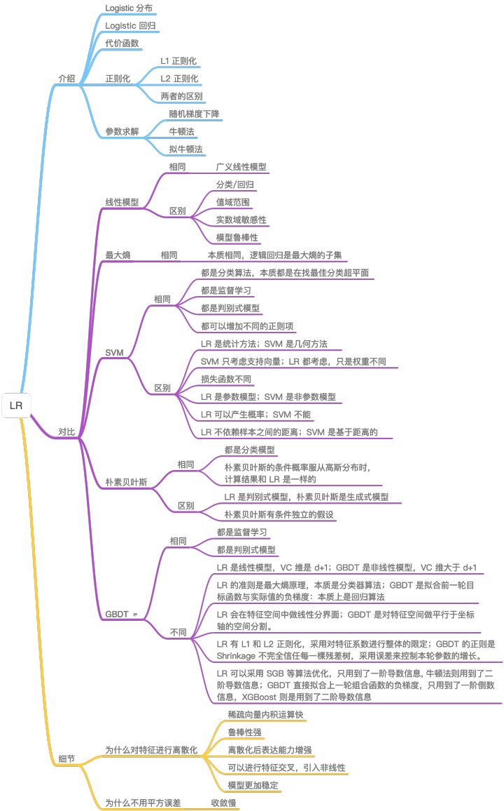

# Resource
[機器學習該怎麼入門, 贊同 440+](https://www.zhihu.com/question/20691338/answer/1066789694?fbclid=IwAR0uKyJf-8uI6lT_1YsG95bWe_EcfxNdp8E5sVU489EDVKMDfR_jgm-zoDc)

## 入門
* 看周志華 - 西瓜書 - 快速看完
* 看吳恩達 - 機器學習
* 調包跑算法

## 進階
* 學習**統計學習方法**，西瓜書
* 學習書本以外的常見算法
  * XGBoost, LightGBM, CatBoost, FM, FFM
* 學習特徵工程，打比賽
* 學會取捨，分程度來了解算法知識
  * 要學習的算法，掌握數學原理，算法優缺
  * 不用學習的算法，了解作用，使用場景

## 精通
* 了解算法細節，對比各算法差異
* 學習算法落地應用，看source code
  * 了解怎麼並行化
  * 精度/速度 trade off
  * 有特別的trick?
  * 程式碼哪裡可以參考
* 看論文
  * GBDT + LR, GDBT + FM
* 寫博客
  * 寫也是整理思路的一個重要過程
  * 教別人的人學到最多，這句話是真的

## Mindset
* 入門時，一下看太細，哪些看不懂怎樣的，很容易產生排斥心理
* 帶著問題去閱讀，然後畫出思維圖 - tree map
  * 優點，雖然沒看得很深，但是學玩不至於感到空虛
  * 優點，幫自己迭代知識，知識跟產品一樣需要迭代，沒有一次到位的(下圖基本款)

</img>

* 現在網路上資源一大堆，越基本的知識，越要選**精品**
* 入門時，跑跑看
  * 優點，提高感性認知
  * 優點，快速了解算法限制
* 知識based的材料值得一讀再讀，會隨著你所累積的知識量不同有不同的看法
* 經典書籍所提供的骨架(體系)很重要
* 帶著問題重新review，會讓Tree Map會長越大，知識體系越來越縝密(下圖多了細節)

</img>

* 對於經典算法，掌握他的Tree Map!(下圖 - 細節更多，而且還加入對比)

</img>

