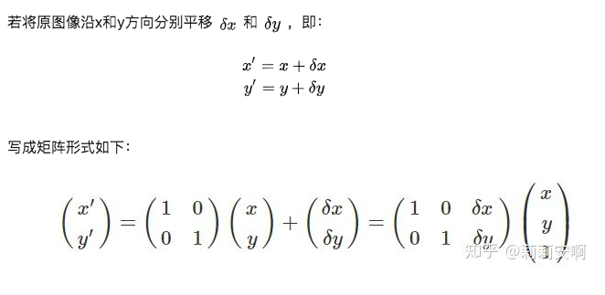
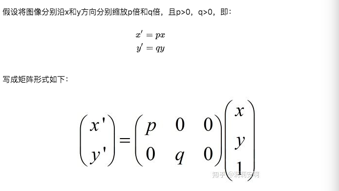
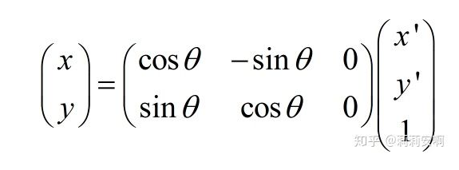
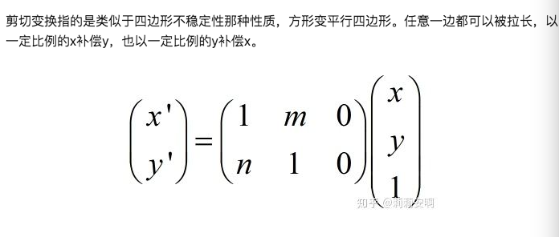
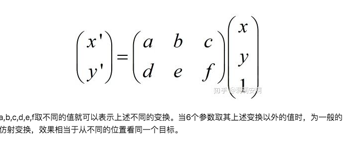
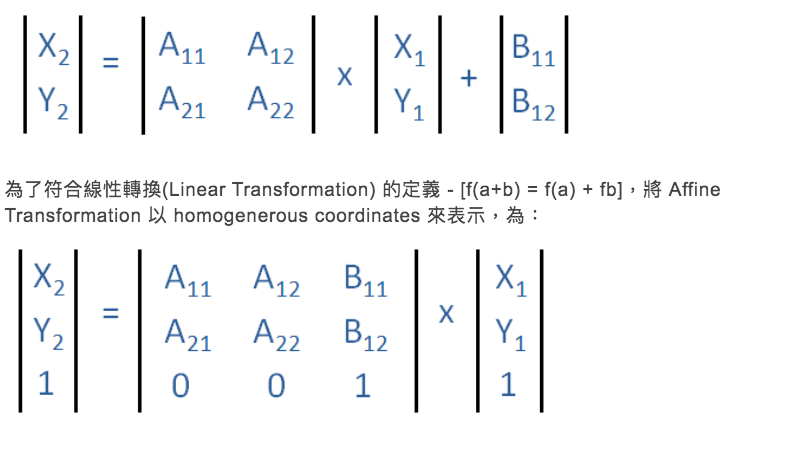
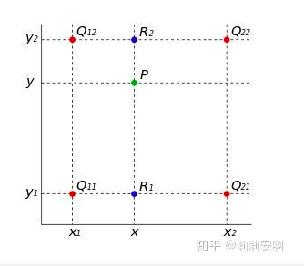
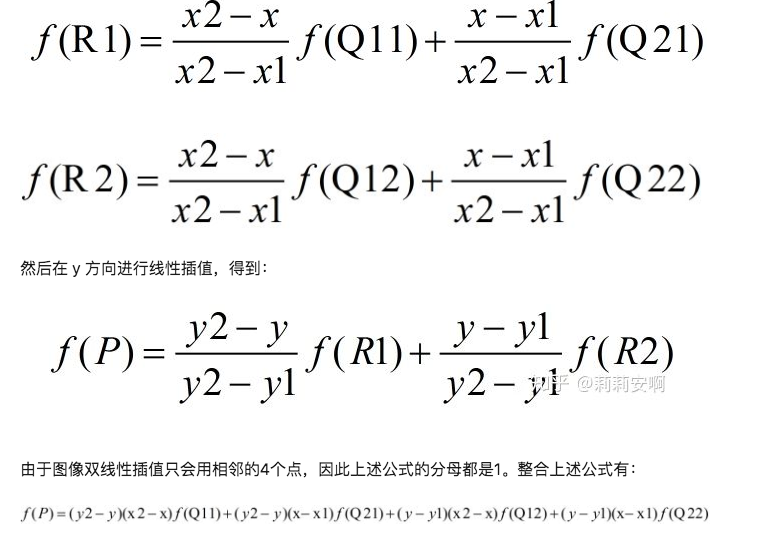

# Spatial Transformer Networks
* [知乎 贊同104+](https://zhuanlan.zhihu.com/p/37110107?fbclid=IwAR0v5rMVxrPaCRvPkS1ZvhqLxS0U6Y4OK5FXXfnmzz8x8OeszBm5Z88xZNo)
* [Affine Transformation](https://silverwind1982.pixnet.net/blog/post/160691705-affine-transformation?fbclid=IwAR1EffdKLNF_TTPzlWtpTQRHJJezjkAIZHMxLJXS9U8sMTXO9GoqoZ6XlDw)
* [Paper NIPS 2015 Spatial Transformer Networks, citization 2551](http://papers.nips.cc/paper/5854-spatial-transformer-networks)
* [GitHub 632 stars](https://github.com/kevinzakka/spatial-transformer-network)
# Background
* 如果網路可以透過**平移**，**旋轉**，**縮放**，**裁切**等操作的圖片得到與未經變換前的圖片取得相同的檢測結果，我們就說這個網路具有空間變換不變性(將平移，旋轉，縮放，裁切統稱為空間不變性)，具有空間變換不便性的網路能夠得到更精確的分類結果，傳統CNN網路的池化層(Pooling Layer)具有平移不變性(網路在平移小於池化矩陣範圍時具有平移不變性，所以只有平移小於這個範圍，才能保證平移不便性)，但是CNN網路對於大尺度的空間變換並不具備不變性，Spatial Transformer Networks提出空間網路變換層，具有平移不變性，旋轉不變性以及縮放不變性，這個網路可以加在現有的卷積網路中，提高分類準確性
# 相關理論
## 仿射變換 Affine transformation
這裡假設所有變換都是針對一幅圖像，積針對一個三維數組$H\times W \times C$，為了簡單起見，這裡假設為單通道$C=1$
* $(x, y)$: 原圖像中某一點A的位置
* $(x', y')$: 變換後圖像點中A點對應的位置
### 平移(translation)
</img>

### 縮放(scaling)

</img>

### 旋轉(rotation)

</img>

### 剪切(Shear)

</img>

## 仿射變換

* 上述4種變換都可以用同一種變換表示，也就是仿射變換
</img>
Affine Transformation是一種混合的線性二維幾何變換，而混合的線性轉換包含放大縮小，旋轉，平移，剪切等，General Affine Transformation可以以錊標搭線性操作標示:
</img>

[Some Example](https://silverwind1982.pixnet.net/blog/post/160691705-affine-transformation?fbclid=IwAR1EffdKLNF_TTPzlWtpTQRHJJezjkAIZHMxLJXS9U8sMTXO9GoqoZ6XlDw)

## 雙線性插值 Bilinear Interpolation
對圖像進行仿射變換時，會出現一個問題，**當原圖中某一個點的座標經過轉換映射到變換圖像時，可能會出現小數**，我們都知道，圖像上某一個像素點的位置座標只能是整數，這時候怎麼辦呢，這時候內插法/外插法，就起作用了，這裡要介紹的就是雙線性差值，先複習一下內插法(單線性差值)
已知點${x_0, y_0}$以及$(x_1, y_1)$，要計算$[x_0, x_1]$區間內某一位置$x$在直線上的$y$值，寫出直線方程式然後找中間的值
$$
y = \frac{x_{1} - x}{x_{1} - x_{0}}y_{0} + \frac{x - x_{0}}{x_{1} - x_{0}}y_{1}
$$
現在我們將一維轉乘二維
雙線性插值的基本思想是想要通過某一點周圍4個點的輝度值來估計出該點的灰度值
</img>

</img>

## 算法
pass