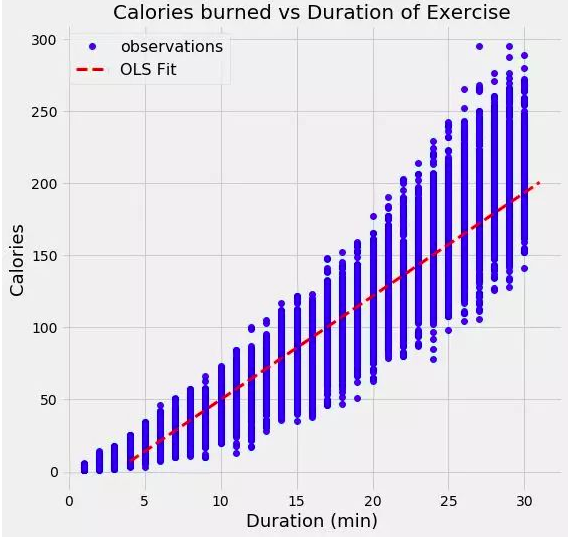

# 回顧頻率派線性迴歸

$$
y = \beta_{0} + \beta_{1}x_{1} + \beta_{2}x_{2} + \epsilon
$$
</img>
通過最小二乘法，我們得到了對模型參數的單次估計。在這個例子中，參數是直線的截距與斜率。我們可以寫出通過OLS生成的方程式 : 
`calories = -21.83 + 7.17 * duration`
從斜率上，我們可以看到美多鍛鍊一分鐘就會額外消耗7.17卡路里的熱量。這個例子中截距貌似沒什麼作用，因為他告訴我們，如果我們運動0分鐘，我們會消費-21.86卡路里！
* 這是一個OLS你和過程的案例，在不考慮他的物理意義是否說得通的情況下，他找到了訓練數據及上最小化誤差的直線
> 普通最小二乘法給了我們對輸出的單次點估計，我們可以將其解釋為給定數據時可能性最大的估計。然而，如果有一個很小的數據集，我們可能希望將估計表示為一個可能值的分佈，這就是貝葉斯估計起作用的地方
# 貝葉斯線性迴歸
從貝葉斯學派的觀點來看，我們使用機率分佈而非點估計來構建線性迴歸，反應變量$y$不是被估計的單個值，而是假設從一個常態分佈中提取出來 : 
$$
y ~ N(\beta^{T} X, \sigma^{2} I)
$$
輸出y是從一個由均值(mean)和方差(variance)兩種特徵刻畫的高斯分佈生成，線性迴歸的均值是權重矩陣得轉置和預測變量矩陣之積，方差是標準差$\sigma$的平方(乘以單位方陣，因為這是模型的多維表示)

貝葉斯線性回歸的目的不是找到模型參數單一的"最佳"值，而是確定模型參數的**後驗分佈**。不僅響應變量是從機率分佈終生成，而且假設模型參數也來自機率分佈。模型參數的後驗分佈是以訓練的輸入和輸出做為條件的
$$
p(\beta~|y, X) = \frac{P(y~|\beta)P(\beta~|X)}{P(y|X)}
$$
這基本上符合貝葉斯理論的架構
$$
Posterior = \frac{Likelihood~*~Prior}{Nomalization}
$$

讓我們停下腳步，想想這意味著什麼? 與OLS相比，我們有一個模型參數的後驗分佈，它與數據的似然和參數的先驗機率乘積成正比。在此，我們可以看到貝葉斯線性回歸的兩個好處: 
1. 先驗分佈 : 如果具備領域知識或者對於模型參數的猜測，我們可以在模型終將他們包含進來，而不是像在線性回歸的頻率方法那樣 : 假設所有關於參數的所需訊息都來自於數據。如果事先沒有任何的預估，我們可以為參數使用無信息先驗，比如一個高斯分佈。
2. 後驗分佈 : 使用貝葉斯線性回歸的結果是一個基於訓練數據和先驗機率的模型參數分佈。這使得我們能夠量化**模型的不確定性** : 如果我們擁有比較少的數據點，後驗分佈會更加發散

# 實現貝葉斯線性迴歸
實際上，對於連續變量來說，估計模型參數的後驗分佈是很困難的，因此我們採用抽樣方法從後驗分佈中抽取樣本，用來對後驗分佈近似。
從分佈中抽取隨機樣本來近似估計分佈的技術是**模特卡洛**方法的應用之一。我們有許多模特卡洛抽樣的算法，其中最常用的是**馬可夫練模特卡洛變體**

# 貝葉斯線性模型的應用
我將跳過本文的代碼部分(參考PyMC3中的代碼實現)，但是實現貝葉斯回歸的基本流程是 : 指定模型參數的先驗(在這個例子中我使用高斯分佈)，創建將訓練數據中的輸入映射到輸出的模型，接著用一個馬可夫練模特卡洛(MCMC)算法從模型參數的後驗分佈中抽取樣本。最終的結果是參數的後驗分佈。我們可以查看這些得到的分佈，看看救命發生了什麼
[TODO] implement and finally check it out

# Reference
[贝叶斯线性回归方法的解释和优点](https://zhuanlan.zhihu.com/p/36107616)