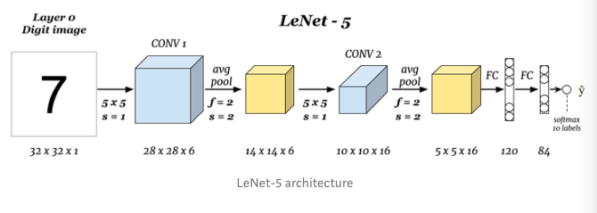
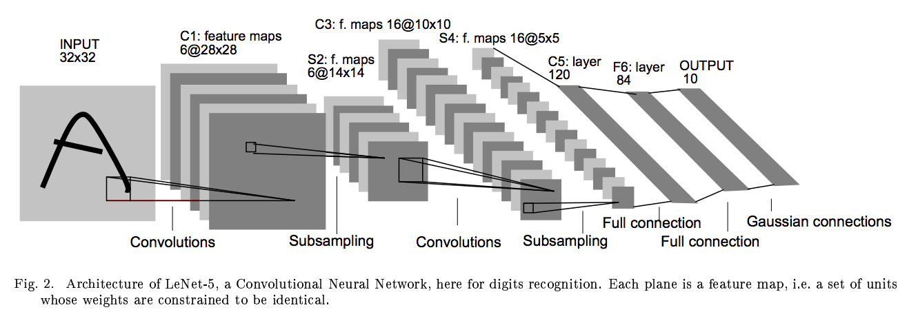
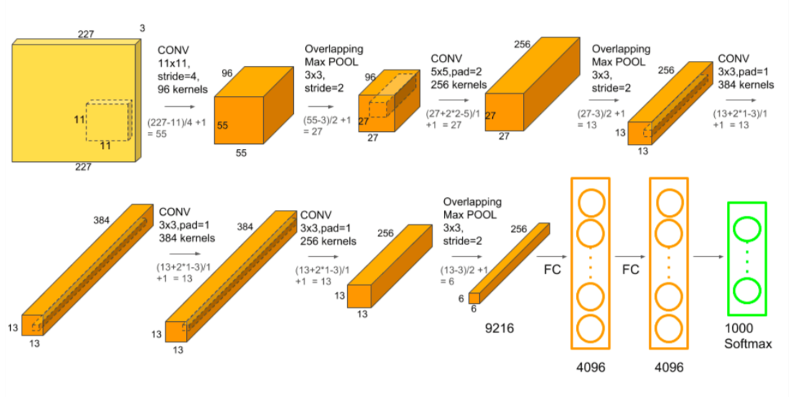
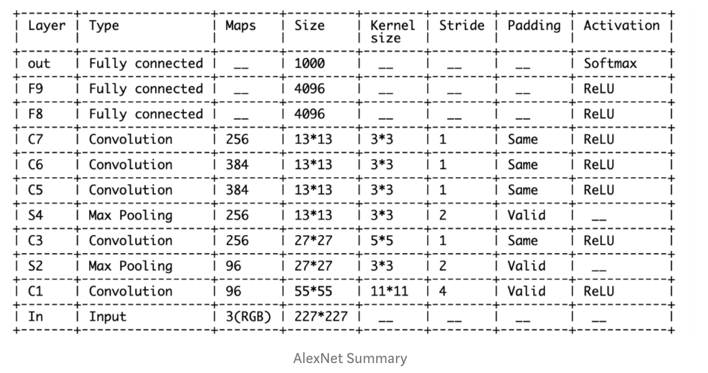
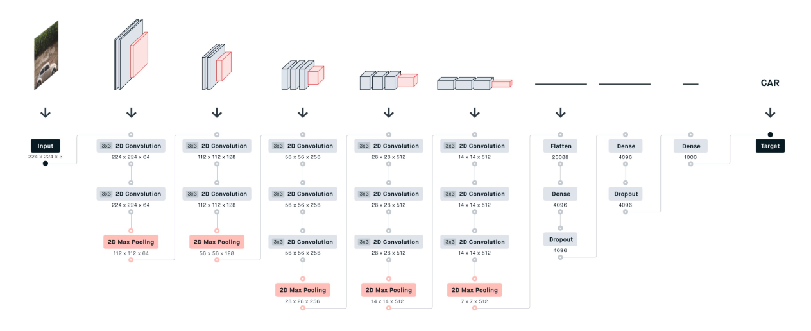
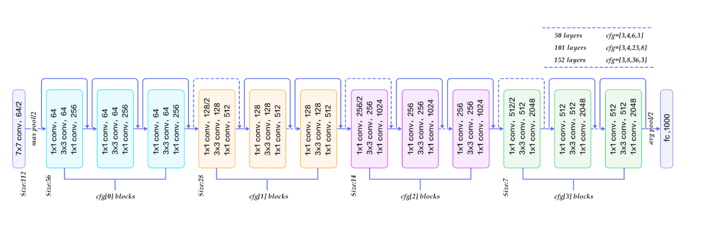
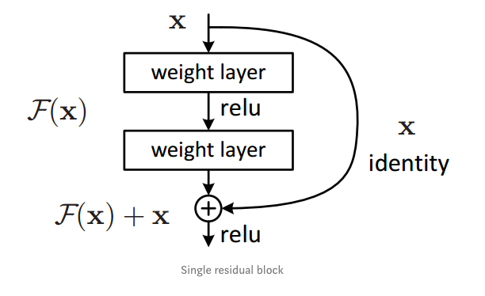
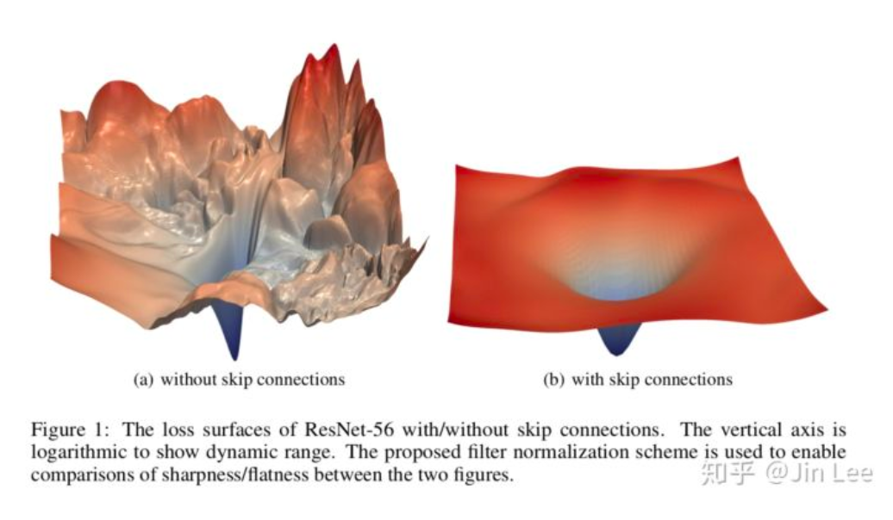

# Brief_Introduction_of_4_well-known_CNN_Architecture.md
Comes from [4 CNN Networks Every Machine Learning Engineer Should Know!](https://medium.com/ml-cheat-sheet/4-cnn-networks-every-machine-learning-engineer-should-know-e9c62408fd76)

[为什么残差连接的网络结构更容易学习？](https://www.zhihu.com/question/306135761)

[【模型解读】resnet中的残差连接，你确定真的看懂了？](https://mp.weixin.qq.com/s?__biz=MzA3NDIyMjM1NA==&mid=2649029645&idx=1&sn=75b494ec181fee3e8756bb0fa119e7ce&chksm=87134270b064cb66aea66e73b4a6dc283d5750cfa9d331015424f075ba117e38f857d2f25d07&scene=21#wechat_redirect)

[ResNet论文笔记及代码剖析](https://zhuanlan.zhihu.com/p/56961832)

* LeNet-5
* AlexNet
* VCG
* ResNet

# LeNet-5
* Yann LeCun
* 1998
* pdfhaps the most widely known CNN architecture
* [Gradient-Based Learning Applied to Document Recognition](http://yann.lecun.com/exdb/publis/pdf/lecun-01a.pdf)
* citation 24760

* 5*5 convolution filter
* padding : NO
* mean pooling
* 32x32x1(gray scale) extract into 14x14x6 feature pyramid
* connected with 2 fully connected layers as classifier
* output layer  tried both **softmax** and **RBF**
* 會丟失蠻多訊息，因為當時不會用padding

# AlexNet
* Alex Krizhevsky, Ilya Sutskever, and Geoffrey E. Hinton
* 2012
* quite similar to LeNet-5
* 更大更深的網路

# VGG-16
* 看了AlexNet之後，CNN架構開始更深更深，最直覺增加表現力的方式就是加深網路
* VCG(Visual Geometry Group) VGG-16有13層convulutional layer以及3層fully-connected layers，使用Relu activation function
* using smaller size of filters 5x5 -> 2x2, 3x3, 138M parameters
* also a deeper variant VGG-19

# ResNet - Residual network
* winner of ILSVC 2015
* Kaiming He et al
* [Deep Residual Learning for Image Recognition](https://arxiv.org/abs/1512.03385)
* citation : 40078
* extremely deep CNN composed of 152 layers
* 要訓練一個這個深的網路一個關鍵點在於skip connections
  * The signal feeding into a layer is also add to the output of a layer locayed a bit higher up the stack

The residual block

## Why it work?
* 當網路層數逐漸深，除了梯度爆炸與梯度消失的問題，也有參數量太大，Error surface太崎嶇的問題
* 這時候一個將多層網路用簡單線性逼近的想法出現了，假設通過兩層layer的function為$G(x)$
* 使用$F(x)+x$來逼近，這個觀念來自於LSTM的控制們思想
* 這樣的做法在深層神經網路中很好的處理梯度消失的問題，如果
$$
G(x) = F(x) + x\\
\frac{dG}{dx} = \frac{df}{dx} + 1
$$
留下了一個constant項，基本上就不怕梯度消失了，當然，梯度爆炸問題可以使用Gradient Clipping來解決
目前關於skip-connect對網路表達能力的影響仍然在進行中，還有很多東西可以挖

