# Why CNN?
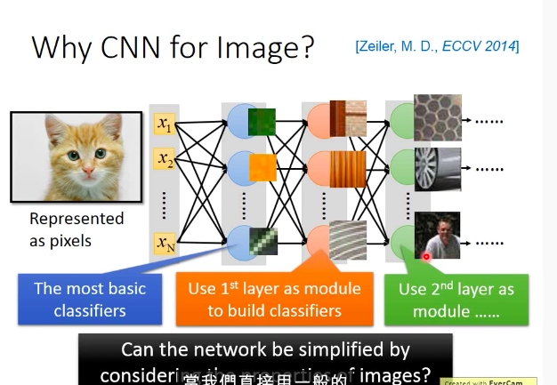</img>

* 簡化CNN的架構，根據我們對影響處理的知識

* 在影像處理上，有沒有某種pattern出現，只需要看部分圖片不用看整張
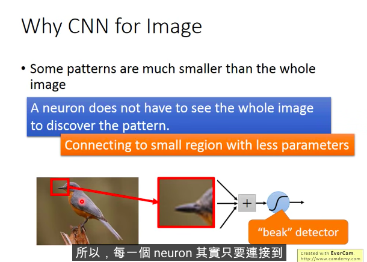</img>

* 在影像處理上，不同image裡面的同樣pattern可能在不同位置，可以用一個filter即可
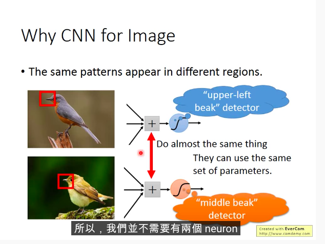</img>

* Subsampleing - 可以減少參數量

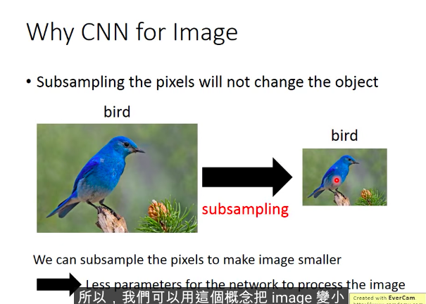</img>

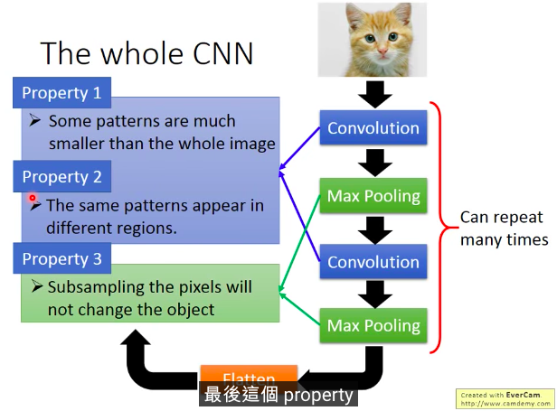</img>

# Convolution
* Filter是必須被自動學出來的
* Operator process是Convolution - 水平移動叫做stride, stride可以等於1, 2, 3, pixel-level

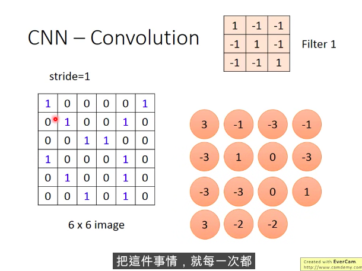</img>

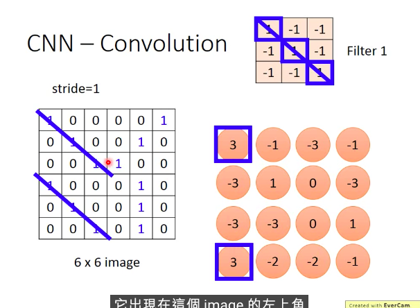</img>
* 局部偵測成功 =)

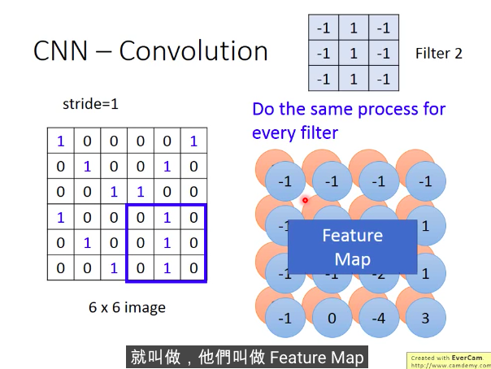</img>

* 一堆filter就會變成一堆matrix，疊起來會稱作feature map
* 事實上不同scale在CNN是不能處理的，需要接上其他layer

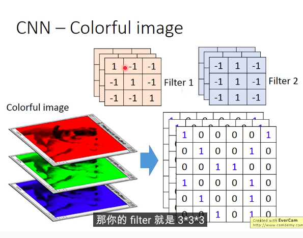</img>

* 彩色的圖，filter就會是一個立方體，立體的

# CNN vs fully connected

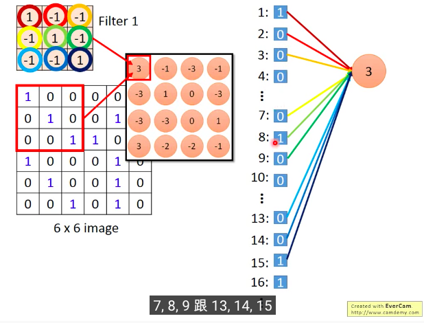</img>

* Convolution可以當作一個內績操作，其他很多的neuron都是 zero weight - 更少參數!

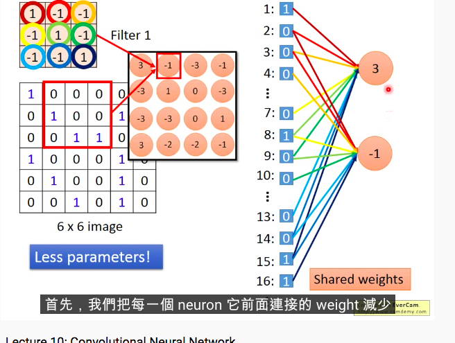</img>

* 而且還會有shared weight - 更少參數!

* 其實基本上你不會自己識做這個東西XD

# Max Pooling

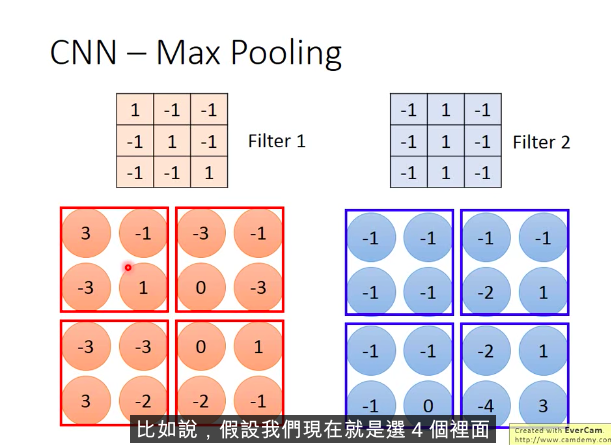</img>

* 參數又減少 
* 但是可以微分嗎? 其實可以喔，等等講
* 做完一次Convlution 以及 pooling，深度就會是filter的數量

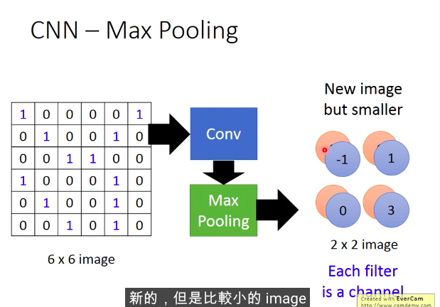</img>

* 你可以repeat N次

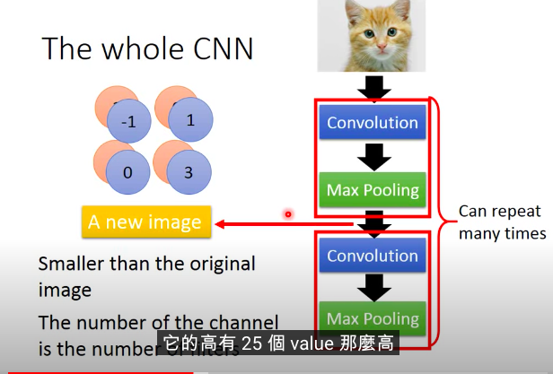</img>

* 事實上第2次的CNN set也會是filter個數的深度，因為一次會考慮整個cubic而非分開channel來計算

* CNN in Keras
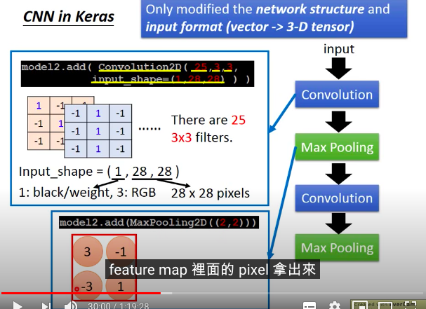</img>
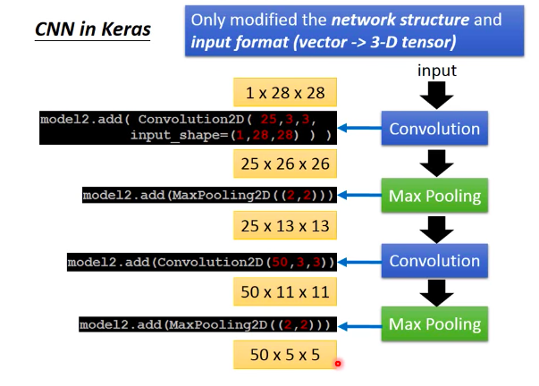</img>
* 上面架構沒有考慮padding，當然你也可以考慮，邊邊補0
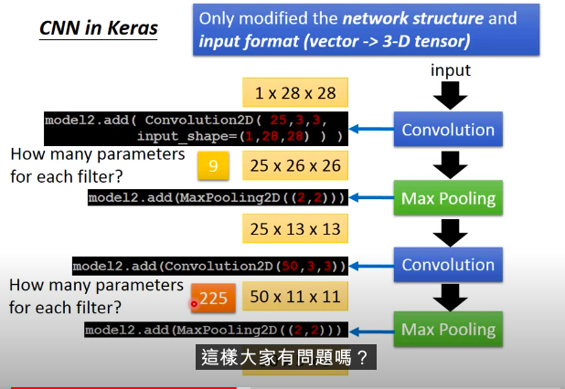</img>
* 參數計算方式，會depends on input的channel數量以及filter maxtrix size
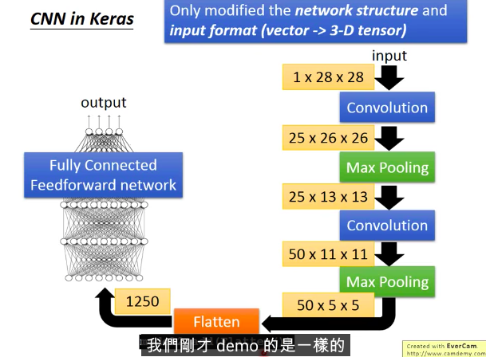</img>

# CNN學了啥?
* 第一層容易看
* 第二層不容易看，第2層會看到更廣的圖片

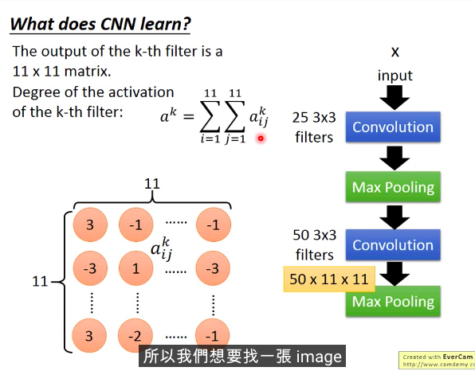</img>

* 從固定的parameter來找x，看activation最大的

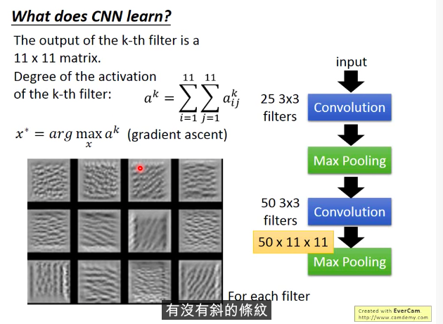</img>

* 同樣的作法看fc layer

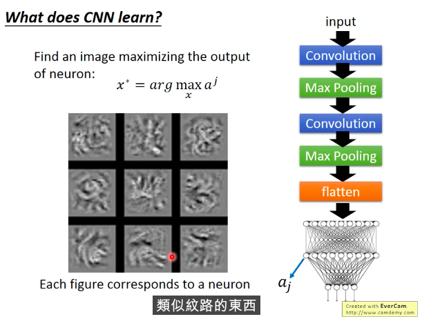</img>

* 整張圖在看的時候，會看到高階特徵，或稱為比較大的pattern
* 考慮output?

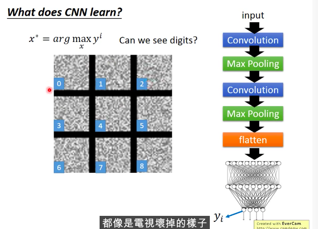</img>
* output neuron和我們的認知不太相同，所以很好騙，真的XD

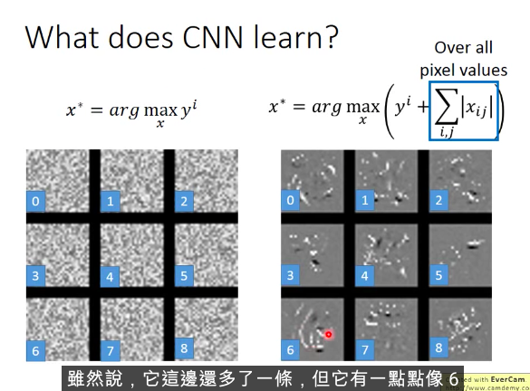</img>
* 也能將該neuron，加一個L1 regularization，把一些怪怪的噪點去掉

# Deep Style
[55:00](https://www.youtube.com/watch?v=FrKWiRv254g)

# Playing Go
* 落子位置當作一張圖

# CNN的適用範圍

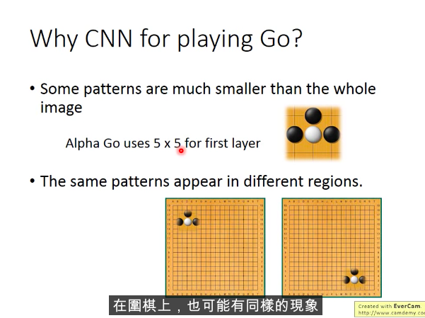</img>

* subsampling?

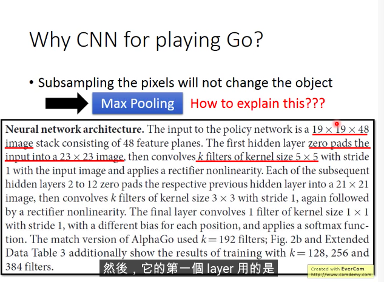</img>

* channel有放置domain knowledge，不只是白or黑，還有加上其他為佳專家定義的狀態，以onehot表示

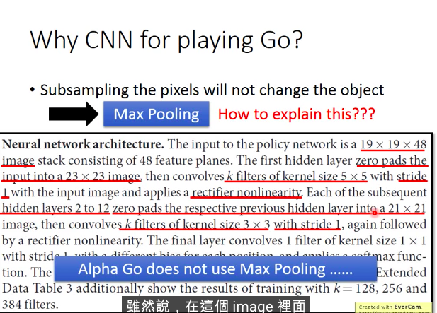</img>

* 事實上AlphaGo沒有使用max pooling

# Speech
* 聲音也可以看，只要可以展成一個平面，但是CNN stride會有特定方向

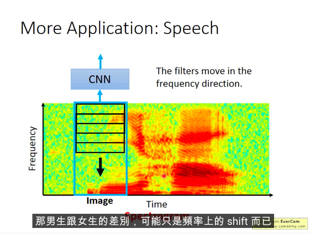</img>

# Text

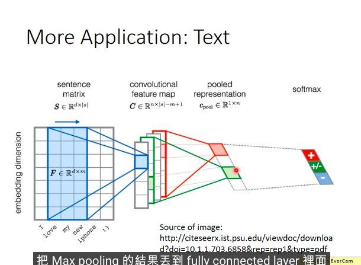</img>

* filter只在時間的順序上一定
* 但是在word embedding的dimension是獨立的，因此只會在時間上滑動