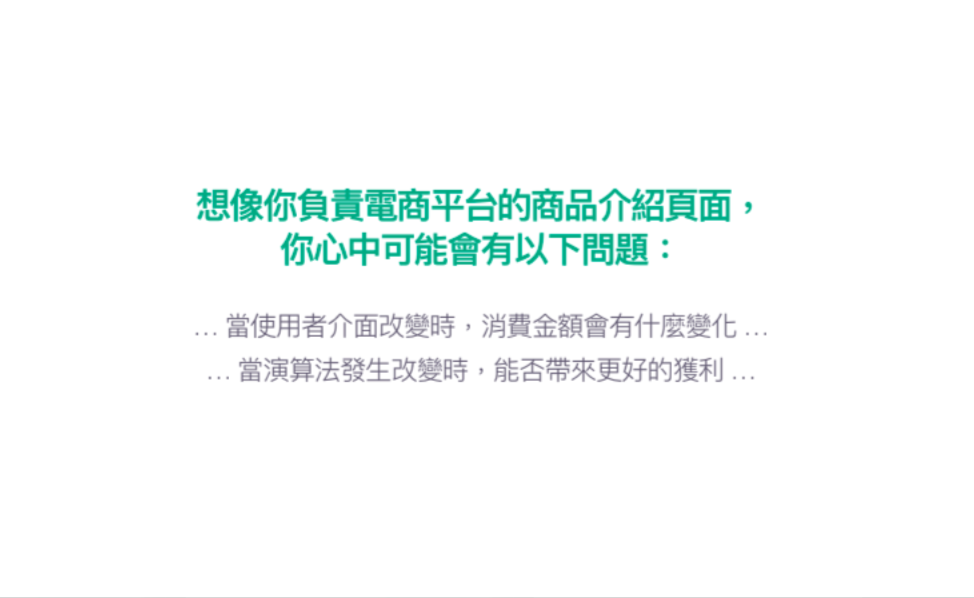
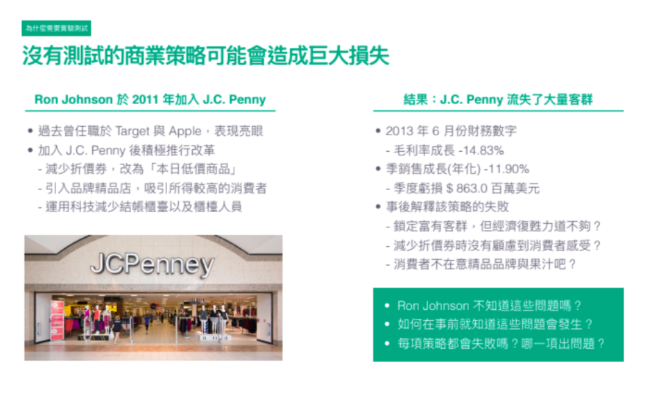
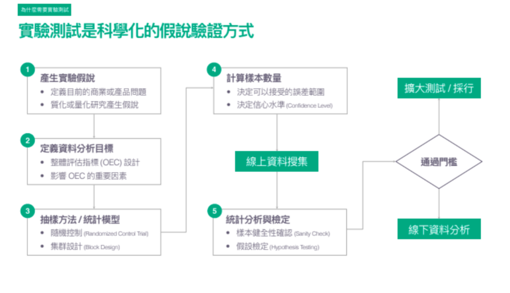
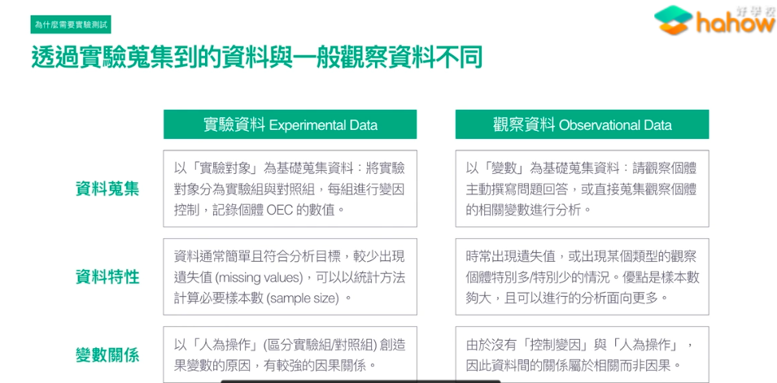
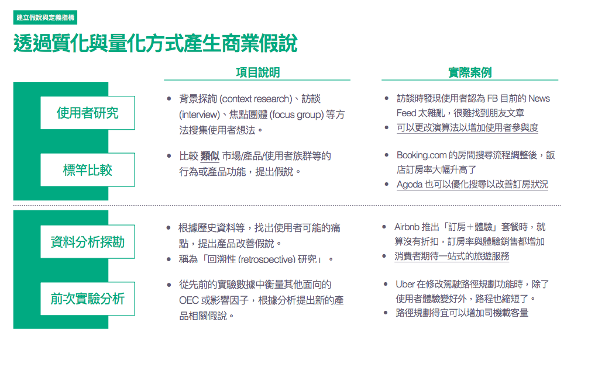
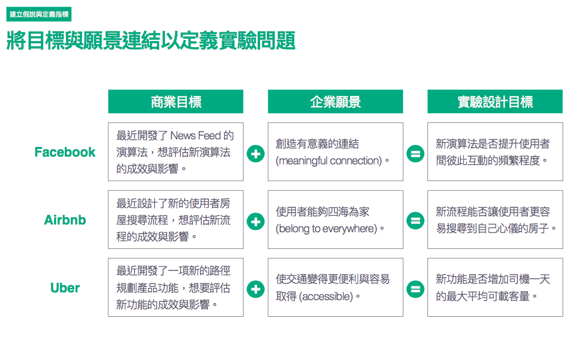
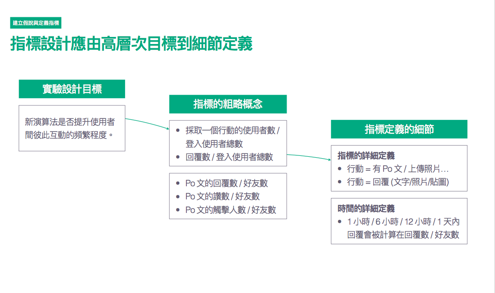

# Start from Question

</img>

</img>

# 實驗流程

</img>

* 要特別注意對誰抽樣(個體)，以及抽樣時間多長
* 實驗時希望能夠達到具有統計意義的樣本數，同時不希望抽樣數量過多(成本過高)
* sanity check : 實驗組和對照組是不是真的行為相似，可以被用來比較
  + 如果實驗組和對照組都不能表示母體 - 沒用
  + 如果實驗組和對照組差太多 - 沒用
* 如果通過門檻 - ok pass，用它
* 如果沒通過門檻 - 分析一下哪邊有問題

</img>

* 觀察資料，就是一般的資料，大部分是公司工程師需要什麼就有什麼，不一定是你要的，而且有一些缺失值
* 實驗資料，經過你的設計所拿到的，你當然會希望你拿到的資料完整且符合你的要求，而設計時也要記得實驗組和對照組的數量要差不多!
* 在觀察資料中通常你只能說變數之前存在相關性，因為你無法確認他們之間的因果關係
* 而在實驗資料中，我們希望做到因果推論，所以希望讓其他變數的影響降到最低

## 假說建立與指標定義

* 從技術結合公司願景

</img>

質化研究 

</img>

* 從粗略到細緻來定義指標，Top-Down的建立指標

</img>
