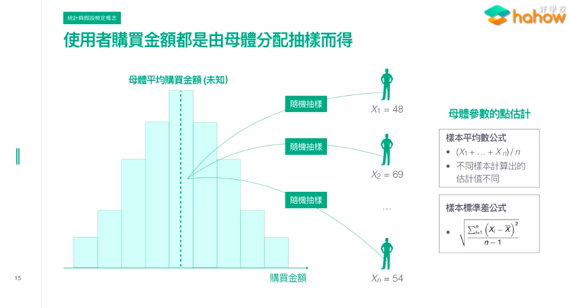
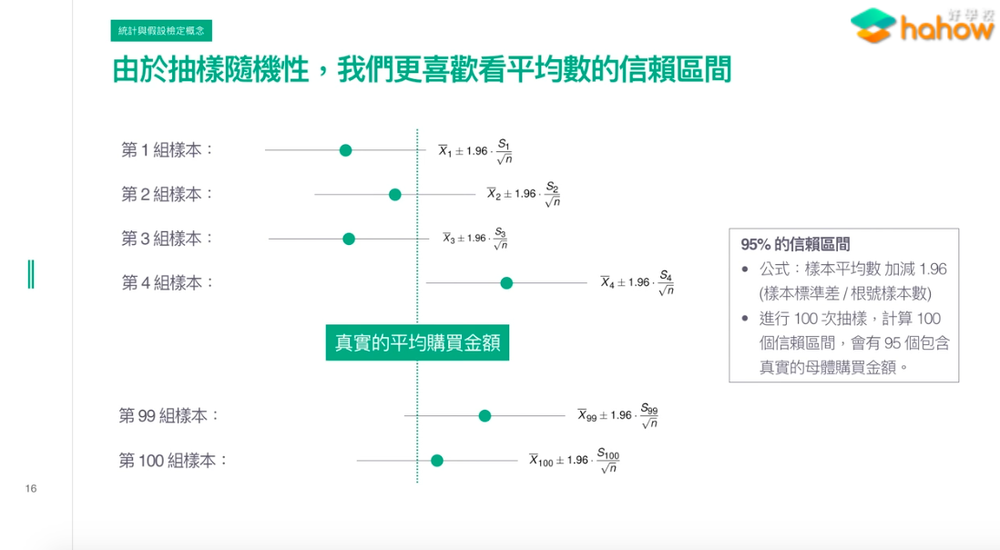
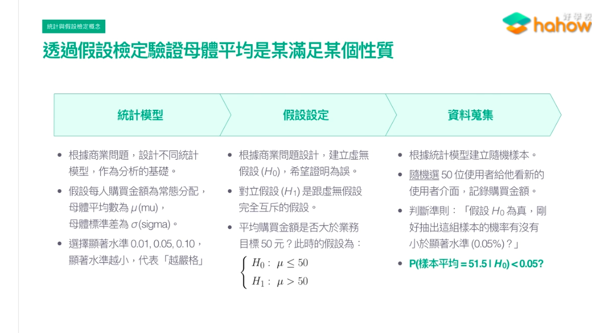
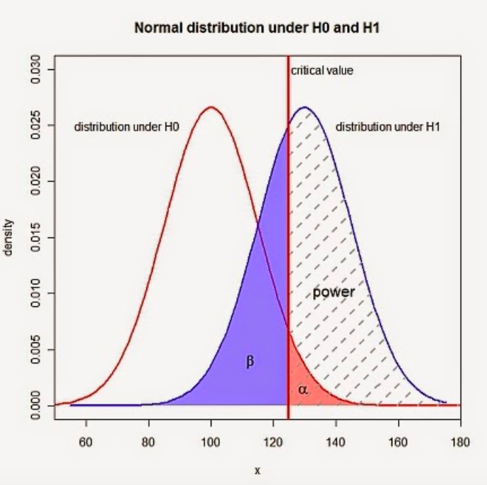
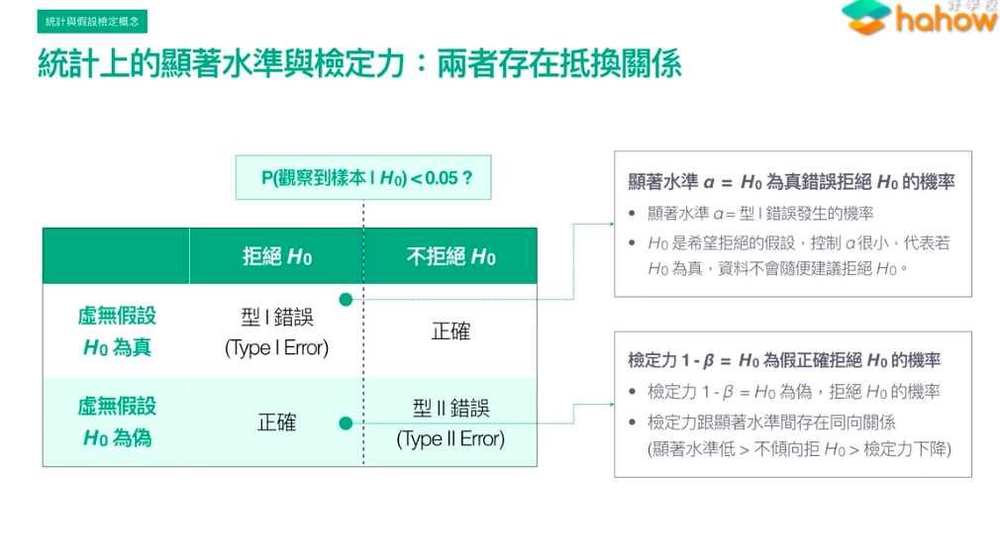
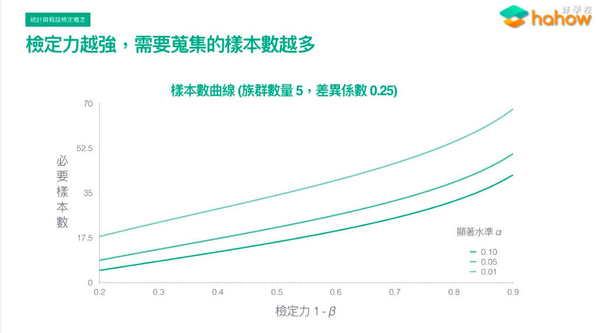

# 母體

* 我們要得知的就是母體，除非可以直接測量(例如網路使用者)，否則則是需要進行抽樣
* 母體參數點估計 - 透過樣本
* 母體參數區間估計 - 透過樣本

</img>

## 區間估計 - 平均數的信賴區間

* 母體來來去去，抽一批樣本(N個資料點)，可能不夠準確
* 但每一批樣本會有一個信賴區間，圖中為95%信賴區間
* 圖中的每一組抽樣形成的分布被稱為抽樣分配(或稱抽樣分佈)
* **信賴區間的解釋**

``` 
做同樣的抽樣100次，會有95次有涵蓋母體的平均值，但不可能抽樣100次，所以我們用信賴區間來表達真實母體平均的可能範圍
像是圖中的第4組樣本就剛好沒有包含到母體平均
```

</img>

## 假設檢定 - 驗證母體參數是否滿足某個性質?

* 3個步驟照著做
  + 統計模型
  + 假設檢定
  + 資料蒐集

</img>  

### 統計上之顯著水準及檢定力 : 兩者存在抵換關係

* 通常的做法會先找一個顯著水準$\alpha$，接著在此顯著水準下找尋最好的檢定力$1-\beta$
* $\alpha$ : Type I Error的機率，$\alpha = 0.05$，顯著性水平為95%，描述以下情境

假設澳大利雅人的年輕成年人總體IQ平均是105，標準差為15，我們想檢查Linz的FH學生的平均IQ是否和澳大利雅得平均值相同
我們選擇了20位學生，並設置$\alpha=0.05$，在這樣的情況下，我們設置顯著型水平為95%。現在讓我們假設重複了該研究20次，則20次會有一次，樣本的平均值和澳大利雅的平均值顯著不同，而這樣的發現會是一個錯誤的結果，哪怕我們的假設是正確的，如此一來就形成的type 1 錯誤

* 下圖可以看到Type I Error會發生在$H_0$的尾巴和$H_1$交界的地方，事實上左側尾巴也有發生的可能，只是本圖沒有show出來

</img>

</img>

* 固定顯著水準之下，怎麼提高檢定力呢? - 抽取更多樣本數，這樣可以更貼近母體平均
* 族群數量與差異係數待解釋
* 要蒐集多少樣本? - 決定顯著水準以及檢定力之後看圖對照

</img>

# Resource

* 大鼻課程
* Python統計分析
* [第一型與第二型誤差(type I and type II error)](https://smallcollation.blogspot.com/2013/08/type-i-and-type-ii-error.html#gsc.tab=0)
