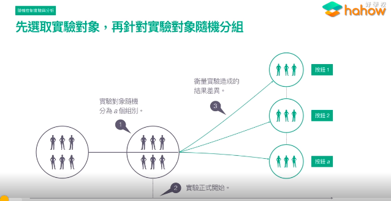
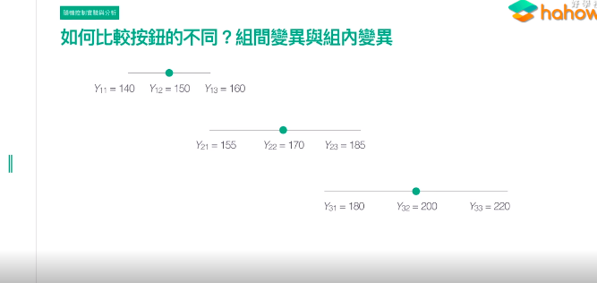
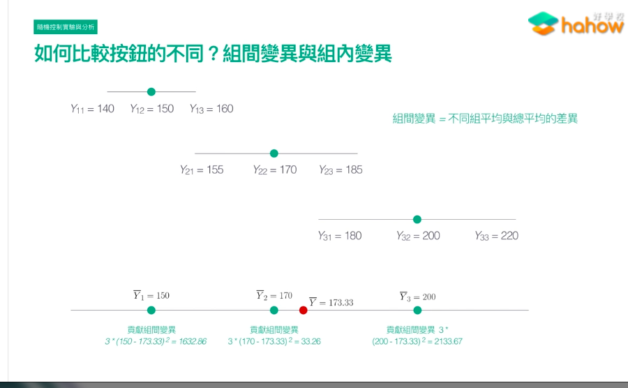
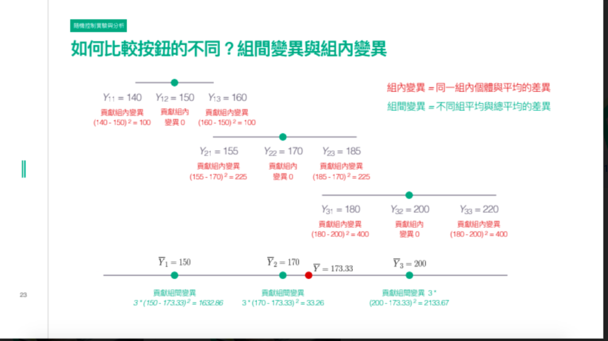
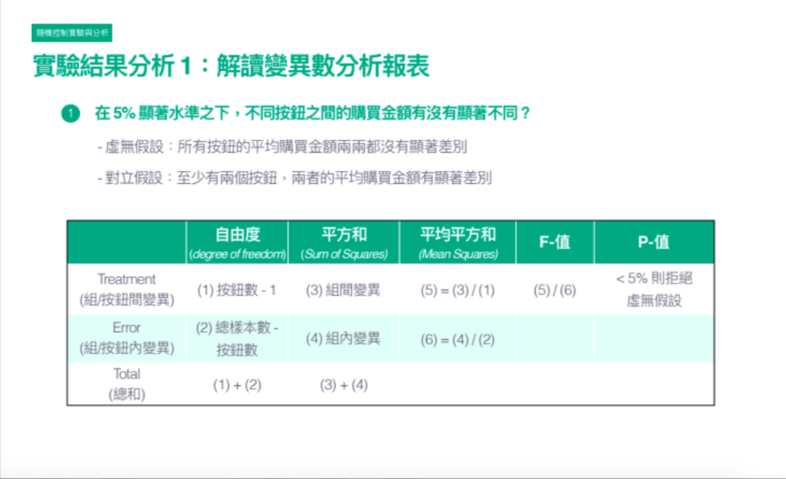
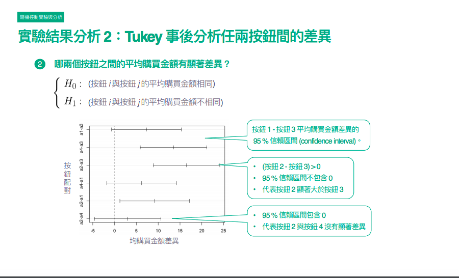
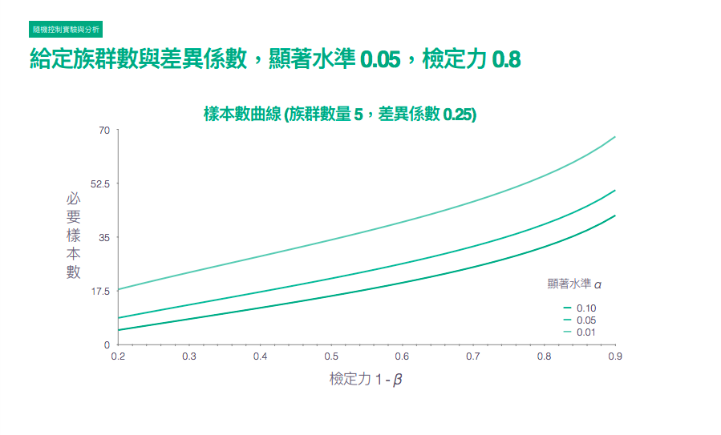
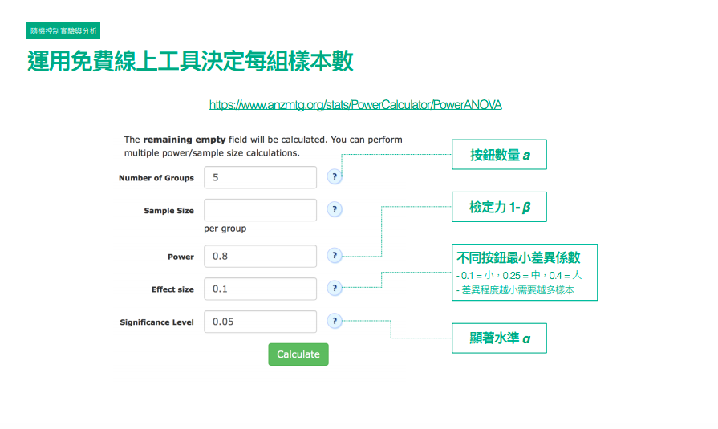
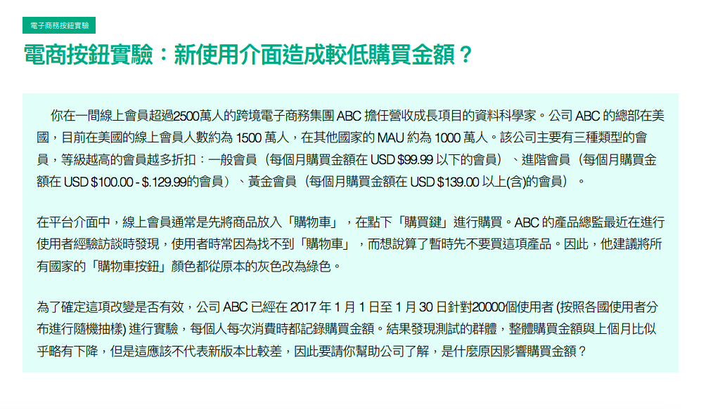

# 隨機控制實驗

* Randomized controlled expriments
* 先選取實驗對象，再針對實驗對象隨機分組

``` 
我們想要知道10種按鈕，哪些是好的，哪些是不好的，假設我們有100萬個使用者，隨機抽出了1000個，分成a個組別，每個組別給他看對應的按鈕，過程中我們紀錄衡量的指標，最後比較有沒有差異，哪幾組比較好，哪幾組比較不好
```

</img>

# 如何比較按鈕的不同? - 組間變異以及組內變異

* 在此舉例為10種不同的按鈕，每個使用者的平均購物金額是多少
* $Y_{11}$為第一組的第一個使用者，購買金額為140元
* $Y_{12}$為第一組的第二個使用者，購買金額為150元
* $Y_{ij}$為第$i$組的第$j$個使用者
* 以下圖來說，你會發現第3組好像比第2組好，第2組好像比第1組好

</img>

## 我們怎麼樣設計一個統計的檢定來確定不是巧合呢?

* 這個case是刻意設計過，所以看起來很容易分辨
* 但是實際上組跟組可能重疊的部分會更多，這個時候怎麼辦呢?
* 下圖來說，綠色點是組內平均值(分別為$\bar{Y}_1$, $\bar{Y}_2$, $\bar{Y}_3$)，紅色點是組間平均值$bar{Y}$

``` 
第一組所貢獻的組間變異 = (樣本數(3)x組內平均數(150) - 組間平均數(173.33)) ** 2 = 1632.86
第二組所貢獻的組間變異 = (樣本數(3)x組內平均數(170) - 組間平均數(173.33)) ** 2 = 33.26
第三組所貢獻的組間變異 = (樣本數(3)x組內平均數(200) - 組間平均數(173.33)) ** 2 = 2133.67
```

# 組間變異與組內變異

* 如果按鈕之間有顯著的不同的話，**重點是要比較組間變異是否夠大，如果組間變異夠大，代表每一組的平均值都跟整體平均差很多，那麼就可以代表按鈕之間是不同的**
* 我們要怎麼知道組間變異夠不夠大? - 拿去跟每一組之內的**組內變異**做比較，看看哪個比較大，如果組間的變異比組內的變異大，那麼表示按鈕之間有顯著的不同

</img>

## 組內變異

</img>

## 按鈕之間有無不同?

虛無假設(原假設)$H_0$ : 所有按鈕的平均購買金額兩兩都沒有顯著差別
對立假設$H_1$ : 至少有兩個按鈕，兩者的平均購買平均金額有顯著差別

</img>

* fractor 

$$
\frac{a-1}{n-a}
$$

從公式推論中得知

</img>

## Tukey 事後分析

</img>

## 要抽多少樣本?

</img>

</img>
