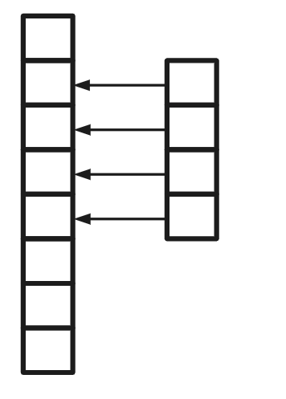
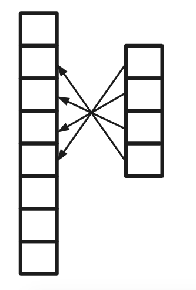
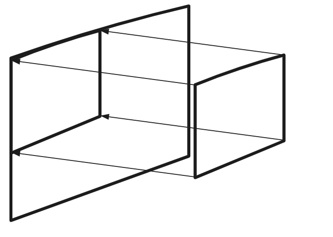
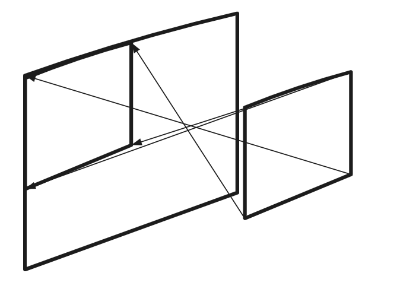

# Convolution_dot_and_Cross-correlation
* 原文為CNN的意義 from Julia Taiwan 創辦人 Yueh-Hua Tu
* 背景 : 念Convolution時，覺得他很像local的dot production, 但無奈數學不好，無法把他們連結起來，現在有人做到這件事了，當然要來朝聖一下
[註] 必須已經對CNN, Convolution, dot production, cross correlation有所了解
* 特色 : 兼具數學公式以及圖示，我自己更加入了gif動畫!

## 影像處理的秘密
這個部分在其他地方已經唸過一次，快速帶過，影像處理有幾個特點
1. 一些模式比整張圖小
2. 同樣的模式可能出現在圖片的不同地方
3. 縮放圖片不影響圖片中物件的辨識

第 1 點講的是，要去辨識一個模式並不需要整張圖，也就是，local 的資訊比 global 的資訊重要。在影片中有舉例，一隻鳥的特徵有鳥喙、羽毛、翅膀等等特徵，你並不會去在意他背景的圖片長什麼樣子。鳥喙這樣的特徵他是 區域性的，你不需要整張圖片的資訊去判斷這張圖是不是鳥喙，所以在設計模型的原則上需要去擷取區域性的資訊。

第 2 點講的是，同樣的模式可能會出現在不同圖片的不同地方，這邊其實隱含了一個概念，就是 位移不變性（translation invariance）。由於同樣模式可以在不同地方上被找到，所以我們只需要一個 node 去偵測他就好了 ，這樣的話可以節省非常多的 node（或是 weight），這稱為 shared weight。

第 3 點，如果圖片縮放不影響圖片辨識，那麼。這時候我們可以做 subsampling，除了可以減少資料處理的量，也不會影響圖片的辨識結果。

## Convolution
真正的作用是什麼? ****擷取local的資訊****
承接前面第一點，在圖片當中，pattern是local的資訊而是global的，而pattern是我們想抓的資訊，我們要的資訊只有local的而已

### Convolution運算

先看convolution的原始定義，這邊假設兩個函數$f, h$則兩個函數的convolution為:
$$
(f * g)(t) = \int_{-\infty}^{\infty}f(\tau)g(t-\tau)d\tau
$$
以上我們看到它是一個積分式，當中引入了另一個變數$\tau$，代表一個**時間區間**，接下來是兩個函數的相乘，我們來想想看，先不管變數$\tau$，相乘之後積分的運算跟什麼樣的運算很像?

是的！**內積** 我們來看看函數的內積長什麼樣子

$$
<f, g> = \int_{-\infty}^{\infty}f(t)g(t)dt
$$

什麼? 你跟我說這不是你認識的內積，不不不，你認識的內稽其實是這個內積的離散版本

$$
<f, g> = \sum_{i=1}^{n}f_{i}g_{i}
$$

$$
<\vec{a}, \vec{b}> = \sum_{i=1}^{n}a_{i}b_{i} = \vec{a}^{T}\vec{b}
$$

這樣是不是清楚一點了，我們來比較一下，因為$\int$是在**連續空間的加總**，相對應的$\sum$就是在**離散空間的版本**，那麼在連續空間上需要一個$d\tau$來把連續空間切成一片一片的，但是在離散空間上，他很自然的就是$1$了，這樣是不是又發覺他們跟本是一樣的呢?

記得，**函數其實就是一種向量**(線性代數)，接下來我們來討論一下那個神奇的$\tau$

$\tau$是一個時間區間，而積分其實是在對這個時間區間做切片然後加總，他其實跟我們在做訊號處理上的wondow的概念是一樣的，**所以他其實是在某個window中做內積的意思**。我們先來看看有window的內積長什麼樣子:

$$
(\vec{a}*\vec{b})[n] = \sum_{m=1}^{k}\vec{a}[m]\vec{b}[n+m]
$$

在下圖我們可以假想左邊的向量是$\vec{b}$，右邊的是$\vec{a}$，而向量$\vec{a}$是有被window給限定範圍的$m=1, ..., k$，所以在下面這張圖就是當:
1.$n=1$
2. $m=1, ..., 4$
的情境，箭頭則是向量元素相乘的對象，每次內積完，$n$就會往下移動一個元素
</img>
更實際的例子可以看這個gif動畫，來自於[這個影片](https://www.youtube.com/watch?v=ulKbLD6BRJA)

</img>

計算完之後就變成一個新的向量，這就是window版本的內積的運作原理了！他其實有一個正式的名字，稱為corss-correlation

我們來看看把convolution離散化來看看是長什麼樣子，剛剛我們看到的convolution是連續的版本，是函數的版本，那我們實際上的運算式以向量去操作的，那麼離散版本的convolution是

$$
(\vec{a}*\vec{b})[n] = \sum_{m=\infty}^{\infty}\vec{a}[m]\vec{b}[n-m]
$$

這邊的window就是$m$這個參數，其實我們可以給他一個區間，不要是負無限大道正無限大

$$
(\vec{a}*\vec{b})[n] = \sum_{m=1}^{k}\vec{a}[m]\vec{b}[n-m]
$$

所以這邊的windoe大小調成是$k$了!
</img>
你會發現，convolution會跟cross-correlation很像，差別在於順序，也就是convolution內稽的順序是相反的，所以他在數學式上的表達是用相減的
這邊的情境是，$n=6, m=1,.., 4$

我們來總結一下convolution這個運算，他其實是local版本的內稽運算，而且他的內積分像是反序的

## Convolution layer
這邊我們回到我們的convolution layer
如果把以上一維向量拓展到二維的矩陣資料會長什麼樣子呢

先看看二維的corss-correlation
</img>
然後是反序的convolution

</img>

接著，想像在右手邊比較小的方框就是你的filter(或稱為kernel)，他會沿著兩個軸去移動，掃描看看有沒有跟filter的pattern很像的，當他偵測到很像的pattern的時候，輸出的feature map數值就會很高，所以這樣就可以做到上面講的第二點，也就是位移不便性，不過說起來也不是真的有什麼位移不變性啦，他只是沿著軸去做掃描，可以減少運練的參數，到此我們就解決了

1. 一些模式比整張圖小
2. 同樣的模式可能出現在圖片的不同地方
兩點

## Subsampling
如果讓圖片變小，不只可以降低要辨識的區塊大小，還可以降低需要訓練的參數量
Maxpooling是目前主流的方法，也就是在一個window的範圍內去找最大值，只保留最大值，還有一種是meanpooling，顧名思義，他娶整個window的平均值作為保留值

所以subsampling在一些應用場景是需要的，有些是不需要的，像是有些pattern的辨識是不能去除細節的，一但去除細節就會造成辨識困難，那就代表他沒辦法用subsampling，有時候照片縮小到一定程度人類也無法辨識當中的圖片是什麼，所以也不要用過頭。

## Feature extractor-classfier架構

經過以上介紹之後，我們可以把convolution layer 跟 subsampling結合起來，成為所謂的feature extractor

經由以上三點特性，這些layer的巧妙運算可以是非常棒的feature extractor，不同種的資料特性需要不同設計的feature extractor，接下來就是classifer上場了

典型的classifier可以是SVM，或是要用比較潮的deep learning也可以，最單純的就是前一篇提到的MLP了

這樣前後組合就是個CNN的雛形了

## MLP做不好的事情

前一篇我們有提到**MLP因為會從整體特徵去做內積，所以整體的模式會優先被考慮，如果有區域性特徵並不一定會被凸顯出來**，在MLP相對上會比較注重整體性而不是區域性，所以使用MLP在影響處理上就比CNN不是那麼有利

## 關鍵在哪裡
作者認為關鍵在資料的**區域性**，也就是你想做的事情其實是跟資料的區域性有關係，或是你的資料是週期性資料，這樣你就可以用convolution later!(注意! 不是CNN!)

像是音樂中有週期性的模式出現就可以用，在生物領域，蛋白質會去辨認DNA序列，有被辨認到的部分就會有蛋白質黏附上去，生物學家會想知道到底哪些地方有蛋白質黏附，黏附的序列是區域性的，所以也有應用 CNN 技術在這方面上。

最重要的還是去了解你的資料的特性，然後了解模型當中各元件的性質跟數學特性，這樣才能正確地使用這些技術解決問題，走到這邊需要同時是領域知識的專家，也同時是 DL 的專家才行阿！