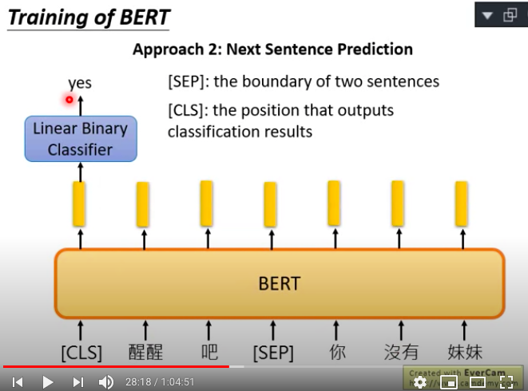

# Resource

[ELMO, BERT, GPT by Hung-yi Lee, 2019](https://www.youtube.com/watch?v=XnyM3-xtxHs&list=PLJV_el3uVTsOK_ZK5L0Iv_EQoL1JefRL4)

</img>

# Before BERT

</img>

Word Embedding - soft word class, 可以在class裡面表示遠近關係

</img>

Word Embedding 就是某種抽feature的方法

# Aword can gave multiple senses

* 不同token同樣type
* 前兩個句子指的是銀行
* 後兩個指的是河堤
* 過去的做法是先查字典，了解該字有幾種type，接下來在訓練時讓該字擁有兩種不同的embedding
* 但是這樣無法滿足現實世界的需求
* blood bank應該算哪一種?

</img>

我們期待每一個word的token都有一個embedding
我們讓上下文來決定他們是不是同一個embedding

</img>

</img>

* 這件事怎麼做呢，使用ELMO架構，不需要標注資料，需要交他的事情就是給他一個Begin sign，他就要輸出潮水，給他潮水，他就要輸出退了，給他退了，就要輸出**就**，這樣給他一大堆句子進行學習，學完之後你就會有contextualized word enbedding
* 你可以想像，你給他高燒，退了，或是臣，退了，都會輸出不一樣的embedding，因為存在memory裡面的玩意兒不同

* 這樣子好像只有考慮到前面，沒有考慮到後面?
* 不然我們訓練一個雙向的，然後把前向和反向拼接起來

</img>
</img>

* deep?

</img>

* 我怎麼知道我最後要拿哪一層的embedding? - ELMO paper : 我全部拿

  

* 每個字現在都會吐出一個上下文相關的embedding，前向的稱作$h_{1}$, 反向的稱作$h_{2}$
* ELMO做weights sum

</img>

* $alpha_1, alpha_2$怎麼決定? 用你要訓練的下游任務來決定此參數

</img>

* 每一層都拿出一組$alpha_1, alpha_2$在下游任務繼續學習

# BERT

</img>

* 把ELMO的RNN全部換成self attention
* again，我們不需要標籤，我們收集一大堆句子即可
* 兩句話講完BERT，你給他一個句子，每個句子的每個單詞他都會吐一個上下文相關的embedding出來，這個embedding很好，能夠讓同樣的單詞在不同的句子中有不同的意思
* 實際上，如果你要訓練一個中文的BERT，用字來當作單位會更為恰當，為什麼?
  + 潮水 - 輸入的one hot encoding dimension基本上是無限大，無法被窮舉
  + 潮, 水 - 輸入的one hit encoding是有限的，常用的大概就4000多個

## Training of BERT

* Masked LM

</img>

* 把輸入的每個句子隨機15%置換為特殊的toekn，稱作mask
* BERT去猜測被蓋住的地方到底應該是哪個詞彙
* 怎麼猜，把被蓋住的那個詞彙的embedding作為feature，使用一個Linear Multi-class CLassifier預測，output是輸入的one hot encoding size，並和mask的ground truth比對，用categorical corss entropy來當作loss function
* 由於Linear Multi-class Classifer非常地弱，所以訓練出來的embedding就要非常的好
* 所以我們想像，如果兩個詞彙填在同個地方沒有違和感，那他們就會有類似的embedding -> 他們有類似的意思
* 潮水**退了**就知道誰沒穿褲子 vs 潮水**弱了**就知道誰沒穿褲子，應該會是極其類似的embedding

</img>

* Next Sentence Prediction
* 讓BERT去預測兩個句子是否可以接在一起，例如醒醒吧SEP你沒有妹妹

</img>
</img>
</img>

* 需要兩個token，CLS以及SEP，SEP表示連接處，CLS表示要把連接處左右的句子做訓練，進入一個Linear Binary CLassifier，告訴我們說應該要被接在一起還是不應該被揭在一起

TBC [28:18, 64:50]
