# Resource

[ELMO, BERT, GPT by Hung-yi Lee, 2019](https://www.youtube.com/watch?v=XnyM3-xtxHs&list=PLJV_el3uVTsOK_ZK5L0Iv_EQoL1JefRL4)

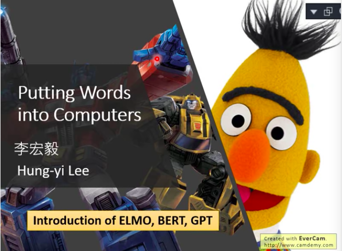</img>

# Before BERT

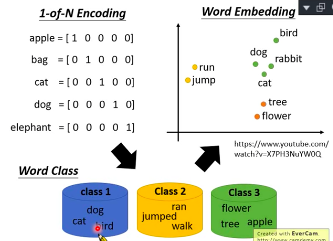</img>

Word Embedding - soft word class, 可以在class裡面表示遠近關係

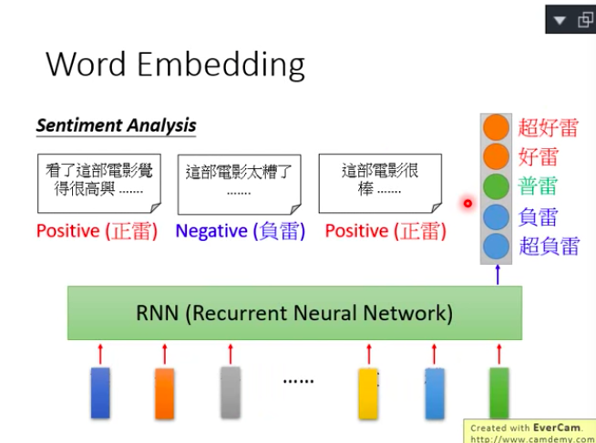</img>

Word Embedding 就是某種抽feature的方法

# A word can gave multiple senses

* 不同token同樣type
* 前兩個句子指的是銀行
* 後兩個指的是河堤
* 過去的做法是先查字典，了解該字有幾種type，接下來在訓練時讓該字擁有兩種不同的embedding
* 但是這樣無法滿足現實世界的需求
* blood bank應該算哪一種?
* 以往word embedding的方法對於一字多意近乎沒輒，只能提出非常rule based的解法

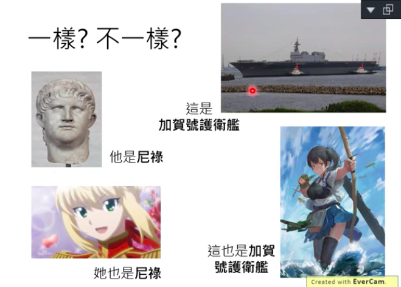</img>

基於上下文的word embedding - contextulized word embedding !

我們期待每一個word的token都有一個embedding
我們讓上下文來決定他們是不是同一個embedding

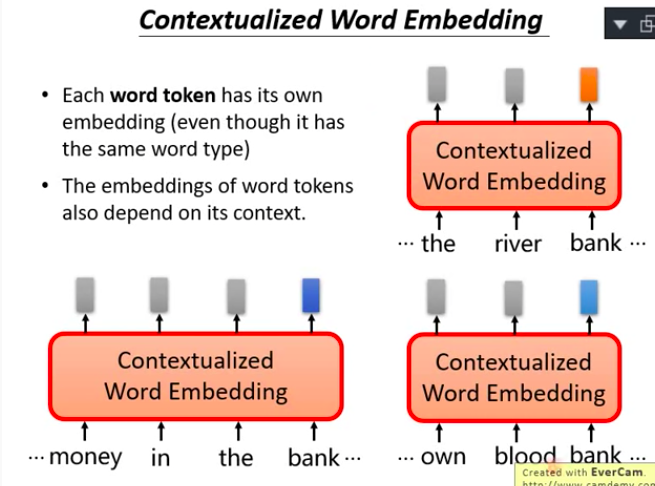</img>

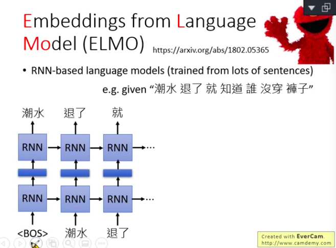</img>

* 這件事怎麼做呢，使用ELMO架構，不需要標注資料，需要交他的事情就是給他一個Begin sign，他就要輸出潮水，給他潮水，他就要輸出退了，給他退了，就要輸出**就**，這樣給他一大堆句子進行學習，學完之後你就會有contextualized word enbedding
* 你可以想像，你給他高燒，退了，或是臣，退了，都會輸出不一樣的embedding，因為存在memory裡面的玩意兒不同

* 這樣子好像只有考慮到前面，沒有考慮到後面?
* 不然我們訓練一個雙向的，然後把前向和反向拼接起來

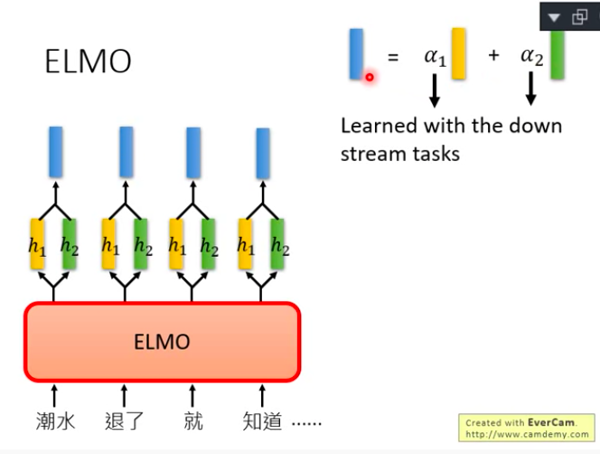</img>
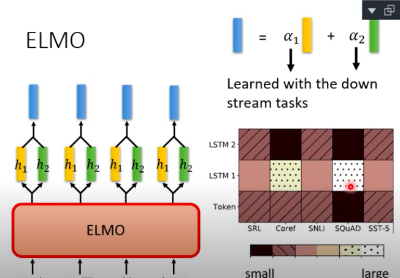</img>

<!-- 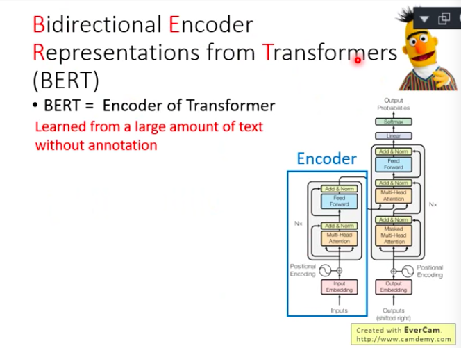</img> -->

* 我怎麼知道我最後要拿哪一層的embedding? - ELMO paper : 我全部拿

  

* 每個字現在都會吐出一個上下文相關的embedding，前向的稱作$h_{1}$, 反向的稱作$h_{2}$
* ELMO做weights sum

<!-- 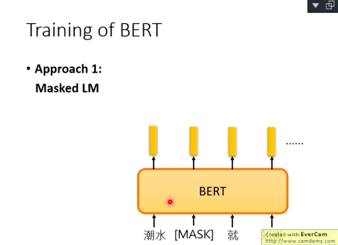</img> -->

* $\alpha_1, \alpha_2$怎麼決定? 用你要訓練的下游任務來決定此參數

<!-- 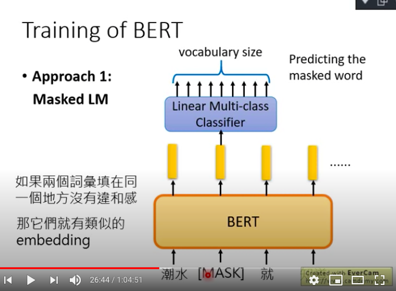</img> -->

* 每一層都拿出一組$\alpha_1, \alpha_2$在下游任務繼續學習

# BERT(Encoder of transformer)

</img>

</img>

* 把ELMO的RNN全部換成self attention
* again，我們不需要標籤，我們收集一大堆句子即可
* 兩句話講完BERT，你給他一個句子，每個句子的每個單詞他都會吐一個上下文相關的embedding出來，這個embedding很好，能夠讓同樣的單詞在不同的句子中有不同的意思
* 實際上，如果你要訓練一個中文的BERT，用字來當作單位會更為恰當，為什麼?
  + 潮水 - 輸入的one hot encoding dimension基本上是無限大，無法被窮舉
  + 潮, 水 - 輸入的one hit encoding是有限的，常用的大概就4000多個
  + 不用斷詞了! 不然會造成無限大維度的One Hot Encoding dimension!

## Training of BERT

## 法一 Masked Language Model (MLM)(讓模型做克漏字)

</img>

* 把輸入的每個句子隨機15%置換為特殊的toekn，稱作mask
* BERT去猜測被蓋住的地方到底應該是哪個詞彙
* 怎麼猜，把被蓋住的那個詞彙的embedding作為feature，使用一個Linear Multi-class CLassifier預測，output是輸入的one hot encoding size，並和mask的ground truth比對，用categorical corss entropy來當作loss function
* 由於Linear Multi-class Classifer非常地弱，所以訓練出來的embedding就要非常的好，才能夠完成任務!
* 所以我們想像，如果兩個詞彙填在同個地方沒有違和感，那他們就會有類似的embedding -> 他們有類似的意思
* 潮水**退了**就知道誰沒穿褲子 vs 潮水**弱了**就知道誰沒穿褲子，應該會是極其類似的embedding

## 法二 Next Sentence Prediction

* 讓BERT去預測兩個句子是否可以接在一起，例如醒醒吧SEP你沒有妹妹

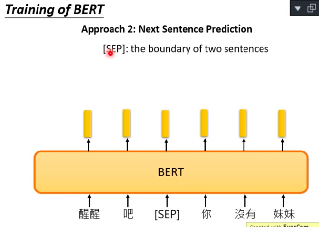</img>
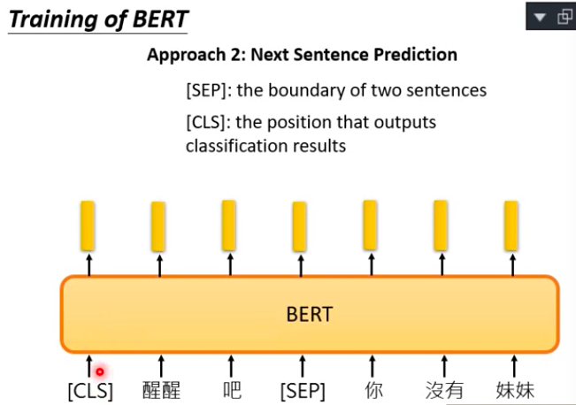</img>
<!-- 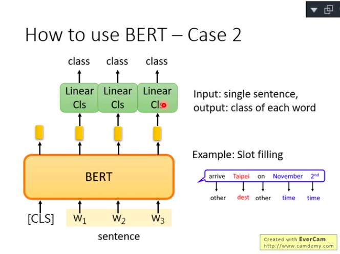</img> -->
<!-- 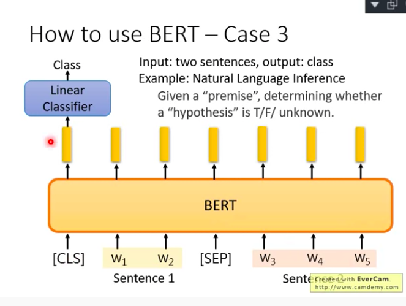</img> -->

* 需要兩個token，CLS以及SEP，SEP表示連接處，CLS表示要把連接處左右的句子做訓練，進入一個Linear Binary Classifier，告訴我們說應該要被接在一起還是不應該被揭在一起

* 例如下面這個句子，醒醒吧，眼睛業障重，CLS就應該輸出False

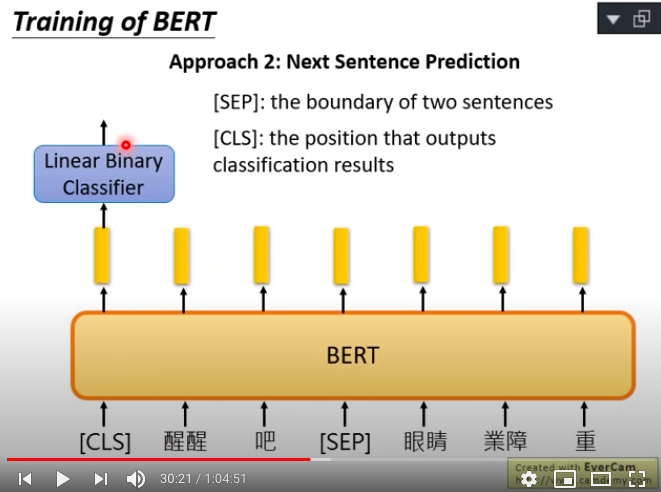</img>
<!-- 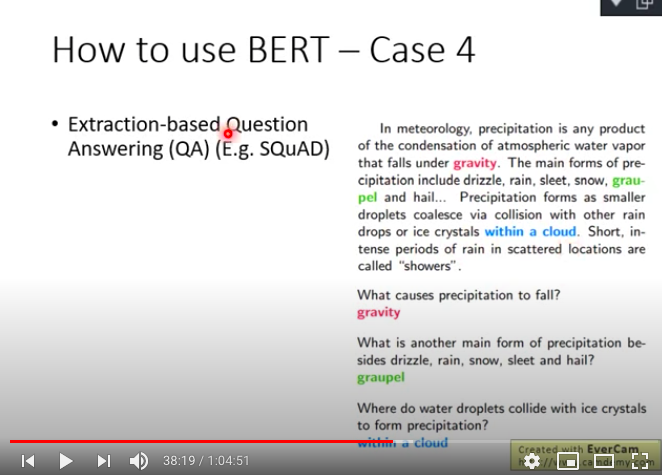</img> -->

## 文獻中怎麼Train的?

* 把Task1，Task2，接在同樣的BERT Model上，全部一起學，然後取出BERT Model

# 怎麼應用BERT?

* 把BERT當作一個抽feature的工具，你就會有每個word的contextulized embedding，然後你就拿去做你想做的任務，例如classification，simlarity，clustering等
* 不過上述基本上就是上游的權重已經固定在訓練的語料庫上了，能不能和下游任務一起fine tuning?
* Paper中舉了4種不同的例子

## Case 1 

### Input : sentence, Output : class - 語句情緒分析、文章類型分類

* 語句情緒分析 - 正評、負評
* 文章類型分類 - 體育新聞、財經新聞、xxx新聞
* 怎麼fine tuning ? CLS為文章起始點，該起始點的embedding直接輸入Linear classifer，預測你想要的class

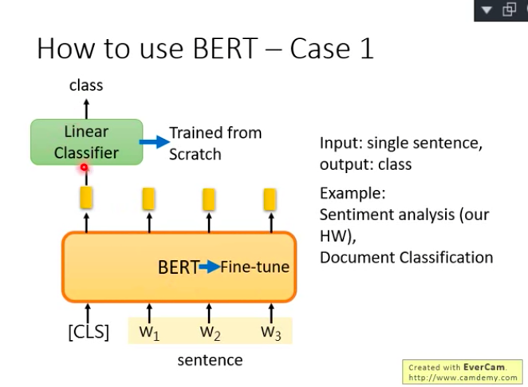</img>

## Case 2

### Input : sentence, Output : class of each world - Slot Filling

* slot filling : arrive taipei on november 2nd 找出出發地，日期
* 怎麼解呢? 除了CLS之外，每一個自都會出一個embedding，把他的embedding都接到一個Linear Cls，然後都去預測是否是你要的標籤

</img>

## Case 3

### Input : two sentence, Output : class : Naturl Language Inference

* Natural Language Inference - 給定一個前提(sentence)，以及一個假設(sentence)，讓模型學習根據這個前提，這個假設是對、錯、無法判斷
* 這個怎麼解呢? 需要CLS，開始符號，以及SEP、分隔符號，接兩個句子，把開頭的Contextulized embedding輸入給Linear classifer，預測是True/False/Unknown

</img>

## Case 4

### Extraction-based Question Answering (QA)

* Extraction-based Question Answering (QA) - 給模型讀一篇文章，然後問他問題(這個問題必須有在模型讀過的文章裡面)，希望可以得到正確的答案，也因為問問題的特性如此，所以稱作Extraction-based Question Answering
* 這個怎麼解呢，先給定文章($D$)以及問題($Q$)皆以token sequence表示，token包括單詞，標點等
* 有兩個input，給QA Model，output兩個整數，$s$, $e$，$s$和$e$表示你的答案落在文章$D$裡面的第$s$個token到第$e$個token

</img>
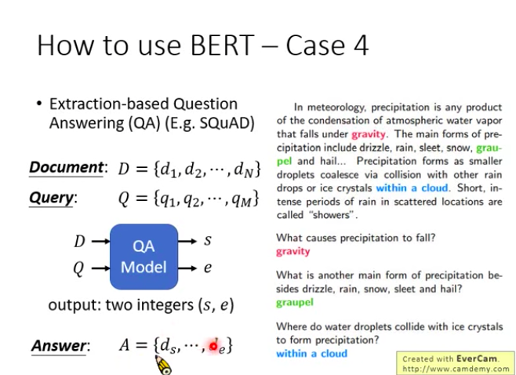</img>

* 舉例?
* 在本篇文章中，gravity是第17個詞彙，你的Q是What causes precipitation to fall，電腦回答$s=17$, $e=17$，就是回答gravity
* within a cloud，是77-79，你問了另一個問題，電腦回答$s=77$, $e=79$，就是正確答案

* 所以剛剛這個問題怎麼用BERT解? - 稍微有點複雜，方法如下所述

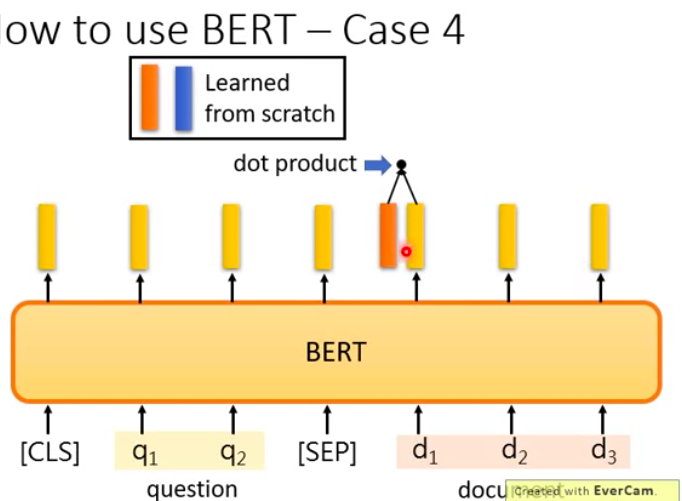</img>

* 開始符號後面放question token，接著放分隔符，在放文章token，接下來我們要學習兩個vector，這兩個vector和contextulized embedding vector的dimension要一樣
* 將橘色vector和文章token的contextulized embedding vector做dot product，再通過softmax normalization，會得到一個probability-like scalar，最高分的那個toekn就是$s$

* 接著藍色的vector也跟文章token的contextulized embedding vector做dot product並且soft max，取分數最高的作為$e$

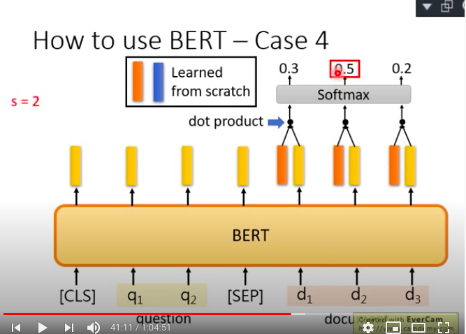</img>
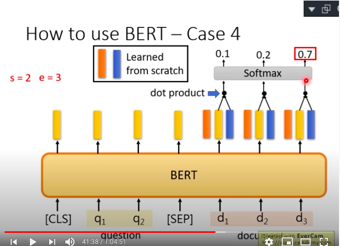</img>

* QA 如果s和e矛盾怎麼辦? 例如s > e，這個時候的處理 model就output沒有答案(unknown)，你的訓練資料也會有此題無解的標籤 :)
* 實作時BERT只要fine tuning，而vector要從random initialization開始學

## BERT到處屠榜

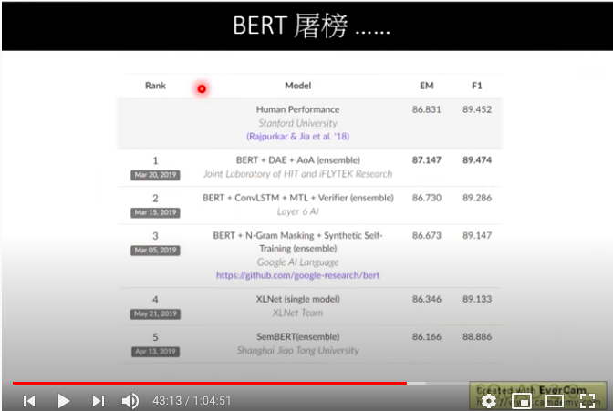</img>

[這個是Question Answer Squard2.0 leader board XD](https://rajpurkar.github.io/SQuAD-explorer/)

# ERNIE

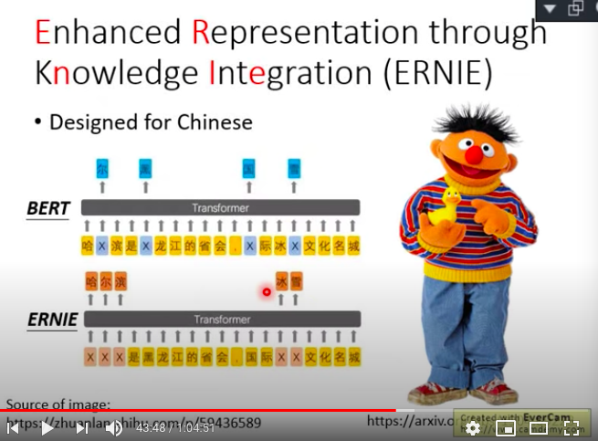</img>

* 硬湊梗，ERNIE是BERT的好朋友，是一個特別為了中文而設計的BERT model
* BERT的訓練要做Mask LM，這些被蓋掉的字其實非常容易被猜出來，中文的單字克漏字和英文比起來有點太簡單了，所以我們一次蓋掉一個詞而不是一個字，所以我們就有了ERNIE

# What does BERT learn?

Normal BERT有24層，Large BERT有48層，每一層做了什麼事情!?

* 確實有一篇論文在討論這件事情[What does BERT learn about the structure of language? 2019](https://hal.inria.fr/hal-02131630/)
* 先說結論，基本上和CNN的概念很像，從前面的層學到後面的層，很像我們之前做的NLP Pipeline!，由淺層到深層，會依序學到詞性，句子文法頗析樹，找出代名詞指射的對象等，辭彙語詞彙之間的關係等等
* 這些事情在實驗上可以得到一些佐證，BERT有24層，所以每一個詞彙會抽到24個vector，將這24個詞彙做weighted-sum，這個weight根據任務決定，而看weight的分佈，該task中weight大的層，就是該task需要的層!
* 接著就以index作圖，就會有24個 x index，藍色就是該weight的值
* 每一個Row代表了一個NLP的任務，如此一來我們就能夠看出每一種NLP任務需要BERT的那一層越多的weights

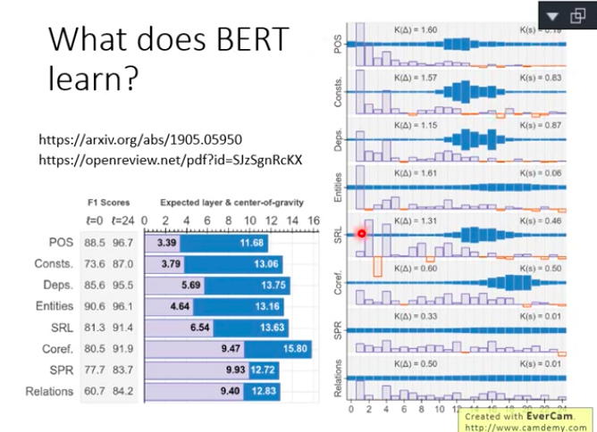</img>

* insights : POS packing - 詞性標記，最需要第11層到第13層，Coreference，更需要BERT的第17層道第19層

# MultiLinfual BERT 

* 把BERT拿去Training在104種語言上XD
* 似乎自動學到了各種語言之間的對應關係

[How multilingual is Multilingual BERT?](https://arxiv.org/abs/1906.01502)

* 所以我們請他做英文文章分類，經過BERT就可以直接分類中文文章!?(Zero Shot Learning - might be a goos start)

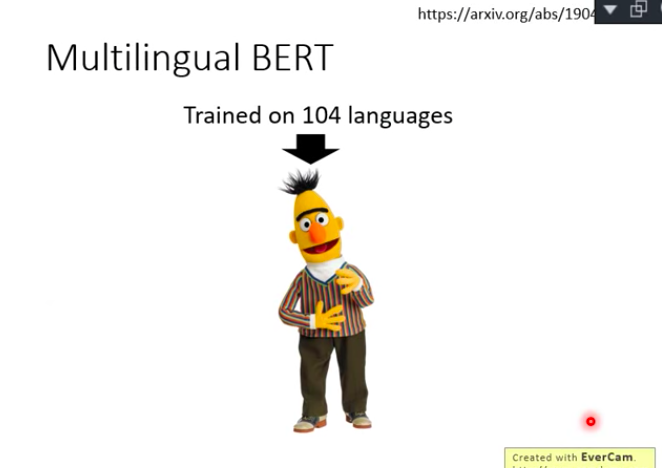</img>
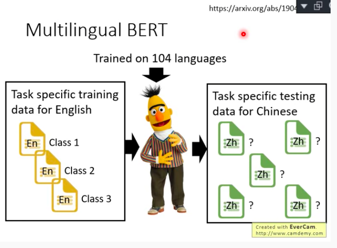</img>

# Generative Pre-Training(GPT) - (Decoder of Transformer)

* 巨型 language Model - 是至今有史以來最大的language model
* 賣點 : 巨大...
* 問題 : 他不是芝麻街的人物XD

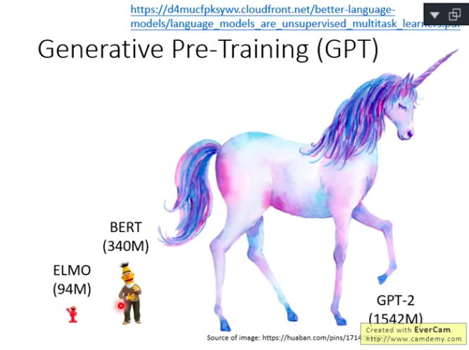</img>

* How it work?
* 他要解的任務是，你給他詞彙(token)，他要預測接下來造給你什麼詞彙
* BOS (Begin of Sentence) + 潮水 -> Output : 退了
* self attension

 * 退了就繼續預測下面的

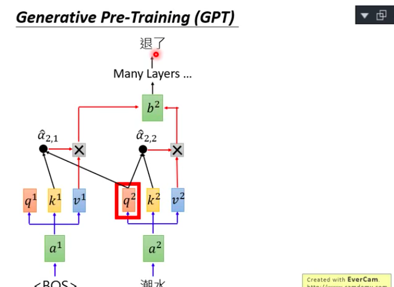</img>

* 就這樣繼續做之後的事情....

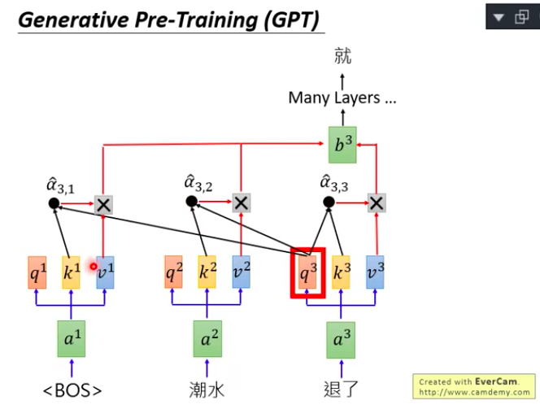</img>
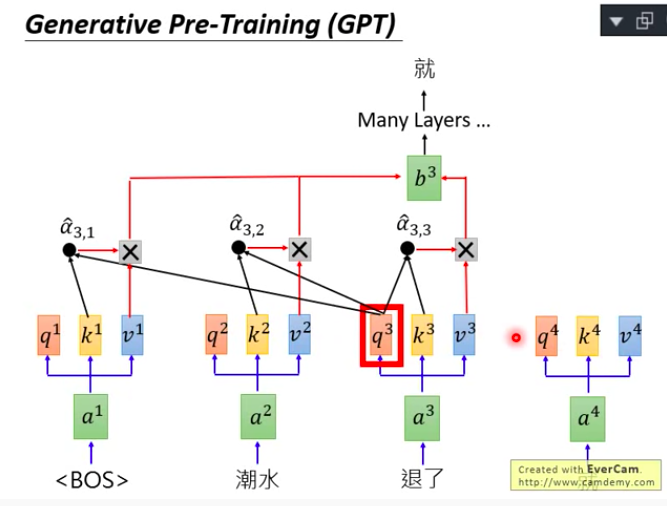</img>

## GPT-2的巨大所展現的神蹟

* reading comprhension - 就是QA問答

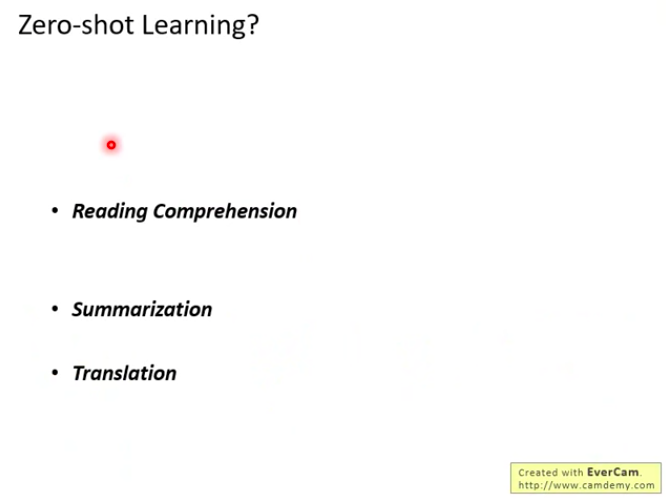</img>
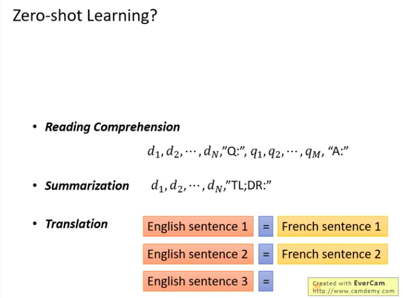</img>

* 基本上是非常強的model，而且是zero shot learning
* 有可能文章中，一大篇， `A:` 後面就是答案， `TL:DR` 後面就是SUmmary，不過老師評論只有在reading comprehension上真的很強

# Visulization

* 也有人分析了GPT-2的attension layer visulization

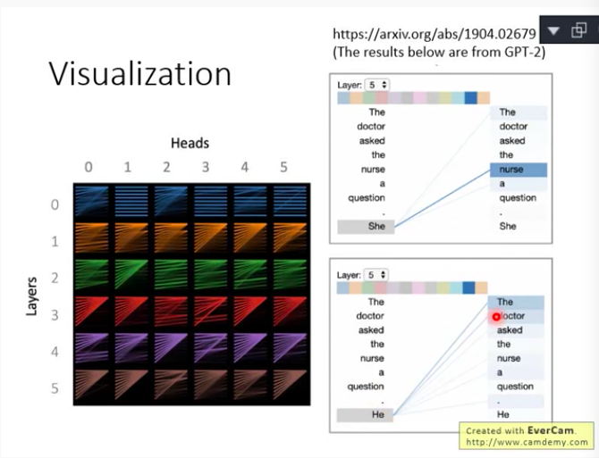</img>

# 回到強大之處

* GPT-2可以自己寫作，因為你給他幾個詞彙他就自己寫文章，OPENAI有 XD
* 而GPT-2為什麼是一隻獨角獸? 因為研究人員隨便給她一篇前半段的文章，指出某個山谷有獨角獸，GPT-2就自己完成了後面，而且還把獨角獸命名了XD

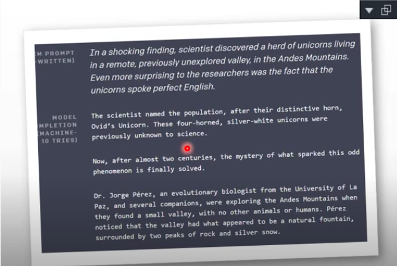</img>
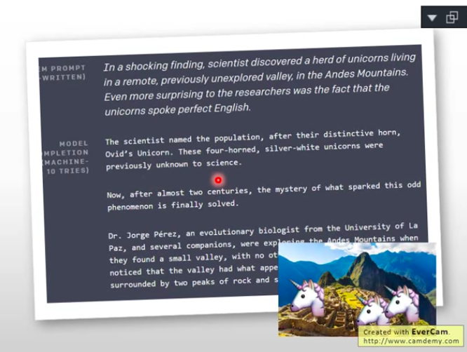</img>

* OPENAI並沒有release GPT-2 XD，深怕會被拿來產生假新聞
* 而比較小的版本有被release出來
* google 搜尋 talk to transformer，是一個跟BERT大小差不多的GPT-2 model
* 看起來可以用GPT-2來做一些神奇且智障的劇本，並且需要慎防假新聞.....

# 梗圖...

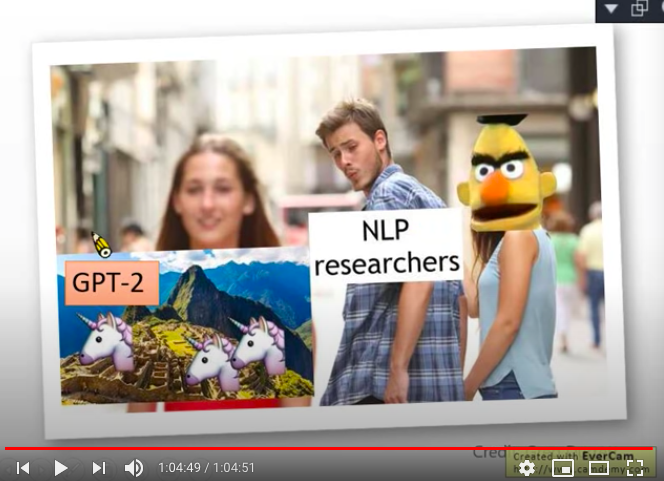</img>

* 兩層意思 : 1 GPT-2 比較新，2 GPT-2 download不下來(沒有被release)，BERT可以XD
