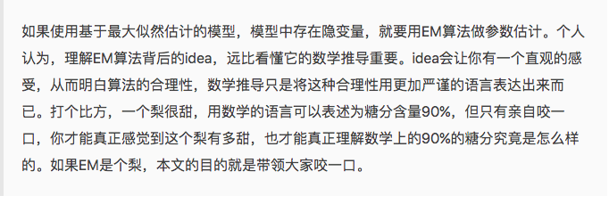
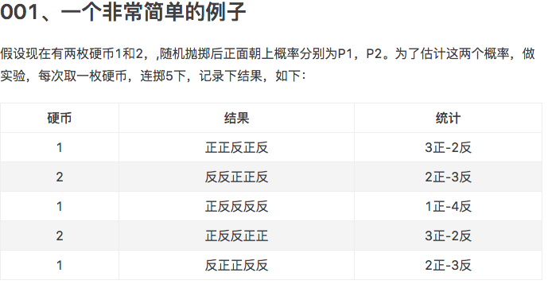
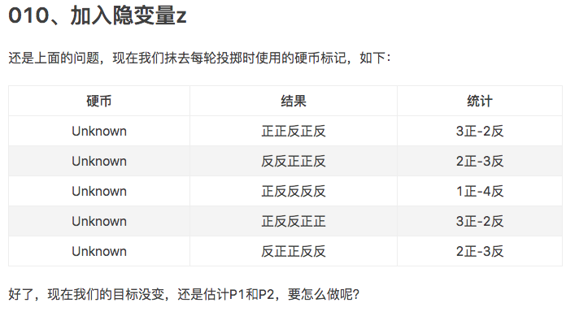
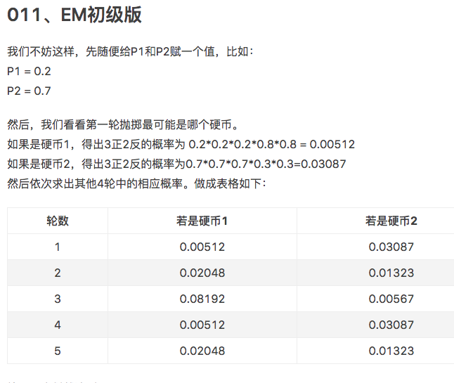
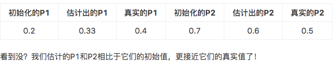
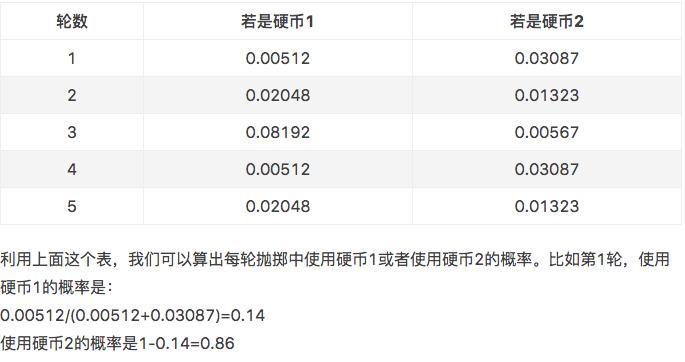
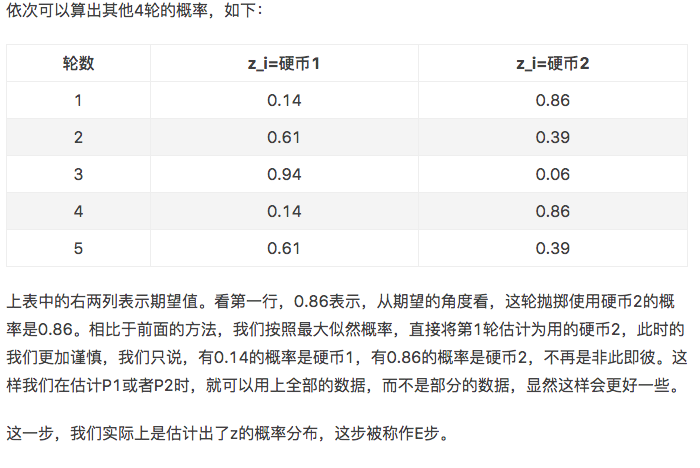
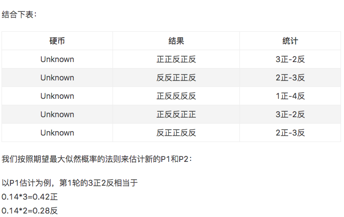
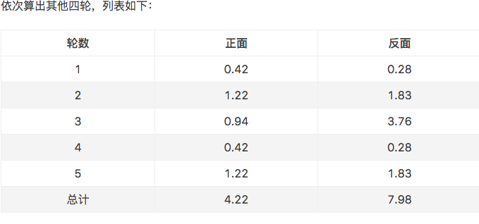

# Expectation Maximization 
[知乎 怎么通俗易懂地解释EM算法并且举个例子? 贊同500+](https://www.zhihu.com/question/27976634)
[簡書 如何感性地理解EM算法？ 讚 200+](https://www.jianshu.com/p/1121509ac1dc)
## Picture
</img>
理論 :
簡版 : 猜(E-Step), 反思(M-Step) 重複

囉唆版 : 你知道一些東西(觀察到的數據)，你不知道一些東西(觀察不到的)，你很好奇，想知道點那些不了解的東西，怎麼辦呢？
你就根據壹些假設(parameter)先猜(E-Step)，把那些不知道的東西都猜出來，假裝你全部都知道了，然後有了這些猜出來的數據，你反思一下，更新一下你的假設(parameter)，讓你觀察到的數據更加可能(Maximize likelihood; M-step); 然後再猜，在反人，最後，你就得到了一個可以解釋整個數據的假設了

1. 注意，你猜的時候，要盡可能地猜片所有情況，然後求期望(Expected)，就是你不能僅僅猜一個個例，而要猜出整個宇宙
2. 為什麼要猜? 因為反思的時候，知道全部的東西比較好(就是$P(X, Z)$要比$P(X)$好優化一些，$Z$是hidden state)

### EM 初級版
</img>
可以簡單計算出$P_1, P_2$
$P_1 = \frac{3+1+2}{15} = 0.4$
$P_2 = \frac{3+2}{10} = 0.5$

一切似乎很美好，如果我們不知道硬幣是1還是2呢?

</img>

目標沒變，仍然是估計$P_1, P_2$這時候怎麼做呢?
我們可以把5次的投擲結果視為一個5維度的向量$(z_1, z_2, z_3, z_4, z_5)$，代表每次投擲時所使用的硬幣，$z_i \in \{1, 2\}, i \in \{1, 2, 3, 4, 5\}$
但是，如果不知道變量$z_i$就無法估計$P_1, P_2$，所以我們必須先估計出$z_i$，才能進一步估計$P_1, P_2$
怎麼做呢?
**先隨便猜，再根據一個機制優化我們的猜想**
具體做法是怎麼樣的呢?
先初始化$P_1, P_2$按照最大似然估計估計出$z$，然後基於$z$，按照最大似然估計在反過來估計$P_1, P_2$

</img>
第一輪結果為正正反正反，共五輪，按照上面表格依序計算硬幣1硬幣2的可能性，並且按照最大似然法則，每一輪中挑出可能機率最大的，則 : 

第一輪中最有可能是硬幣2
第二輪中最有可能是硬幣1
第三輪中最有可能是硬幣1
第四輪中最有可能是硬幣2
第五輪中最有可能是硬幣1
[註1]

如此一來我們得到了可能的$z_i$，接著按照最大似然機率法則估計新的$P_1, P_2$

$P_1 = \frac{2+1+2}{15} = 0.33$
$P_2 = \frac{3+3}{10} = 0.6$

設想我們有ground truth $P_1 = 0.4, P_2 = 0.5$

而剛剛我們經過了以上過程
1. 亂猜一組$P_1, P_2$
2. 最大似然找$z_i$
3. 最大似然$P_1, P_2$
</img>

看，我們估計的$P_1, P_2$比起初始值更靠近了真實值
可以期待，我们继续按照上面的思路，用估计出的$P1$和$P2$再来估计$z$，再用$z$来估计新的$P1$和$P2$，反复迭代下去，就可以最终得到$P1 = 0.4，P2=0.5$，此时无论怎样迭代，$P1$和$P2$的值都会保持$0.4$和$0.5$不变，于是乎，我们就找到了$P1$和$P2$的最大似然估计。

这里有两个问题：
1、新估计出的$P1$和$P2$一定会更接近真实的$P1$和$P2$？
答案是：没错，一定会更接近真实的$P1$和$P2$，数学可以证明，但这超出了本文的主题，请参阅其他书籍或文章。
2、迭代一定会收敛到真实的$P1$和$P2$吗？
答案是：不一定，取决于$P1$和$P2$的初始化值，上面我们之所以能收敛到$P1$和$P2$，是因为我们幸运地找到了好的初始化值。

### EM 進階版
下面，我们思考下，上面的方法还有没有改进的余地？

**我们是用最大似然概率法则估计出的$z$值，然后再用$z$值按照最大似然概率法则估计新的$P1$和$P2$。也就是说，我们使用了一个最可能的$z$值，而不是所有可能的$z$值。**

如果考虑所有可能的$z$值，对每一个$z$值都估计出一个新的$P1$和$P2$，将每一个$z$值概率大小作为权重，将所有新的$P1$和$P2$分别加权相加，这样的$P1$和$P2$应该会更好一些。

所有的z值有多少个呢？显然，有$2^{5}=32$种，需要我们进行32次估值？？

不需要，我们可以用期望来简化运算。[註2]

如何使用期望來簡化運算呢?

</img>

</img>

我們不直接說硬幣是2,1,1,2,1, 而是領個硬幣都計算，按照所分配到的機率進行估計，以上行為**實際上估計出了$z$的機率分佈，這步被稱作為E步**

我們將兩個硬幣以及可能的機率拿來計算正反的$P_1, P_2$
作法如下

</img>

</img>

和第一版不同的地方，現在的機率計算不會是整數:
$P_1 = \frac{4.22}{4.22+7.98} = 0.35$

可以看到，改变了z值的估计方法后，新估计出的P1要更加接近0.4。原因就是我们使用了所有抛掷的数据，而不是之前只使用了部分的数据。

这步中，我们根据E步中求出的z的概率分布，依据最大似然概率法则去估计P1和P2，被称作M步。

### 總結

先亂猜一個分佈$P_1, P_2$，接著用$P_1, P_2$ 求出$z_i$的機率分佈(而非最似然，機率分佈可以更充分的利用資訊)，這一步稱作為$E$步(Expectation)，接著一句最大四然估計來估計$P_1, P_2$，稱為$M$步(Maximization)

### 備註
1. 上述做法其實就是所謂最大似然估計，算出特定條件下機率最大的，然後選出來，他的數學式很嚇人
$$argmaxQ(θ|θ(t))$$
 意思為在$\theta(t)$的情況下，你會得到多組$\theta$，選出最大的那個$\theta$
 

2. 透過期望來簡化運算而不需計算32種可能性，可以視為一種利用數學期望值來破解指數型時間複雜度的做法，具有廣泛的用途。 
## Code
[TBD](demo/expectation-maximization/demo.py)
## Complexity Analysis
## Math
[TBD](http://ccckmit.wikidot.com/st:em)
