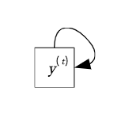

# From_Markov_Chain_to_LSTM
* 原文為RNN的意義 from Julia Taiwan 創辦人 Yueh-Hua Tu
* 背景 : 念RNN, LSTM, Markov Chain時，依稀覺得他們之間是有關聯的，但無法自己從數學上說明，有人做到這件事了，所以一定要來朝聖一下
[註] 必須已經對Markov Chian, HMM, RNN, LSTM 有些為了解，比較容易跟上腳步
* 特色 : 從線性代數的角度出發，而不是機率圖，從Markov Chain逐步推廣到LSTM，充滿物理概念的韻味
* 圖示方面除了機率圖以外，更追加了常見時間軸上RNN的圖在Markov Chain, HMM中的樣子，讓picture更加完整

## Markov Chian
馬可夫模型是這樣的，他假設一個變數有不同種的狀態 : 

在這裡有4個狀態，一個圓圈代表一個狀態，狀態和狀態之間會隨著時間改變，每個狀態會有一定的機率變成其他狀態，或是維持原本的狀態不變。

我們可以把目前得狀態用一個向量來表達

$$
\vec{y} = [y_1, y_2, y_3, y_4]
$$
註: 我們這邊使用的向量為列向量(row vector)，一班在其他數學領域使用的為行向量(column vector)，兩種可以藉由轉至來互換，並不影響運算結果
我們這裡用$\vec{y}$代表該狀態是能夠被觀察的，狀態變化我們可以用一個矩陣來表達

其中$a_{ij}$代表的是由狀態$i$變成狀態$j$的機率，這邊要注意的是，每一個列(row)的機率總合要是1

> 補充: 由於我們的向量都是row vector
$A$為一個right stochastic matrix, 運算形式為$\vec{y}A$
由狀態$i$變成其他狀態之機率和為1
$AI = I$

所以說不同時間點的狀態變化關係可以寫成以下式子
$$
\vec{y}^{(t)} = \vec{y}^{(t-1)}A
$$
$\vec{y}^(t)$的意思是第$t$次(或是時間$t$))的狀態，$\vec{y}^{(t-1)}$狀態會經過一次轉換(或稱運算)變成$\vec{y}^(t)$

如果你把其中第一項的運算拆開來看就會長這樣，可以自行檢驗狀態的變化
$$
y^{(t)}_{1} = a_{11}y^{(t-1)}_{1} + a_{12}y^{(t-1)}_{2} + a_{13}y^{(t-1)}_{3} + a_{14}y^{(t-1)}_{4}
$$
從時間軸上來看，我們可以把狀態的轉變畫出來像是這樣

每次轉變我們可以看成一個函數$f$，在Markov Chain的例子中，其實就是上面提到的transition matrix $A$

所以他的意思是，$\vec{y}^{(t-1)}$會經由$f$變成$\vec{y}^{(t)}$，所以這是單純的狀態變化

上面的矩陣當中其實內容是機率，所以我們也可以轉換成機率的寫法，但是解釋會變得不太一樣
$$
p = f(\vec{y}^{(t)}|\vec{y}^{(t-1)}) = P(\vec{y}^{(t)}|\vec{y}^{(t-1)})
$$
這邊的解釋是，$\vec{y}^{(t-1)}$會經由$f$變成$\vec{y}^{(t)}$的機率

上下了劇的不同在於，上劇的描述是肯定的，他只描述了狀態的改變，但下句多加描述了**這件事會發生的機率**，所以應該要把$\vec{y}^{(t)}｜\vec{y}^{(t-1)}$理解成**一件事**，那麼$f$的輸出就是機率了

上圖可以收起來捲成一個方塊，畫成下面這樣

花了點時間把一些符號和數學概念講完了，來談談他的假設，一般來說，馬可夫模型最大的假設在於
$$
P(\vec{y}^{(t)}|\vec{y}^{(1)},\vec{y}^{(2)},...  \vec{y}^{(t-1)}) = P(\vec{y}^{(t)}|\vec{y}^{(t-1)})
$$
也就是要預測地$t$單位時間的狀態，我們經歷了第1~$(t-1)$的時間單位，但是他只需要用錢一個時間的單位狀態就可以預測下一個狀態，前面很多狀態都是不必要的，這我們把它稱為一階馬可夫模型(first-order Markov chain)。

當然可以推廣到$m$階馬科夫模型(m-th order Markov chain)，那代表需要前$m$個狀態來預測下一個狀態，順帶一提，有0階馬科夫模型，其實就是我們一般的機率分佈模型$P(\vec{y}^{(t)})$

沒有特別提的話，通常大家談的馬可夫模型都是一階馬科夫模型，一般來說，他有一個非常重要的特性，就是**無記憶性**，
也藉是他不會去記住她所經歷的狀態，他只需要用現在的狀態就可以預測下一個狀態

不過這裡要特別提一下馬可夫模型的其他假設
* 狀態是離散的，在馬可夫模型的狀態空間中是離散的，也就是你可以用一個正整數來數出有幾種狀態存在
* 時間是離散的，我們剛剛有看到馬可夫模型計算的是第$t$單位時間，下一次就是乘上一個矩陣之後成為$t+1$單位時間
* 狀態是可被觀察的
* 以一個隨間變數作為一個狀態

## Jidden Markov model
接下來是進階版的隱馬可夫模型(hidden Markov model)，他的假設是這樣的，在一個系統中存在一些我們看不到的狀態，是系統的內在狀態，隨著系統內在狀態的不同，所表現出來的外在狀態也不同，而外在狀態是我們可以觀測到的

大家可以看到這個圖和剛剛的圖很相似，但是又多帶了一些東西，較大的圈圈是內在狀態，小的圈圈是外在狀態，隨著時間改變，內在狀態會隨著變動，內在狀態的變動我們同樣用矩陣$A$來表示

裡面一樣裝的是機率，接下來，不同的內在狀態會有不同的機率噴出(emit)外在狀態，這也會用另一個矩陣$B$來表示

寫成狀態轉移的關係式的話會變成:
$$
\vec{h}^{(t)} = \vec{h}^{(t-1)}A
$$

$\vec{h}^{(t)}$代表在第$t$單位時間的內在狀態

$$
\vec{y}^{(t)} = \vec{h}^{(t)}B
$$

$\vec{y}^{(t)}$代表在第$t$單位時間根據內在狀態噴出的外在狀態

如果在時間軸上表達的話是這個樣子:

由於在這邊又多了一個內在狀態，所以在模型的表達力上遠遠超越馬可夫模型。舉個例子好了，假設小明很好奇在不同天氣的時候外面的人吃冰淇淋的狀況是如何，但是小明又很懶得出門看天氣，這時候他就假設天氣（晴天、陰天、雨天）是內在狀態（看不到），然後他觀察路上的人吃冰淇淋（外在狀態，吃、不吃）的多寡，這時候這麼模型就可以派上用場，**他藉由持續觀察路人有沒有吃冰淇淋，可以推論外面天氣的變化狀況。**

這時候我們也來總結一下，這個模型的假設：

* 內在狀態跟外在狀態都是離散的。
* 時間是離散的。
* 內在狀態是不能被觀察的，外在狀態是可被觀察的。
* 以一個隨機變數作為一個狀態。

## Recurrent neural network
那大家所熟知的RNN是怎麼回事呢? 我們把假設改了一下
* **狀態是連續的**
* 時間是離散的
* 內在狀態是不能被觀察的，外在狀態是可以被觀察的
* **以一個隨機向量作為一個狀態**
* **允許在每個時間點給輸入**
* **引入非線性**

首先，在這邊的狀態會以一個向量作為表示，大家應該也知道RNN的input是一個向量(如果再加上時間，一起塞進去那就是一個矩陣了)，最後output也是一個向量，而這些向量當中的值都是連續的$\Re^{n}$(假設向量大小為$n$)，不像上面兩個模型的是離散的$k$(假設有$k$個狀態)，所以在空間的大小上可以說是擴大非常多

接下來我們來看看時間的狀態轉換:

在RNN中依樣含有內在狀態，但不同的是RNN可以在每個時間點上給輸入向量$\vec{x}^{(t)}$，所以可以根據前一個時間點的內在狀態$\vec{h}^{(t)}$和輸入向量來計算輸出($\vec{h}^{t+1}$)，或是外在狀態$\vec{y}^{(t)}$

所以大家會在一些論文上看到模型的狀態關係式長程下面這個樣子

$$
\vec{h}^{(t)} = f(\vec{x}^{(t)}, \vec{h}^{(t-1)}) = \vec{x}^{(t)}W_x+\vec{h}^{(t-1)}W_h + \vec{b}
$$
$$
\vec{y}^{(t)} = g(\vec{h}^{(t)}) = sigm(\vec{h}^{(t)}W_y)
$$
這邊特別引入的非線性轉換(sigmoid)來讓模型更強大

隨著一開始的馬科夫模型到這邊應該對這幾個模型有點感覺，其實RNN可以說是很大的突破，在假設上放了很多元素讓模型變得更強大

## Long shot-term memory
人們為了改進RNN這個模型的記憶性，希望他可以記住更遠以前的東西，所以設計了LSTM來替換他的hidden layer運作模式，後期更有GRU，還有人說只需要forget gate就有很強大效能的MCU，這些都是對於記憶性做的改進，個人覺得這些在工程上的貢獻比較大，真正學術上的突破其實海好