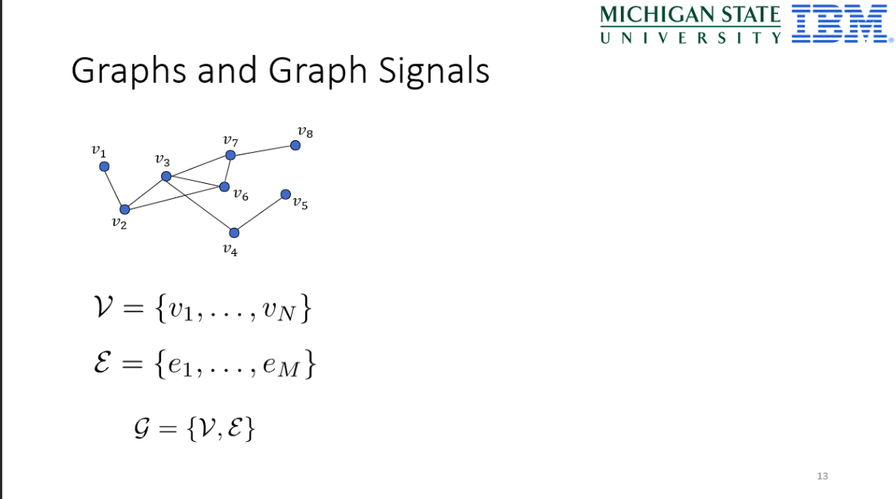

# Matirials

0. 傳統的表格資料在形式上就已經無法呈現資料之間相關的特性，資料之間是互相獨立的，特徵資料$X$僅和目標$Y$有關係，樣本$X_i$和$X_j$之間沒有關係，在圖結構下，$X_i$和$X_j$之間可能是有關係的，能夠透過一個圖來表示，而一個圖$G$最少需要兩種元素，頂點$V$及邊$E$來進行表示

$$G=\{V, E\}$$

</img>

1. [如何理解 Graph Convolutional Network（GCN）？ 贊同2461](https://www.zhihu.com/question/54504471)

   * 從熱傳導方程式到圖結構中的熱傳導方程式，再到廣告與推薦(鄰接矩陣$A$，度矩陣$D$，拉普拉斯矩陣$L$，特徵矩陣$X$)

2. [GCN(Graph Convolutional Network)的理解](https://purelyvivid.github.io/2019/07/07/GCN_1/)

   * numpy舉例實作，鄰接矩陣$A$，度矩陣$D$，拉普拉斯矩陣$L$，特徵矩陣$X$，歐拉數據與非歐拉數據
   * Agreegation的歸一化，自環的理由

3. [2016 NIPS Convolutional Neural Networks on Graphs with Fast Localized Spectral Filtering citation 2141](http://papers.nips.cc/paper/6081-convolutional-neural-networks-on-graphs-with-fast-localized-spectral-filtering.pdf)

   * 將CNN的方法推廣到任意圖結構，且有github實作，MIT license 

4. [如何理解 Graph Convolutional Network（GCN）？ 贊同5000+](https://www.zhihu.com/question/54504471)

   * 從CNN的本質到GCN - 事實上只要搞定了

``` 
在vertex domain(spatial domain)以及spectral domain實現目標是兩種提取拓樸圖空間方式，目前主流的方式是spectral
```

   * 從整個研究進程來看，首先研究GSP(graph signal processing)的學者定義了graph上的傅立葉轉換，進而定義了graph上的convolution，最後與深度學習結合提出了Graph Convolutional Network

# TODO

* 我知道拉普拉斯矩陣$L$可以表示鄰近點帶來的訊息傳遞，那麼GCN和傅立葉轉換為什麼會扯上關係?
