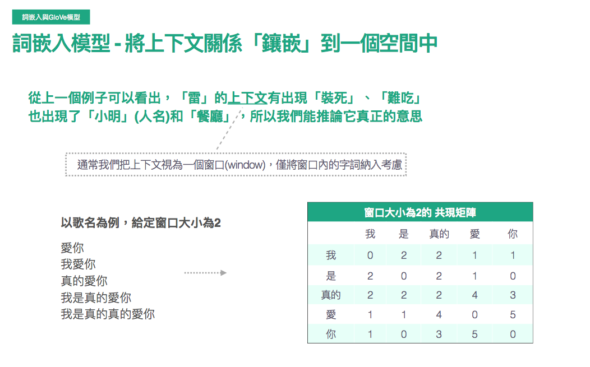

# word_embedding
* 大家最常聽到的可能是google發的word-embedding
* 但其實Glove有著較好的解釋性，並且實作上的性能也較word2vec要好一些(?)
* 2014年，cited by 11335
## Embedding
</img>
需求 : ngram以及貝氏推論的缺點 : 整個上下文的脈絡
E.g : 
1. 小明真的很雷，團體報告都裝死
2. 這間餐廳好雷，食物有夠難吃
其實我們無法從前面"小明真的很"以及"這間餐廳"來理解雷其實是負面的意思，反而要到後面"團體報告都裝死"，"食物有夠難吃"才能夠推論說:
雷這個字是在形容"小明"，"餐廳"，而且是不好的意思。
上下文模型就是遵從這個理念來進行設計，某個不認得的字，用上下文來推論其意思
窗口的大小(上下文的共現矩陣) - dense matrix，而非sparse matrix

## GloVe的模型設計
Global Vectors for Word Representation
透過固定上下文窗口建立貢獻矩陣，在針對目標函數進行訓練，得出詞向量，進而表達詞與詞之間的關係
</img>
以愛你舉例，**給定窗口大小為2**，我們可以看到**真的**現在包含了更多資訊，也從較為sparse的matrix進入到dense matrix，該矩陣可以做為一個labelled traning target $X_{ij}$
</img>
該模型的設計，把固定窗口大小的共現矩陣當作target
希望能夠找出k個當出現某個字時，後續出現字機率較高的，並且定義一個loss function

</img>
可以透過cos similarity來找出最相近的推薦字

</img>

* 訓練過程與目標函數
* 細節可以看論文，應該是還ok不會太難
* $\frac{1}{d}$取代counts : d為窗口大小，很合理，越靠近的字有越大的比重
* 考慮字詞之間的probability Ratio
* 字詞之間共現過高或過低的處理

# 其他觀點
## 通俗易懂理解——Glove算法原理
講到GloVe模型的思想方法，我們先介紹其他兩個方法
1. 基於奇異值分解(SVD)的LSA算法，該方法對term-document矩陣(矩陣的每個元素值為tf-idf)進行奇異值分解，從而得到term的向量表示以及document的向量表示，此處使用的tf-idf主要還是term的全局統計特徵
2. 另一個方法是word2vec，該算法可以分為skip-gra和comtinous bag-of-words(CBOW)兩類，但都是基於局部滑動窗口計算，即，該方法利用了局部的上下文特徵(local context)
GloVe模型就是將這兩種特徵合併到一起，即語料庫的全局統計(overall statistics)，局部上下文(滑動窗口)。為了做到這一點，Glove模型引入了term的**共現機率矩陣**(Co-occurrence Probabilities Matrix)
### 共現矩陣$X$
$X_{ij}$: 出現在$word~i$上下文中的$word~j$的次數。
$X_{i} = \sum_{k}X_{ik}$是出現在$word~i$上下文中所有word的總次數
$P_{ij} = P(j|i) = \frac{X_{ij}}{X_{i}}$是$word~j$出現在$word~i$上下文的機率
由以上概念引申出共現機率矩陣(Co-occurrence Probabilities Matrix)，以下為論文中的例子
</img>
該矩陣的第一個元素為`ice`出現時`solid`出現的機率，第二個元素為`ice`出現時，`gas`出現的機率依此類推。
由Co-occurrence Probabilities Matrix可以看出$Ratio = \frac{P_{ik}}{P_{jk}}$的取值會存在一定規律，文章對該規律進行了總結
</img>
也就是說$Ratio$值能夠反映word之間的相關性，而**GloVe**模型就是利用了這個Ratio值。
GloVe模型的目的是取得每一個word的向量表示$v$，不仿假設我們已經得到word$i, j, k$的詞向量，$w_{i}, w_{j}, w_{k}$。**GloVe**認為，這三個向量通過某種函數的作用後所成像出來的規律和$Ratio = \frac{P_{ik}}{P_{jk}}$具有一致性，即相等，也就可以認為詞向量中包含了共現機率矩陣中的訊息
即
$$
F(w_{i}, w_{j}, w_{k}) =  \frac{P_{ik}}{P_{jk}}
$$
[check 1](https://zhuanlan.zhihu.com/p/42073620)
[check 2](https://zhuanlan.zhihu.com/p/79573970)

### 模型推導
$$
F(w_{i}, w_{j}, w_{k}) =  \frac{P_{ik}}{P_{jk}}
$$
右側的值可以透過統計語料求得
左側則是我們想要的特徵向量
同時函數$F$未知
如果能夠將函數$F$的形式確定下來，就可以通過優化算法求解詞向量，作者怎麼做呢? 非常腦洞大開
1. $\frac{P_{ik}}{P_{jk}}$考察了$i, j, k$三個word兩倆之間的關係，如果先考慮$i, j$的兩個向量，$w_{i}, w_{j}$，線性空間中的相似關係通常會怎麼表示?，作者採用兩個向量的差$(v_{i}-v_{j})$
所以$F$的形式可以是$F_(w_{i}-w_{j}, w_{k})= \frac{P_{ik}}{P_{jk}}$
2. $frac{P_{ik}}{P_{jk}}$是一個標量，而$F$作用在兩個向量上，向量與標量之間的關係鎖者想要使用內積來表達
$$
F((w_{i}-w_{j})^{T}, w_{k}) = F(w_{i}^{T}w_{k} - w_{j}^{T}w_{k})= \frac{P_{ik}}{P_{jk}}
$$
3. 而腦洞到現在，左邊是差，右邊是商，如果有$exp$，就提供了等好兩邊的關聯性，所以我們來個exp(或者取log)，兩者是等價的
$$
exp(w_{i}^{T}w_{k} - w_{j}^{T}w_{k}) = \frac{exp(w_{i}^{T}w_{k})}{exp(w_{j}^{T}w_{k})} = \frac{P_{ik}}{P_{jk}}
$$
4. 雖然是比例為維持一樣，但是其中一個solution就是分子等於分子，分母等於分母
$$
exp(w_{i}^{T}w_{k}) = P_{ik}, ~ exp(w_{j}^{T}w_{k}) = P_{jk}
$$
5. 我們想要的是$w_{i, j, k}$，所以其他的全部換到等號另一邊
$$
w_{i}^{T}w_{k} = log(P_{ik}) = log(\frac{X_{ik}} {X_{i}}) = logX_{ik} - logX_{i}
$$
6. 作為向量，交換上式$i, k$的順序乘積是相等的，但是公式右邊的log相減卻不具備交換性，為了解決這個對稱性問題，模型引入了兩個bias term $b_{i}$, $b_{k}$
$$
logX_{ik} = w_{i}^{T}w_{k} + b_{i} + b_{k}
$$

其中$b_{i}$包含了$logX_k$，所以公式中沒有寫明這一項(這個部分就是細到要看論文了)

7. 上面公式只是理想情況下，在實際實驗中左右兩邊只要求相近即可，因此就可以產生cost function
8. 
$$
J = \sum_{ik}(w_{i}^{T}w_{k} + b_{i} + b_{k} - logX_{ik})^{2}
$$

1. 根據經驗，兩個詞共現的次數越多，那麼這兩個詞在cost function中的影響就應該要越大，所以根據兩個詞共同出現的次數可以設計一個權重項

$$
J = \sum_{ik}f(X_{ik})(w_{i}^{T}w_{k} + b_{i} + b_{k} - logX_{ik})^{2}
$$

作者認為權重函數$f$應較符合下面三個特點
1. $f(0)=0$ - 兩個詞沒有共同出現過，權重就是0
2. $f(x)$應該是具有單調遞增，一次微分遞減的特性 - 兩個詞共現的次數越多，產生的impact越小，逐漸飽和
3. $f(x)$對於較大的$x$不能是很大的值，否則停用字會造成很大的impact

</img>

結合以上3點，其實可以有很多函數可以選擇，作者最後選用這樣的分段函數

$$
p(x) = \left\{
  \begin{array}{lr}
    (\frac{x}{x_{max}})^{\alpha} &  if~x < x_{max}\\
    1 &, otherwise
  \end{array}
\right
$$

* 拿實驗來調參，作者認為，$x_{max}~100, \alpha=\frac{3}{4}$ 模型能夠有不錯的表現

# word2vec

[check here, 2.6k+ upvote](https://zhuanlan.zhihu.com/p/26306795)

* 語言模型 : f(x) = y, --> x, y 是否是人話?
* 句子 1 --> 她们 夸 吴彦祖 帅 到 没朋友 --> x --> 吳彥祖 , y --> 她們、誇、帥、沒朋友
* 句子 2 --> 她们 夸 我 帅 到 没朋友 --> x --> 我 , y --> 她們、誇、帥、沒朋友 
* f(吳彥祖) = f(我) --> 我 == 吳彥祖 (好喔)

## Ski-gram vs CBOW

* 一個詞(x) 預測上下文 (y) --> Skip-gram
* 一個詞的上下文(x) 預測一個詞 (y) --> CBOW 
* 以上兩點其實就是克漏字練習
* 以上是 positve label, 需要 negtive sampling，基本上可以做一些排列組合，組出非人話的句子作為 negtive sample

### ONEHOT to WordEmbedding

</img>

$x_1 : [0,0,0,1,0,0....]$ 

$x_2 : [0,0,0,0,0,1....]$ 

...

$x_V : [0,0,0,1,0,0,...]$

x, y 皆是 $V$ 個節點

a.k.a. 任意詞彙 `吳彥祖`，`我`，都會有 onehot 以及 embedding 兩種形式表示，而此訓練結果的embedding是表達，`我`, `吳彥祖` 經常出現在同樣的上下文當中

## SkipGram 架構 vs CBOW 架構

</img>

</img>

## 訓練

1. x, y 從語料庫中的順序關係可以生成大量 positive pair (端看語料庫的多樣性及詞條數量)
2. negtive sampling - 將詞條做隨機 shuffle(我自己想的)，讓他變成不像人話，可作為 negtive pair
3. 預測類別太多了，有 $V$ 個詞語，需要做特殊處理才好訓練，所以有 hierarchical softmax (N分類 --> $logN$分類)

## 小節

1. Word2Vec 是訓練語言模型的副產物，語言模型是希望輸入 x ，得到 y ，而 x, y 從人類角度來看是一句人話
2. Word2Vec 這個副產物是 單詞的 dense representation，在訓練語料中，上下文將近的詞彙會有接近的 embedding. --> 因此使得 Word2Vec 可用於尋找類似語意的詞(這裡的語意指的是經常有相似的上下文)
3. CBOW是將目標詞雨蓋住，用上下文預測他，等同於克漏字測驗，這個思想在 BERT 中繼續沿用
4. CBOW, SkipGram, GloVe 都是基於語言的上下文特性，所設計出來的模型
5. 克漏字做法在成效上，容易表達 `多字一意` --> 例如 背包 ~ 後背包 ~ 登山包，而在 `一字多意` 上則表現得不好，例如 `蘋果` --> `我買了一隻蘋果`, `頻果真得很好吃`, `蘋果日報今天的頭條很瞎`，而 BERT 解這個問題解得比較好
6. 使用者閱讀序列，也可理解為一個語句，在此場景下使用者閱讀序列的語料可以訓練出 user embedding，進而找到相近的 user (基於閱讀序列)，相近 user 可做 u2u2i 的 item 推薦 (推薦系統)

# word2vec - review 

[ML Lecture 14: Unsupervised Learning - Word Embedding](https://www.youtube.com/watch?v=X7PH3NuYW0Q&t=475s)

* As a unsupervised algorithm, word2vec is a dimension reduction tech.

* 用 Vector 表示文字， one-hot encoding
* 可用，但資訊量不足
* cat, dog 都是動物，但 one hot 看不出來
  * 建立 word class
  * 不足之處 - 沒辦法知道， cat, dog elephant 都是動物，更高階層的樹狀關係是未知的

</img>

## **word embedding**

</img>

* 為什麼說是 dimension reduction，因為給定的 copus ， 整個展開通常有 10萬維， embedding 通常只有 100維或更少
  * 語意相似的比較近 (run / jump) (dog, rabbit), (tree, flower)
  * axis 可能有意義，例如 y 軸可能展現移動性 x 軸展現生物性 (待考查)

### How about auto-encoder? (Failed)

1-of-N --> NN --> 1-of-N (沒有資訊量可以學習)

### Insights in algorithm 

* Context will define the word
* 馬英九 520 宣誓就職
* 蔡英文 520 宣誓就職
  * 馬英九、蔡英文 --> 可能是同樣地位的詞彙

### How to exploit the context

* Counting based - co-occur matrix (共現) 
  - Glove Vector 
  - 關聯規則 / 機率方法

* Prediction based -

* 通常資料量少 / sparse, counting based 會做得更好 (經驗法則)

</img>

#### Prediction based ， 預測下個字是什麼
  * 給你 $w_{i-1}$ , 預測 $w_{i}$
  * input 1-of-N encoding of **$w_{i-1}$**
  * classifier - NN - MLP
  * output 1-of-N encoding of **$w_{i}$**
  * 訓練完之後，拿出 NN 裡面的 hidden layer

</img>

</img>

* why can we do this?
* 回到馬英九 & 蔡英文，他們會經常對應到通常的 Target (下文) - 宣誓就職，也因此，他們的 hidden layer 的數值會非常近

#### Prediction based, 給 $w_{i-k}$ ~ $w_{i-1}$ ， 預測下一個字

* 從人類直覺來看，給定一個 word window，更能夠猜測下個 字 / 詞 是什麼
* MLP 要做一點調整

</img>

* $w_{i-2}$ ~ $w_{i-1}$ ， 直接 concat 行不行呢?
  * 實做的時候會 tie 在一起 
  * 1 of N 的第一個 wij 要一樣， 第2個也要一樣，如同一樣顏色的線

</img>

* 理由1 - ~~同樣一個字 - 馬英九在 $w_{i-2}$ 或者 $w_{i-1}$ 必須是同樣的 word-embedding~~ --> 應該是求計算上方便
* 理由2 - word-window 很大，中間的 weights matrix 會是一個很大的矩陣 (k * V)，直接變成 V ， 作 regularization

</img>

* 實做的時候，直接加在一起，乘上一個 weight matrix
* 實作時，怎麼 back-propergation?

</img>

#### Training

1. Unsupervised 
2. 建立 window & targets (1 of V targets)
3. minimizing cross entropy (因為語言結構的關係，實際上人類文字就可以變成 labelled data，所以看起來還是 supervised learning，且 targets 的量很巨大，所以會衍生如何訓練好的問題)
   1. hierarchical softmax - classifier N --> classifier logN
   2. 怎麼產生 negtive sample? - 把 Target random sample from next words (?)

</img>

#### Prediction-based Various Architectures

* Continuous bag of words (CBOW) - 拿前面愈後面 --> 變成挖空格， aka 克漏字測驗
* Skip-gram - 拿中間字，預測旁邊字

</img>

#### word2vec is not a deep layer 

  * 其實 word2vec - 只有一層 hidden layer (不是 DNN)，老師問了原作者
    * 在作者之前，就有很多人做過 word2vec，該作者的文章表示
      * 不用 deep，用各種 engineering tips，就可以把 shallow layer network 訓練出來 (e.g. negtive sampling, hierarchical softmax)
      * 不用 deep，運算量很低，可以跑非常巨量的資料，也因此可以得很好的結果
      * 李老師大學時，就看過 DNN 預測下個字，但是實驗跑了三週還跑不出來
      * 在語音界， 2010 年就紅起來的方法
      * Thomas 第一次投這篇論文時，頭到一個很小很小的期刊，接受率有 70% ，然後還被 reject，結果現在他有超過 10000 次 cite

#### Building Structure Tree in WordEmbedding

* city - captial or 詞彙三態 (由於經常 share 相同的上下文結構，因此距離很近)
* 能夠發現從屬 & 階層關係 (semantic hierarchies via word embeddings)
  * word vec 兩兩相減

</img>

</img>

* 類比問題可以被解決 - Rome : Italy = Berlin : **Germany**

</img>

* Multi-lingual Embedding
* 中文英文個自訓練 wordvec，並建立部分的對應關係 (實心顏色) (label-pair)
  * 學一個模型
  * 該模型可以做到類似翻譯的蕭果

</img>

* Multi-Domain (Image)

</img>

* used for zero-shot (similarity based) - 新增加的類別

#### Document Embedding

</img>

* 主要應用點在於 - 句子是不同長度，但是 vector 是同樣長度

</img>

* 將 documents --> bags of word (1 of N)，透過 AutoEncoder，可以得到中間的 documeny embeddings

* 然而 Bags of word 的順序資訊被丟失了

</img>

</img>

* Word2Vec 很好的解決了 **多字一意** (e.g. 背包 ~ 書包 ~ 登山包, 烤肉 ~ 燒肉 ~ 燒烤)
* 然而，沒有解決一字多義

</img>

* Next - BERT Family [ELMO_BERT_GPT](ELMO_BERT_GPT.md)

## Meaning of Recommendation / Search

### Recommendation 
1. similarity items from user (user intent as a sequence)
   1. note : be careful that we need to bucket a sentense as an EDA (something similar)

</img>

* User / User-Session as `bucket`, word(item) in between
* learning wordvec ~ itemvec - could be used in realtime.

### Search

[airbnb_search_ranking - KDD2018](airbnb_search_ranking.md)

* Frame word as listing (word)
* Frame sentense (sentense)
* SkipGram Model
  * go through the detail

# Ref

[Is Word2vec a supervised/unsupervised learning algorithm?](https://www.quora.com/Is-Word2vec-a-supervised-unsupervised-learning-algorithm)

[Learn Word2Vec by implementing it in tensorflow](https://towardsdatascience.com/learn-word2vec-by-implementing-it-in-tensorflow-45641adaf2ac)

[ML Lecture 14: Unsupervised Learning - Word Embedding](https://www.youtube.com/watch?v=X7PH3NuYW0Q&t=475s)

