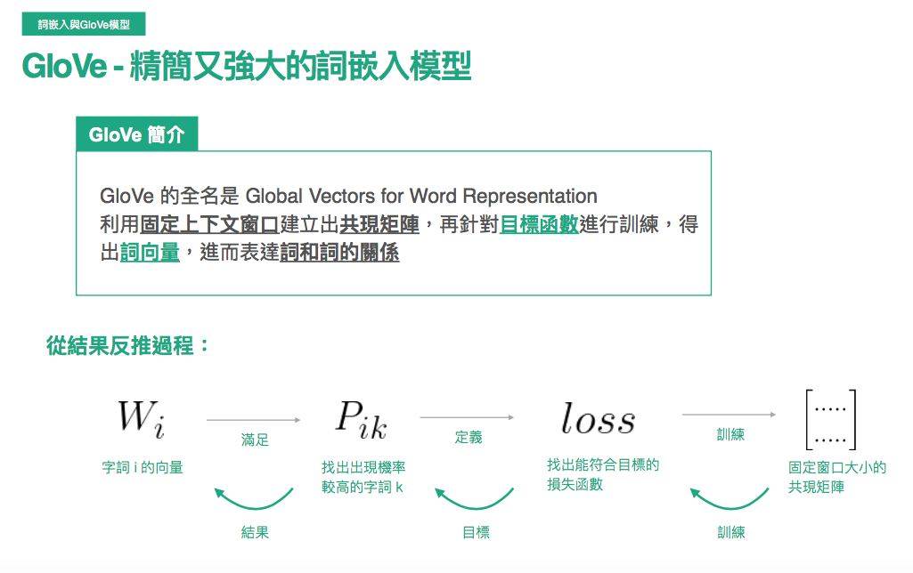
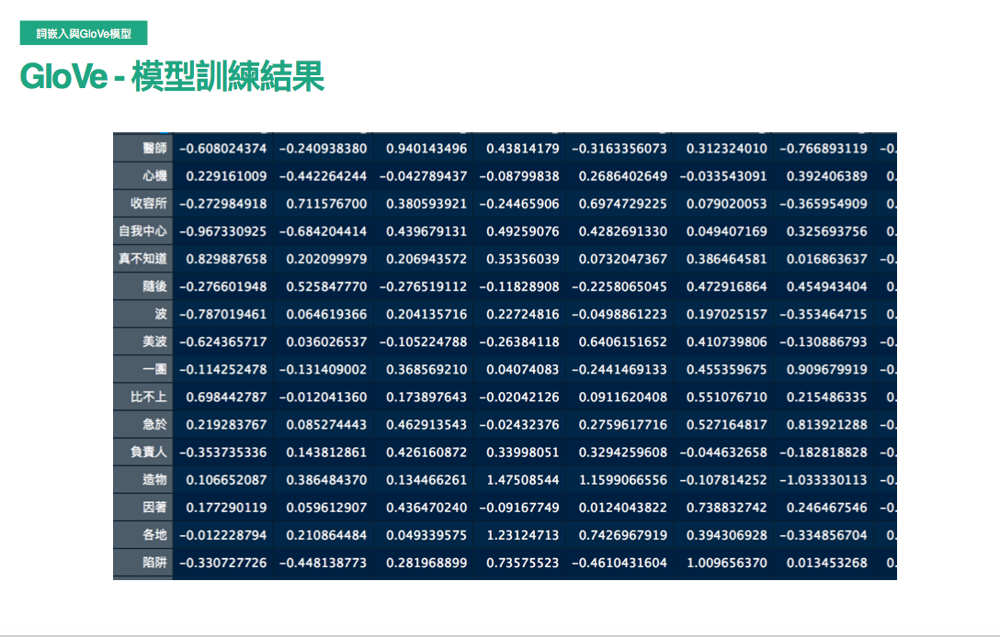

# word_embedding
* 大家最常聽到的可能是google發的word-embedding
* 但其實Glove有著較好的解釋性，並且實作上的性能也較word2vec要好一些(?)
* 2014年，cited by 11335
## Embedding
</img>
需求 : ngram以及貝氏推論的缺點 : 整個上下文的脈絡
E.g : 
1. 小明真的很雷，團體報告都裝死
2. 這間餐廳好雷，食物有夠難吃
其實我們無法從前面"小明真的很"以及"這間餐廳"來理解雷其實是負面的意思，反而要到後面"團體報告都裝死"，"食物有夠難吃"才能夠推論說:
雷這個字是在形容"小明"，"餐廳"，而且是不好的意思。
上下文模型就是遵從這個理念來進行設計，某個不認得的字，用上下文來推論其意思
窗口的大小(上下文的共現矩陣) - dense matrix，而非sparse matrix

## GloVe的模型設計
Global Vectors for Word Representation
透過固定上下文窗口建立貢獻矩陣，在針對目標函數進行訓練，得出詞向量，進而表達詞與詞之間的關係
</img>
以愛你舉例，**給定窗口大小為2**，我們可以看到**真的**現在包含了更多資訊，也從較為sparse的matrix進入到dense matrix，該矩陣可以做為一個labelled traning target $X_{ij}$
</img>
該模型的設計，把固定窗口大小的共現矩陣當作target
希望能夠找出k個當出現某個字時，後續出現字機率較高的，並且定義一個loss function

</img>
可以透過cos similarity來找出最相近的推薦字

</img>

* 訓練過程與目標函數
* 細節可以看論文，應該是還ok不會太難
* $\frac{1}{d}$取代counts : d為窗口大小，很合理，越靠近的字有越大的比重
* 考慮字詞之間的probability Ratio
* 字詞之間共現過高或過低的處理

# 其他觀點
## 通俗易懂理解——Glove算法原理
講到GloVe模型的思想方法，我們先介紹其他兩個方法
1. 基於奇異值分解(SVD)的LSA算法，該方法對term-document矩陣(矩陣的每個元素值為tf-idf)進行奇異值分解，從而得到term的向量表示以及document的向量表示，此處使用的tf-idf主要還是term的全局統計特徵
2. 另一個方法是word2vec，該算法可以分為skip-gra和comtinous bag-of-words(CBOW)兩類，但都是基於局部滑動窗口計算，即，該方法利用了局部的上下文特徵(local context)
GloVe模型就是將這兩種特徵合併到一起，即語料庫的全局統計(overall statistics)，局部上下文(滑動窗口)。為了做到這一點，Glove模型引入了term的**共現機率矩陣**(Co-occurrence Probabilities Matrix)
### 共現矩陣$X$
$X_{ij}$: 出現在$word~i$上下文中的$word~j$的次數。
$X_{i} = \sum_{k}X_{ik}$是出現在$word~i$上下文中所有word的總次數
$P_{ij} = P(j|i) = \frac{X_{ij}}{X_{i}}$是$word~j$出現在$word~i$上下文的機率
由以上概念引申出共現機率矩陣(Co-occurrence Probabilities Matrix)，以下為論文中的例子
</img>
該矩陣的第一個元素為`ice`出現時`solid`出現的機率，第二個元素為`ice`出現時，`gas`出現的機率依此類推。
由Co-occurrence Probabilities Matrix可以看出$Ratio = \frac{P_{ik}}{P_{jk}}$的取值會存在一定規律，文章對該規律進行了總結
</img>
也就是說$Ratio$值能夠反映word之間的相關性，而**GloVe**模型就是利用了這個Ratio值。
GloVe模型的目的是取得每一個word的向量表示$v$，不仿假設我們已經得到word$i, j, k$的詞向量，$w_{i}, w_{j}, w_{k}$。**GloVe**認為，這三個向量通過某種函數的作用後所成像出來的規律和$Ratio = \frac{P_{ik}}{P_{jk}}$具有一致性，即相等，也就可以認為詞向量中包含了共現機率矩陣中的訊息
即
$$
F(w_{i}, w_{j}, w_{k}) =  \frac{P_{ik}}{P_{jk}}
$$
[check 1](https://zhuanlan.zhihu.com/p/42073620)
[check 2](https://zhuanlan.zhihu.com/p/79573970)

### 模型推導
$$
F(w_{i}, w_{j}, w_{k}) =  \frac{P_{ik}}{P_{jk}}
$$
右側的值可以透過統計語料求得
左側則是我們想要的特徵向量
同時函數$F$未知
如果能夠將函數$F$的形式確定下來，就可以通過優化算法求解詞向量，作者怎麼做呢? 非常腦洞大開
1. $\frac{P_{ik}}{P_{jk}}$考察了$i, j, k$三個word兩倆之間的關係，如果先考慮$i, j$的兩個向量，$w_{i}, w_{j}$，線性空間中的相似關係通常會怎麼表示?，作者採用兩個向量的差$(v_{i}-v_{j})$
所以$F$的形式可以是$F_(w_{i}-w_{j}, w_{k})= \frac{P_{ik}}{P_{jk}}$
2. $frac{P_{ik}}{P_{jk}}$是一個標量，而$F$作用在兩個向量上，向量與標量之間的關係鎖者想要使用內積來表達
$$
F((w_{i}-w_{j})^{T}, w_{k}) = F(w_{i}^{T}w_{k} - w_{j}^{T}w_{k})= \frac{P_{ik}}{P_{jk}}
$$
3. 而腦洞到現在，左邊是差，右邊是商，如果有$exp$，就提供了等好兩邊的關聯性，所以我們來個exp(或者取log)，兩者是等價的
$$
exp(w_{i}^{T}w_{k} - w_{j}^{T}w_{k}) = \frac{exp(w_{i}^{T}w_{k})}{exp(w_{j}^{T}w_{k})} = \frac{P_{ik}}{P_{jk}}
$$
4. 雖然是比例為維持一樣，但是其中一個solution就是分子等於分子，分母等於分母
$$
exp(w_{i}^{T}w_{k}) = P_{ik}, ~ exp(w_{j}^{T}w_{k}) = P_{jk}
$$
5. 我們想要的是$w_{i, j, k}$，所以其他的全部換到等號另一邊
$$
w_{i}^{T}w_{k} = log(P_{ik}) = log(\frac{X_{ik}} {X_{i}}) = logX_{ik} - logX_{i}
$$
6. 作為向量，交換上式$i, k$的順序乘積是相等的，但是公式右邊的log相減卻不具備交換性，為了解決這個對稱性問題，模型引入了兩個bias term $b_{i}$, $b_{k}$
$$
logX_{ik} = w_{i}^{T}w_{k} + b_{i} + b_{k}
$$

其中$b_{i}$包含了$logX_k$，所以公式中沒有寫明這一項(這個部分就是細到要看論文了)

7. 上面公式只是理想情況下，在實際實驗中左右兩邊只要求相近即可，因此就可以產生cost function
   $$
J = \sum_{ik}(w_{i}^{T}w_{k} + b_{i} + b_{k} - logX_{ik})^{2}
$$

8. 根據經驗，兩個詞共現的次數越多，那麼這兩個詞在cost function中的影響就應該要越大，所以根據兩個詞共同出現的次數可以設計一個權重項
   $$
J = \sum_{ik}f(X_{ik})(w_{i}^{T}w_{k} + b_{i} + b_{k} - logX_{ik})^{2}
$$

作者認為權重函數$f$應較符合下面三個特點
1. $f(0)=0$ - 兩個詞沒有共同出現過，權重就是0
2. $f(x)$應該是具有單調遞增，一次微分遞減的特性 - 兩個詞共現的次數越多，產生的impact越小，逐漸飽和
3. $f(x)$對於較大的$x$不能是很大的值，否則停用字會造成很大的impact

</img>

結合以上3點，其實可以有很多函數可以選擇，作者最後選用這樣的分段函數

$$p(x) = \left\{
  \begin{array}{lr}
    (\frac{x}{x_{max}})^{\alpha} &  if~x < x_{max}\\
    1 &, otherwise
  \end{array}
\right.$$
* 拿實驗來調參，作者認為，$x_{max}~100, \alpha=\frac{3}{4}$模型能夠有不錯的表現
# word2vec
[check here, 2.6k+ upvote](https://zhuanlan.zhihu.com/p/26306795)

# Compare word2vec and Glove
