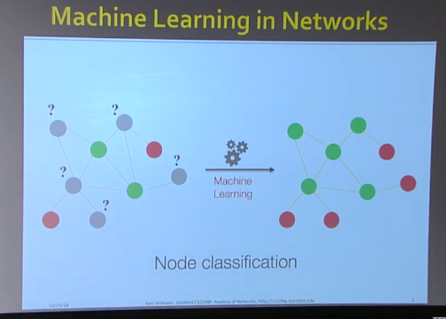
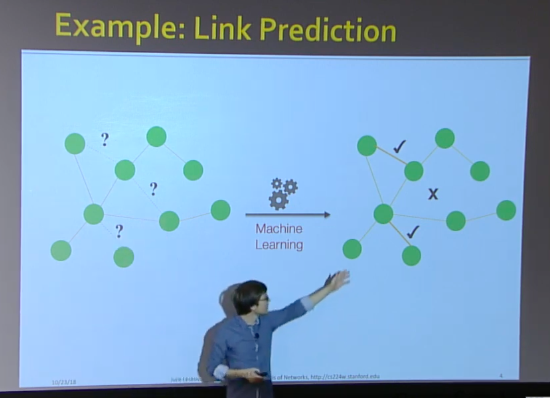
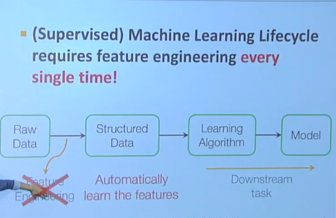
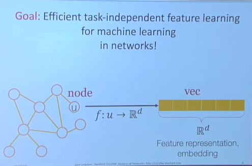
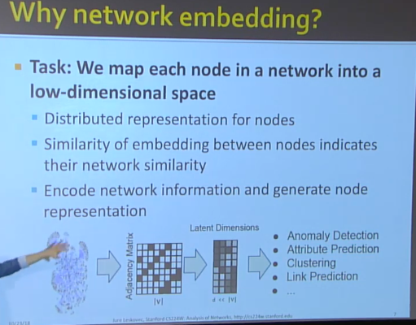

# Resource
* [Graph Representation Learning (Stanford university)](https://www.youtube.com/watch?v=YrhBZUtgG4E&t=199s)
* Actually, L7 in cs224W
* Still very young filed

# Applications
* Node Classification
</img>
* Link Prediction
</img>

# Machine Learning Lifecycle / Why Graph Rrpresentation
Graph Representation的願景是取代Feature Engineering
讓有關係的Data互相有連結(link)，之後看你想要做啥(node classification, link prediction, whatever you want to name it)
</img>

</img>

Again, the goal of graph : efficient task-independent feature learning for machine learning in networks!

```
graph -> vector : the graph representation / graph embedding
```

# Why Graph work for network?
</img>
* Similarity of embedding between nodes indicates thier network similarity