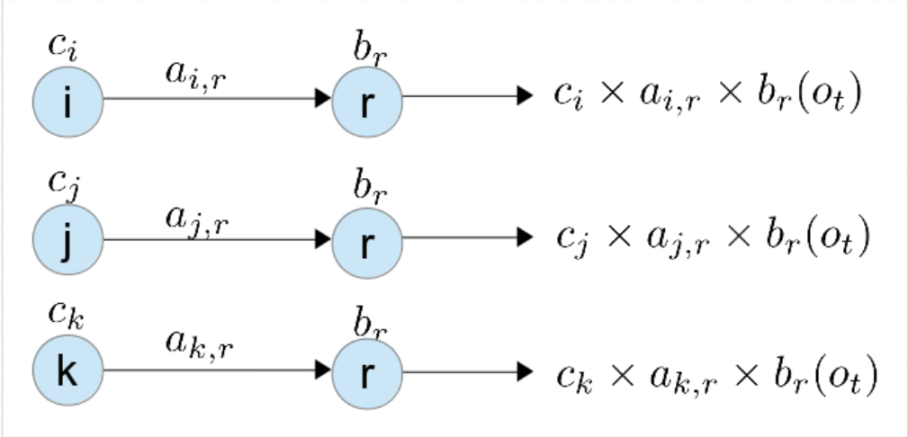
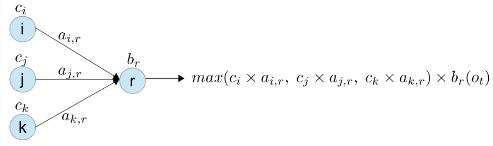
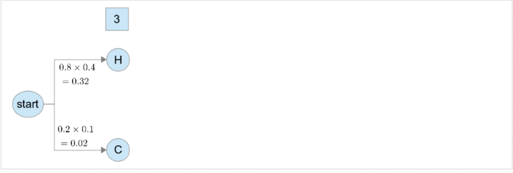
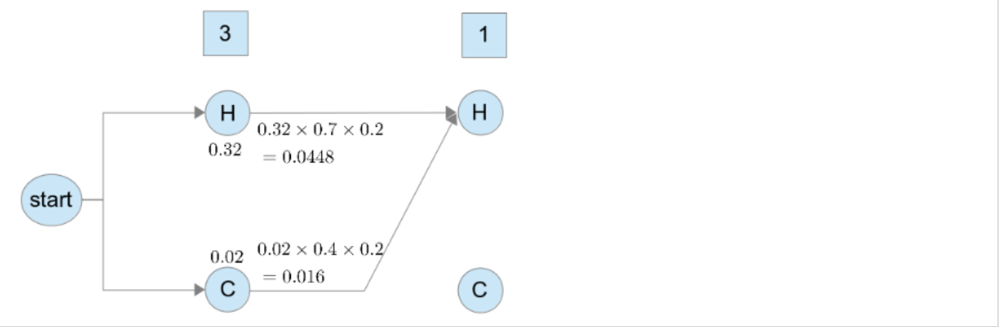
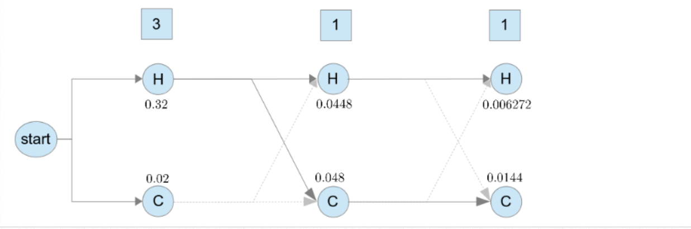

# HMM_Viterbi_Algorithm

## 背景

在HMM中其實，把所有的序列都列出來，這樣的演算法是非常沒有效率的，
假設序列長度為$T$, state有$N$種，則所有可能的序列會有   $N^{T}$種
逐一列出，使得時間複雜度為$O(N^{T})$
事實上，我們要求機率最高的序列，不需要把所有的序列都算出來，用*Dynamic Programming*的技巧可以有效解決問題
其中有一個演算法稱為Viterbi Algorithm，是將*Dynamic Programming*的技巧應用在*Hidden Marcov Model*

## Viterbi Algorithm

* 計算這些序列的機率時，假設目前已經計算到第$t$個字$o_t$，這個字的tag為$r$時，上一個字的tag為$s$，發生機率為

$$
P(q_t = r | q_{t-1} = s) \times P(X_t = o_t | q_t = r) 
\\\\ = a_{s, r} \times b_{r}(o_t)
$$

$$s \in i, j, k$$

其中，$s$有三種可能，分別是$i, j, k$

假設在$t-1$之前的序列為$C_i, C_j, C_k$, 且在$i, j, k$這三個state的機率分別為$c_i, c_j, c_k$
若是暴力法，需要分別計算$C_{i}ir, C_{j}jr, C_{k}kr$這三個序列的機率

由上圖可知，在$r$這個state，就增加了3個序列傳遞下去，之後每個state都會因為前面有$N$種不同的state，而增加$N$種不同的序列，這樣一直增加，**序列的數量呈現指數成長**，最後再一起比誰的機率比較大

這就是造成暴力法沒效率的原因

其實，可以利用*Dynamic Programming*的概念，在計算每個state的機率時，就直接比較序列的機率大小，只保留機率最大的一條序列，傳遞下去

這樣每一個state就只會傳遞一個序列下去，而不會使序列數量呈現指數成長，即 *Viterbi Algorithm*

## 舉例

有個研究者, 想根據某地人們生活日記中, 記載每天吃冰淇淋的數量, 來推斷當時的天氣變化如何
在某個地點有兩種天氣, 分別是 Hot 和 Cold , 而當地的人們會記錄他們每天吃冰淇淋的數量, 數量分別為 1 , 2 或 3 , 
則可以把天氣變化的機率, 以及天氣吃冰淇淋數量的關係, 用 Hidden Markov Model 表示, 

由於天氣是未知的，為*hidden state*，天氣的集合$Weather = \{HOT, COLD\}$
而冰淇淋的數量是已知的，為*obervable*，冰淇淋數量的集合為$Icecream=\{1, 2, 3\}$，天氣的*Transition Matrix, A*，以及天氣變化對冰淇淋數量的*Output Matrix B*如下

|$Day_{~t} $\ $Day_{~t+1}$|$HOT$|$COLD$|
|-------------------------|-----|------|
|$HOT$|0.7|0.3|
|$COLD$|0.4|0.6|

而冰淇淋數量是已知的，為 *observable*，冰淇淋數量的集合為$Icecream=\{1, 2, 3\}$
天氣變化對於冰淇淋數量的*Output Matrix*:

|$Weather $ \ $Icecream$|$1$|$2$|$3$|
|----------------------|----|---|---|
|$HOT$|0.2|0.4|0.4|
|$COLD$|0.5|0.4|0.1|

如果冰淇淋的紀錄$(3, 1, 1)$，這次使用*Viterbi Algorithm*計算看看最可能的天氣序列

首先，從*initial state*開始，計算第一個*state*是$H$以及$C$的機率
$$
P(X_1 = 3, q_1 = H) = P(q_1 = H)\times P(X_1 = 3 | q_1 = H) = 0.8 \times 0.4 = 0.32
$$

$$
P(X_1 = 3, q_1 = C) = P(q_1 = C)\times P(X_1 = 3 | q_1 = C) = 0.2 \times 0.1 = 0.02
$$

計算結果如下圖

接著我們要計算第2個state是$H$的機率，我們要分別計算序列$CH$以及$HH$

$$
P(X_1 = 3 | q_1 = H) \times P(q_2 = H | q_1 = H) \times P(X_2 = 1| q_2 = H) 
\\\\ = 0.32 \times 0.7 \times 0.2 = 0.0448
$$

$$
P(X_1 = 3 | q_1 = C) \times P(q_2 = H | q_1 = C) \times P(X_2 = 1| q_2 = H) 
\\\\ = 0.02 \times 0.4 \times 0.2 = 0.0016
$$

用*Viterbi Algorithm*，在同一個state只需要保留機率最大的序列即可
$$
max (0.0448, 0.0016) = 0.0448
$$
因此我們在第二步$state~H$上，只需要保留機率為0.048的序列$HH$傳遞下去即可，**序列$CH$已經是機率很低的序列，後面的情況只會讓機率越乘越小，基本上已經不可能是最大值了，不必留著**[註1](#備註)

就用這樣的概念, 之後每一個state都這樣算，就會得到每個state的機率值，如下圖

計算之後就過濾出最大的，pass給下一個state

整個過程像是下面這個動畫

## 實作

TBD
[Implementation](/demo/HMM.py)
[awesome tensorflow](https://github.com/dwiel/tensorflow_hmm/blob/master/tensorflow_hmm/hmm.py)

## 改進版本

## 備註

* 註1 : 這種先過濾的方式，也可以說是一種貪婪搜尋，但是恰巧在HMM的例子中，後面的機率都不可能是比1大的數，這確保了當前所去除掉的序列一定不可能是機率最大的序列，普遍來說，只要應用在任何連乘的系統中，乘上的factor永遠小於1，就能夠透過這樣的技巧來有效縮減時間複雜度

