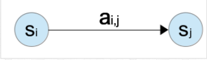
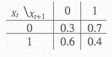
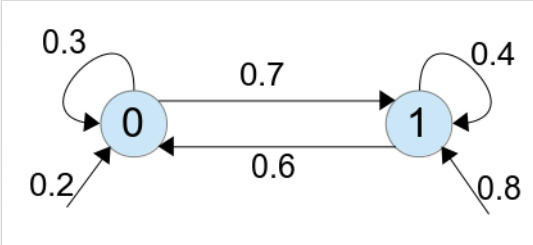

# HMM - HiddenMarkovModel
* Markov Model
* Hidden Markov Model
* 舉例
* 實作
* 時間複雜度
## collections
[如何用简单易懂的例子解释隐马尔可夫模型](https://www.zhihu.com/question/20962240) 5.7k
[HMM和RNN是什么关系？功效上两者有冲突重叠？](https://www.zhihu.com/question/57396443)
[《白话深度学习与Tensorflow》学习笔记（3）HMM RNN LSTM](https://www.jianshu.com/p/a2755179be5b)
[從Baive Bayes -> HMM -> CRF](https://www.zhihu.com/question/53458773) 68, 順位4
[機率圖模型 -> HMM -> MEMM -> CRF](https://www.zhihu.com/question/53458773) 180 順位3
[自然語言處理 -- Hidden Markov Model](http://cpmarkchang.logdown.com/posts/192352-natural-language-processing-hidden-markov-models) 順位1
[RNN的意義 - start from Markov Chain](https://yuehhua.github.io/2018/07/21/why-rnn/) 順位2

## Markov Model
以自然語言處理來舉例，語料庫中，各種字串的機率分佈，可以看成是一個
Random variavle的sequence, $X = (X_{1}, X_{2}, ..., X_{T})$, 其中，$X$的值是alphabet(字)的集合$S = \{s_{1}, s_{2}, ...s_{n} \}$

如果想要知道一個字串出現的機率，則可以把字串拆解成Bigram, 逐一用錢一個字，來推估下一個字出現的機率是多少

但是要先假設以下的 *Markov Assumoption*

> Limitted Horizon :
> > $P(X_{t+1} = s_{k}|)X_{1}, ...,X_{t} = P(X_{t+1} = s_{k}|X_{t})$

> Time Invariant : 
> >$P(X_{t+1} = s_{k}|X_{t} = P(X_{2} = s_{k}|X_{1})$

Limitted Horizon的意思是，每個$X_{t+1}$是什麼字($s_{i}$)的機率，只會受到上一個字$X_{t}$的影響
Time Invariant的意思是
每個$X_{t+1}是什麼字($s_{i}$)$的機率，和前一個字$X_{t}$的機率關係，不會因為在字串中的位置不同，而有所改變

> 註 : 事實上，這兩種假設是為了簡化計算，在真實的自然語言中，以上兩種假設都不成立

有以賞兩個假設之後，上一個字$s_{i}$必成這個字$s_{j}$的機率，就能夠建立*Tansition Matrix : A*，其中*A*的元素可以寫成:
$$
a_{i, j} = P(X_{t+1}= s_{j}|X_{t}=s_{i})
$$
也可以用*Transition Diagram*來表示 : 
</img>
如果想要計算字串($s_1,s_2, ...,s_T$)在Model中出現的機率，可以從第一個字開始，用Transition Matrix逐字推算下去，假設第一個字(*Initial State*)的機率, $P(X_1 = s_1) = \pi_{s1}$，則Random sequence$(X_1, X_2, ..., X_T)$的機率為:
$$
P(X_1 = s_1, X_2 = s2, ... , X_T = s_T)\\\\
 = P(X_1 = s_1)P(X_2 = s_2)...P(X_T = s_T)
$$
即
$$
\pi_{s1}\Pi_{t=2}^{T}P(X_t = s_t|X_{t-1}=s_{t-1}) = \pi_{s1}\Pi_{t=2}^{T}a_{X_T, X_{T+1}}
$$

舉個例子，假設有個*Markov Model*, 
*alphabet*的集合$S=\{0, 1 \}$
*Initial State*的機率$\pi_{0} = 0.2, \pi_{1}=0.8$
*Transition Matrix為*

</img>

用*Transition Diagram*表示成:

</img>

則在此Model中，出現字串1011的機率為
$$P(X_1=1, X_2=0, X_3=1, X_4=1)\\\\
=\pi \times P(X_2=0|X_1=1) \times P(X_3=1|X_2=0) \times P(X_4=1|X_3=1)\\\\
=0.8 \times 0,6 \times 0.7 \times 0.4 \\\\
= 0.1344$$

## Hidden Markov Model(建議先看舉例)
所謂的Hidden Markov Model, 就是從表面上看不到state是什麼，又多了一層推斷，例如狀態的表示是下雨以及晴天(Hidden state)，但能夠觀察到的狀態(observable state)是前一天晚上的氣象預報，由想要透過observable state去推斷hidden state是什麼
其中, observable為一個集合$O=\{o_1, o_2, ...o_n\}$
hidden state為一個集合:$Q = \{q_1, q_2, ...q_n\}$

則表示當某個字tag為$i$時，這個字為$o_{k}$的機率，可以用*Output Matrix B:*表示，其中$B$的元素可以寫成:
$$
b_{i}(o_{k}) = P(X_t = o_k | q_t = i)
$$
即表示 : 當隨機變數$X$出現了$o_k$時，其中應該是*hidden state*，$i$
而當上一個tag為$j$時，這個字的tag的$i$的機率為:
$$
a_{j, i} = P(q_{t} | q_{t-1} = j)
$$
有了上述兩式的數學表達，我們就可以計算上一個tag為$j$時，這個字tag為$i$，且這個字為$o_{k}$的機率:
$$
a_{j, i} \times b_{i}(o_{k}) = P(q_{t} | q_{t-1} = j)P(X_t = o_k | q_t = i)
$$
如果我們要計算，出現字串$o_1, i_2, ...o_T$且tag為$(r_1, r_2, ..., r_T)$的機率:
$$
P(X_1=o_1,X_2=o_2, ... X_T=o_T, q_1=r_1, q_2=r_2, ..., q_T=r_T)
\\\\ = P(q_1=r_1)P(X_1=o_1 | q_1=r1) \times
\\\\ P(q_2=r_2)P(X_2=o_2 | q_2=r2) \times
\\\\ ... \times P(q_T=r_T)P(X_T=o_T | q_T=r_T) 
$$
將$\pi$為initial state帶入，並將連乘放進一個$\Pi$

$$
原式= \pi_{r1} P(X_1 = o_1 |   q_1 = r_1)\Pi_{t=2}^{T}P(q_t = r_t|q_{t-1} = r_{t-1})P(X_t = o_t | q_t = r_t)
\\\\ = \pi_{r1}b_{r1}(o_1)\Pi_{t=2}^{T}a_{r_t-1, r_{t}}b_{r_{t}}(o_t)
$$

如果要求出這個字串最有可能的tag，則找出$r$的序列，讓上述聯合機率為最大值
$$
arg~max_{r_{i}, r_{m}, r_{n}\in~Q} \pi_{r_{ri}}b_{ri}(O_{1})\Pi_{t=2}^{T}a_{r_n, r_m}b_{rm}(o_k)
$$

## 舉例 
有個研究者，想根據某地人們生活日記中，記載每天吃冰淇淋的數量，來推斷當時的天氣變化
在某個地點有兩種天氣，Hot, Cold, 
而當地的人們會記錄他們每天吃冰淇淋的數量，分別為1,2,3
則可以把天氣變化的機率，以及天氣吃冰淇淋數量的關係，用Hidden Markov Model表示 : 
$Weather = \{HOT, COLD\}$
天氣的*Transition Matrix*
|$Day_{~t} $\ $Day_{~t+1}$|$HOT$|$COLD$|
|-------------------------|-----|------|
|$HOT$|0.7|0.3|
|$COLD$|0.4|0.6|

而冰淇淋數量是已知的，為 *observable*，冰淇淋數量的集合為$Icecream=\{1,2,3\}$
天氣變化對於冰淇淋數量的*Output Matrix*:

|$Weather $ \ $Icecream$|$1$|$2$|$3$|
|----------------------|----|---|---|
|$HOT$|0.2|0.4|0.4|
|$COLD$|0.5|0.4|0.1|

而$Intial~State$的機率為$\pi_{HOT}=0.8, \pi_{COLD}=0.2$

根據這個Model，假設有個吃冰淇淋的紀錄(3,1,3)，想要預測當時的天氣如何，例如，天氣是HCH的機率?
則我們可以計算
$$P(X1 = 3, X_2 = 1, X_3 = 3, q_1 = H, q_2 = C, q_3 = H)
\\\\ = P(q_1 = H)P(X_1 = 3 | q_1 = H) 
\\\\ \times P(q_2 = C|q_1 = H)P(X_2 = 1 | q_2 = C)
\\\\ \times P(q_3 = H|q_2 = C)P(X_3 = 3 | q_2 = H)
\\\\  = 0.8 \times 0.4 \times 0.3 \times 0.5 \times 0.4 \times 0.4
\\\\ = 0.00768
$$
如果有冰淇淋紀錄(3,1,3)，但不知道當時天氣如何，想要預測當時的天氣，可以把所有可能得天氣序列都列出來
$HHH~HHC~HCH~HCC~CHH~CHC~CCH~CCC$
然後分別計算，哪個天氣序列和冰淇淋的紀錄為(3,1,3)共同發生得機率，看看哪個機率最高
## 實作
[Implementation](/demo/HMM.py)

## 時間複雜度
其實，把所有的序列都列出來，這樣的演算法是非常沒有效率的，
假設序列長度為$T$, state有$N$種，則所有可能的序列會有   $N^{T}$種
逐一列出，使得時間複雜度為$O(N^{T})$
事實上，我們要求機率最高的序列，不需要把所有的序列都算出來，用*Dynamic Programming*的技巧可以有效解決問題
其中有一個演算法稱為Viterbi Algorithm，是將*Dynamic Programming*的技巧應用在*Hidden Marcov Model*

## 應用