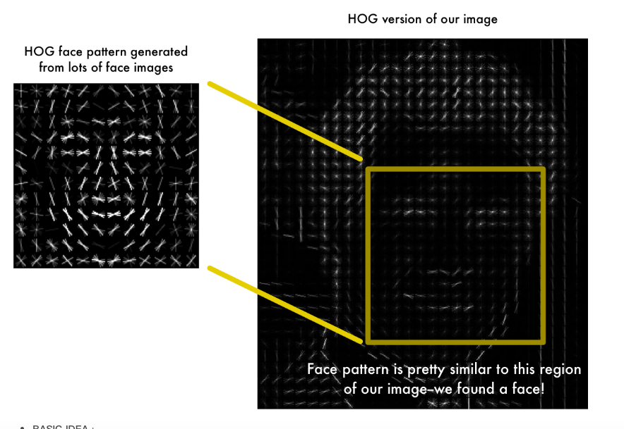

# Histogram of Oriented Gradient
[pyimagesearch](https://gurus.pyimagesearch.com/lesson-sample-histogram-of-oriented-gradients-and-car-logo-recognition/?fbclid=IwAR2ZFu3-51-_6B0dMp2Ce8Hjkqmr316Uznfbcg6pNRH0iMpMsMvU0L10ZF8)
[Kaggle object detection]([Kaggle]object_detection_histroy.md)
* 2005年的技術，可以視為一種對於圖片中物體的feature extraction的方法
* 人臉辨識的話 HOG + Sliding Window Search + SVM(face pattern)
* HOG可以用在任何物體的圖片特徵萃取
## Problem want to solve
* 找出HOG效能上的Bottle neck - 兩層convolution!

## details

CVPR 2005, Histogram of Oriented Gradients for Human Detection 

The 5 stages include:

1. Normalizing the image prior to description.
2. Computing gradients in both the x and y directions.
3. Obtaining weighted votes in spatial and orientation cells.
4. Contrast normalizing overlapping spatial cells.
5. Collecting all Histograms of Oriented gradients to form the final feature vector.

most important params `orientations`, `pixel_per_cell`, `cell_per_block`

</img>

* 透過亮暗程度的變化來取Gradient

</img>

* 可以選取角度，用histogram做統計，來決定該cell的Oriented_Gradient在哪個方向
* 這個做法需要將圖片切分成網格，稱作cells，在每個cell中計算histogram of oriented gradients for every pixel(在每個cell中對每個pixel進行計算)
* 以細節來說還會使用block normalization

## Step1 Normalizating the image prior to description(Optinal)
* 先對圖片中每個pixel做處理，反正我們考慮的是gradient，所以可以對量值做事情，通常考慮單調性轉換函數
* Gamma/power law normalization
* Square-root normalization
* variance normalization
  
## Step2 Gradient computation
* $x$方向和$y$方向都算，用Convolution的方式來操作
  * $G_x = I * D_x$ and $G_y = I * D_y$
  * $I$為Input image, $D_x$為x-direction filter, $D_y$為y-direction filter
</img>
  * Gradient magnitude $|G| = \sqrt{G_{x}^{2} + G_{y}^{2}}$
</img>
  * 取出角度 $\theta = arctan2(G_x, G_y)$
  * 至此我們取得每個pixel的Gradient強度和角度

## Step 3: Weighted votes in each cell
1. divide out images into cells and blocks
   * 128pixel * 128pixel images, `pixel_per_cell` 4x4, then we have 32x32 cells
</img>
   * 128pixel * 128pixel images, `pixel_per_cell` 32*32, then we have 4x4 cells
</img>
   * 128pixel * 128pixel images, `pixel_per_cell` 128*128, then we have 1x1 cells
</img>

1. defined our number of `orientations` `[0, 180]` (unsigned) or `[0, 360]` (signed), preferable use unsigne gradients in the range [0, 180] with `orientation` in the range `[9, 12]`. depending on your application, `[0, 360]` can imporve accuracy

3.each pixel contributes a weighted votre to the histogram - **weight : the gradient magnitude $|G|$** 
    * 16x16 pixel cells for example
</img>
    * `orientations` using 9 bins
</img>
    * 接著我們就可以把每個cell的histograms收集起來，變成我們的feature vector

## Step 4: Contrast normalization over blocks
1. 把幾塊cells拼成一個`bolck`，這些`block`會互相重疊，這意味著每個cell對於最終的feature vector的貢獻會大於1次
2. 2x2 or 3x3 `cell_per_block`通常會得到還可以接受的準確度
</img>

3. 對於當前block中的每個cell，將其histogram串接起來，然後使用L1或是L2的標準化，在Paper中這樣做有助於提升準確度，當然這一步也需要花費計算資源，可以了解的目的就是，讓每個cell中的histogram貢獻更均勻一點，壓縮有些角度強度特別強的情況

## Step 5 Collecting all Histograms of Oriented gradients to form the final feature vecto
每個block都標準化之後，把它們組合起來，變成最後的feature vector

## implemention
1. OpenCV (might faster?)
2. scikit-image (more flexible)

## Pros and Cons
[pyimagesearch](https://gurus.pyimagesearch.com/lesson-sample-histogram-of-oriented-gradients-and-car-logo-recognition/?fbclid=IwAR2ZFu3-51-_6B0dMp2Ce8Hjkqmr316Uznfbcg6pNRH0iMpMsMvU0L10ZF8)
### Pros:
1. 對於local特徵的描述非常好
2. 對於物體的視覺結構有強大描述能力
3. 用於辨識(classification)可以非常準確

### Cons:
1. feature vector可以非常大，須考慮Space Complixity
2. `orietation`, `pixel_per_cell`, `cell_per_block`的調整幾乎case by case
3. 挺慢的，pixel level convolution, cell level convolution
4. 同個物體有角度上的變動，或是背景有雜訊，performance會掉很多