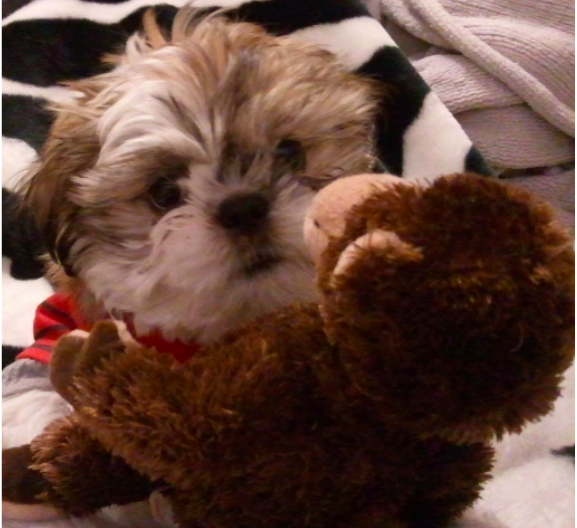

# Introduction
貝葉斯推斷(Bayesian Inference) 可以用來精進預測，特別是在資料不是很多，又想盡量發揮預測能力時特別有用
# Math & Concept
* 機率(probabilities)
* 條件機率(conditional probabilities)
* 聯合機率(joint probabilities)
* 邊際機率(marginl probabilities)
* 貝氏定理
* 機率分佈
* 獸醫院裡的貝葉斯推斷
  * 最大似然估計(MLE)
  * 最大後驗機率(MAP)
* 避免貝氏陷阱
# Other Reference
* MLE and MAP

## 條件機率
</img>

條件機率可以回答什麼問題? **如果這名觀眾是女性，那她有長頭髮的機率為何?** 條件機率與機率不同的一點是，條件機率只會涉及符合條件得少部分樣本，在本圖中 $$P(long hair | woman) = 0.5$$

關於條件機率，有一件需要特別注意的是，$$
P(A|B)~~!=~~P(B|A)
$$
例如$P(cute | puppy)~~!=~~P(puppy|cute)$
如果我手上抱著的東西是一隻狗狗，那這個東西很可愛的機率就很高，但如果我只知道我手上抱著的東西很可愛，那這東西是狗狗的機率只有中下，因為他也有可能是貓貓、兔兔、小刺蝟或是小嬰兒。

## 聯合機率

</img>

聯合機率適合用來回答這類問題 : **這位觀眾是一名短髮女性的機率為何?**
回答這個問題的過程分為兩個步驟，首先，我們會先找出觀眾是女性的機率$P(woman)$，接著，我們在找出在女性觀眾中短髮的條件機率$P(short hair | woman)$。將兩個機率相乘，就可以得到所求的聯合機率，即$P(woman~with ~short~hair) = P(woman) * P(short hair | woman)$。利用這個概念，我們可以解釋 : 電影院中，某位觀眾為長髮女性的機率$P(woman~with~long~ hair)$為0.25，但男性洗手間的隊伍裡，某位觀眾為長髮女性的機率$P(woman~with~long~hair)$為0.01，兩者之所以不同，是因為觀眾為女性的機率$P(woman)$在兩個情況下不同

聯合機率與條件機率不同的地方，在於聯合機率的計算中，順序並不影響結果，也就是說 $$
P(A~and~B) = P(B~and~A)
$$
我喝牛奶又吃果醬甜甜圈的機率，和我吃果醬甜甜圈又喝牛奶的機率是一樣的

## 邊際機率

</img>

最後，我們需要了解的是邊際機率，它可以用來回答這類問題 : **某位觀眾有長髮的機率為何?** 要回答這個問題，我們需要將所有符合這個條件的事件發生機率加總--即長髮男性和長髮女性的聯合機率，將這兩個聯合機率相加之後，我們可以得出電影院裡的觀眾是長頭髮的機率$P(long~hair)$為0.27，但在男性洗手間的隊伍裡面這個機率只有0.05

## 貝氏定理
介紹完這4個概念之後，如果我們想要了解 **如果我們知道某人有長頭髮，這個人是女性(或是男性)的機率為何?**這也是條件機率$P(man~|~long~hair)$的解，但我們現在只知道順序相反的情況$P(long~hair~|~man)$，因為條件機率的順序不可任意調換，我們還沒辦法回答這個問題。
幸好Bayesian早就發現了一個可以為我們解答的神奇工具
$$
P(man~with~long~hair) = P(long~hair) * P(man~|~long~hair)
$$
$$
P(long~hair~with~man) = P(man) * P(long~hair~|~man)
$$
根據聯合機率的計算方法，我們可以將前面兩個條件機率**男性且長髮**$P(man~with~long~hair)$寫成**長髮且男性**$P(long~hair~and~man)$。由於聯合機率的順序是可以互換的，兩者完全相同

</img>

我們把算式搬一搬，就可以求出$P(man~|long~hair)$了。
將**長髮**和**男性**以A和B互換，我們就得到了貝氏定理:
$$
P(A|B)~=~\frac{P(B|A)~P(A)}{P(B}
$$

回到電影票問題，這裡我們應用貝氏定理
</img>

分母有個$P(long~hair)$，我們知道這是邊緣機率!

</img>
同時我們也可以算出，在男性洗手間隊伍裡，$P(man|long~hair)$為0.8
正印證了我們先前認為長髮觀眾應該為男性的直覺，就是說，貝氏定理印證了我們在該情況下的直覺。

> **貝氏定理能夠更新我們在剛狀況下的信念(belief)**

## 機率分佈
* 再訪機率分佈

* 把杯子比喻為男女
</img>
* 把杯子比喻為兩種性別喝兩種頭髮長度的組合
</img>
> 我們可以將這些杯子排成一排，這時候杯子內咖啡的量可以看作是一張直方圖(hisogram)。我們可以將咖啡想成我們的信念(belief)，並將咖啡在不同杯子裡的分佈，想成對不同結果的信念強烈程度
* 硬幣
</img>
* 骰子
</img>
* 買彩券
</img>
> 以上三個例子，硬幣、骰子、彩券，都是資料測量和收集的例子
* 每過成人的身高
</img>
* 把bin分得更細
</img>
* 等到杯子數量多到一個程度，我們就不太能用杯子來比喻了，機率的分佈變得連續，需要不同的計算方法，但背後的概念還是很管用
> 機率分佈反映了信念的分佈

# 獸醫院裡的貝葉斯推斷
</img>
這隻狗狗叫做阿布，我們想測量他的體重，但是當我帶她去看獸醫時，她會在
體重計上扭來扭去，量體重變成一件困難的事，因為如果他變重了，我們就得減少阿布的食物量，由於阿布把食物看得比自己的命還重要，良好體重真的很重要
上次看獸醫的時候，在阿布變得無理取鬧之前獸醫量到了三個體重 : 13.9磅、17.5磅、14.1磅(一磅約為0.45公斤)。我們可以按照一套標準的統計方法，將這些數據化為機率分佈。計算平均值、標準差、以及標準誤差來建立一套阿布的體重分布
</img>
根據這個方阿所得出的分佈，顯示了我們對阿布體重的信念，阿布的體重呈現**常態分佈(mormal distribution)**，有著15.2磅的平均值，以及1.2磅的標準誤差。圖上的白線是我們實際測量到的三個數值，不過不巧的，這個分佈曲線有點太寬了，雖然機率的最大值在15.2磅，但是這個機率分佈顯示阿布的體重還是很有可能低於13磅或是超出17磅，在這麼寬的範圍裡，我們很難做出任何確切的決定
> 通常我們遇到這種情況時，會選擇回去收集更多資料，但有時候這麼做不太可行，或是成本很高

> 在我們的例子中，阿布已經失去耐心，所以我們只能利用這三組數值

## 貝氏定理派上用場、最大似然估計
* 貝氏定理很適合用來充分利用少量資料！
* 但是在實際應用前，五們可以先來回顧一夏貝氏定理的算式以及每個部分

</img>

我們將$A$和$B$，換成體重$w$(weight)和測量結果$m$(measurement)
* 事前機率(prior probability) $P(w)$ 代表我們的事前信念。在這個例子中，事前機率就是我們將阿布放上體重機前，對他體重分布的信念。
* 概似機率(likelihood) $P(m|w)$ 代表在某個既定的體重下，我們得到這些測量結果的機率，這也被稱作為資料的概似機率(the likelihood of the data)
* 事後機率(posterior probability) $P(w|m)$ 則是代表在某測量值出現的情況下，阿布實際體重為$w$的機率，這也是我們最關心的部分
* 資料機率(probability of data) $P(m)$代表我們得到某測量值的機率。在這個例子裡，我們就假設這是一個常數，即體重計本身沒有誤差。

我們可以先放心拋開所有假設，當作自己完全不知道任何狀況。也就是說在這個例子裡，我們可以假設阿布的體重為13磅、15磅、1磅、甚至是100萬磅，讓資料說話。為了做到這一點，我們假設是前機率為**均勻分布 (uniform distribution)**，即任何體重發生的機率都是一個固定的常數，這可以幫助我們將貝氏定理簡化為$P(w|m)~=~P(m|w)$
現在我們用阿布所有可能的體重來計算得到這三組測量值的概似機率。
例如 : 
現在我們看上面圖，我們假設一個情況就是阿布的體重是1000磅
$$P(w=1000~|~m=[13.9, 14.1, 17.3]) = P(m=[13.9, 14.1, 17.3]~|~w=1000)$$
$ = P(m=13.9|w=1000)P(m=14.1)|w=1000)P(m=17.3|w=1000)$
* 上式的拆解是因為在阿布的體重 $w$ = 1000的情況下，幾本上每次測量是獨立的，因此可以拆成3個相乘，而我們看上圖機率分佈可以知道，如果$w$ = 1000，上面三者的機率近乎等式0，直接驗證了這件事發生的機率很低
* 同樣的道理我們可以在假設 $w$ = 17, 按照上式來計算，但是按照上圖，$w = 17$在 $m = 13.9, 14.1$這兩個測量出現的機率是很低的，這導致了整件事發生的機率仍然很低
* 同樣的道理我們可以測 $w = 16, w = 15$等等，我們就會找到一個最大的機率
* [動畫版本 16.51 ~ 17.30](https://www.youtube.com/watch?v=5NMxiOGL39M&feature=youtu.be&t=16m49s)
這麼做所得到的答案，會和前面利用平均值，標準差，和標準誤差所算出來的答案非常相似。實際上，兩個答案確實完全一模一樣，因為利用均勻分布的事前機率，就會得到傳統統計方法下的估計值，機率分佈曲線中的最高點，及平均值15.2磅，也被稱為阿布體重的**最大似然估計值(maximum likelihood estimate) MLE**
雖然我們利用貝氏定理，但我們還沒得到真正有用的估計值。為了達成這個目的，我們需要一個**非均勻分佈的事前機率**。事前機率代表在測量前我們對某件事物的信念，比方說，年齡永遠會大於0歲，氣溫永遠比攝氏-276度還高，成人的身高很少超過八英尺(約244公分)，五們可以運用一些domain knowledge得知哪些情況發生的機率比較高

## 加入先驗/事前(prior)、最大後驗機率
我知道我們上次來看獸醫的時候，阿布的體重是14.2磅，而且我最近並妹有感覺阿布變得特別重或是特別清，儘管我的手臂不如體重計靈敏。因此，我們相信阿布的體重應該在14.2磅附近，有可能變輕或是變重一兩磅。為了呈現這個信念，我建構了一個憑婫誒14.2磅，標準差為0.5磅的常態分佈
</img>

現在我們加入了先驗的機率分佈，我們的貝式定理現在變成這樣
$$
P(w|m)~=~P(m|w)P(w)
$$
而剛才的計算, $m=13.9,~m=14.1, ~m=17.5$同樣可以變成相乘，但是這次我們都要多乘一項$P(w=17)$
看見我們的先驗機率分佈了嗎？$P(w=17)$的機率可以說微乎其微!，計算出來我們可以發現$P(w=17|m=[13.9,14.1,17.5])$的機率極小!
</img>

那如果我們猜測$w=16$呢?
同樣的看先驗機率(prior)分佈，$P(w=16)比P(w=17)$高了一些，不過仍然是蠻小的
</img>

接著持續上述過程，我們又會得到一個最有可能的機率分佈，是一個新的事後機率分佈，這個分佈曲線的最高點被稱為**最大後驗機率(maximum a posterior estimate) MAP**
</img>
在這個例子裡為14.1磅，這和我們之前利用均勻事前機率所算出的最高點(15.2磅)差很多，新的高峰也更為陡峭，這代表者我們可以對這個估計值抱持更高的信心！
現在我們可以看出阿布的體重並沒有什麼變化，他的食物量也不需要增減
* 藉由融合我們對測量目標已知的資料，我們可以做出更精準，更有信心的估計，也能幫助我們善用少量資料。當我們所採取的事前分佈，對於17.5磅的測量賦予很低的發生機率時，這幾乎等同於將17.5磅當作異常值拒絕。**不過我們並不需要憑直覺或是知識判斷異常值！貝氏定理可以幫助我們運用數學，解決這個問題**
* 可以注意到事前/先驗機率所扮演的角色，是壓低或是放大某些體重發生的機率，在我們的例子裡，事前機率會為13~15磅的估計值賦予更多的權重，並削弱這個範圍外的權重。這正是採用常態分佈與均勻分布的差異！在均勻分布的事前機率下，即使是17磅的估計值都還有不錯的發生機率，但是在常態分佈的事前機率下，他的發生機率已經處於分佈的尾端了。乘上事前機率會使17磅發生的機率變得非常低

## 避免貝式陷阱
雖然在阿布的例子裡，我們學到使用貝氏推斷的好處，但同時也該留意潛在的陷阱 : 
* 我們直接假設得到某測量值的機率$P(m)$為均勻分佈。但如果我們得知體重計有一定的偏差，也可以將這項資訊融入$P(m)$當中。如果這個體重計只會顯示偶數、有10%的機率會顯示2.0磅、或是每用3次就會調出隨機的測量值、我們也可以藉由修改$P(m)$反映這些現象，精進事後機率
* 我們雖然能夠藉由對答案作出假設，以提升估計的精確度
  ，但測量、估計的目的，終究在於更加了解該事務，如果我們自以為自己已經知道答案，那這麼做反倒是在修正資料。馬克、吐溫(Mark Twain)對此有很精闢的見解 : **讓我們陷入困境的不是無知，而是信以為真的謬誤**
  如果我們一開始就武斷地認為阿布的體重介於13~15磅，那我們永遠都不會發現，他的體重其實已經掉到12.5磅了。因為我們不管測量多少次，我們所採用的事前分佈都會對12.5磅賦予0%的發生機率，也會忽亮所有低於13磅的測量值
  幸好有一個方法可以幫助我們規避這個風險，只要至少給每個結果分配一點機率，我們就可以避免盲目地消除任合可能性。如此一來，就算世事難料，阿布長成了1000磅，我們所得到的測量值也還是能反映在事後機率上。這就是為什麼常態分佈很常被用為事前機率的模型，他一方面可以集中我們對小範圍結果的信念，一方面具有無限延伸，機率永遠也不歸零的長尾。

# Other Reference
* [MLE and MAP](https://zhuanlan.zhihu.com/p/61905474)