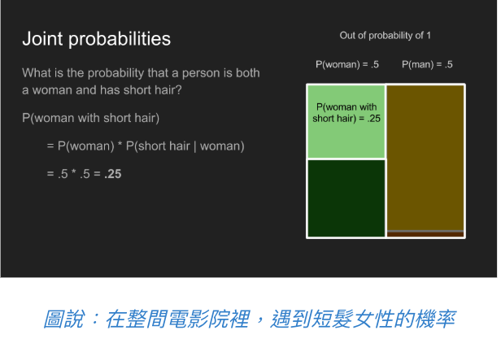
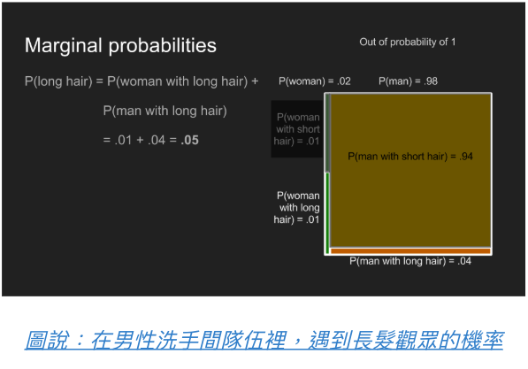
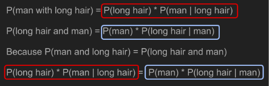

# Introduction
貝葉斯推斷(Bayesian Inference) 可以用來精進預測，特別是在資料不是很多，又想盡量發揮預測能力時特別有用
# Math & Concept
* 機率(probabilities)
* 條件機率(conditional probabilities)
* 聯合機率(joint probabilities)
* 邊際機率(marginl probabilities)
* 貝氏定理
* 機率分佈
* 獸醫院裡的貝葉斯推斷
  * 最大後驗機率
* 避免貝氏陷阱

## 條件機率
</img>

條件機率可以回答什麼問題? **如果這名觀眾是女性，那她有長頭髮的機率為何?** 條件機率與機率不同的一點是，條件機率只會涉及符合條件得少部分樣本，在本圖中 $$P(long hair | woman) = 0.5$$

關於條件機率，有一件需要特別注意的是，$$
P(A|B) != P(B|A)
$$
例如$P(cute | puppy) != P(puppy|cute)$
如果我手上抱著的東西是一隻狗狗，那這個東西很可愛的機率就很高，但如果我只知道我手上抱著的東西很可愛，那這東西是狗狗的機率只有中下，因為他也有可能是貓貓、兔兔、小刺蝟或是小嬰兒。

## 聯合機率

</img>

聯合機率適合用來回答這類問題 : **這位觀眾是一名短髮女性的機率為何?**
回答這個問題的過程分為兩個步驟，首先，我們會先找出觀眾是女性的機率$P(woman)$，接著，我們在找出在女性觀眾中短髮的條件機率$P(short hair | woman)$。將兩個機率相乘，就可以得到所求的聯合機率，即$P(woman with short hair) = P(woman) * P(short hair | woman)$。利用這個概念，我們可以解釋 : 電影院中，某位觀眾為長髮女性的機率$P(woman with long hair)$為0.25，但男性洗手間的隊伍裡，某位觀眾為長髮女性的機率$P(woman with long hair)$為0.01，兩者之所以不同，是因為觀眾為女性的機率$P(woman)$在兩個情況下不同

聯合機率與條件機率不同的地方，在於聯合機率的計算中，順序並不影響結果，也就是說 $$
P(A and B) = P(B and A)
$$
我喝牛奶又吃果醬甜甜圈的機率，和我吃果醬甜甜圈又喝牛奶的機率是一樣的

## 邊際機率

</img>

最後，我們需要了解的是邊際機率，它可以用來回答這類問題 : **某位觀眾有長髮的機率為何?** 要回答這個問題，我們需要將所有符合這個條件的事件發生機率加總--即長髮男性和長髮女性的聯合機率，將這兩個聯合機率相加之後，我們可以得出電影院裡的觀眾是長頭髮的機率$P(long hair)$為0.27，但在男性洗手間的隊伍裡面這個機率只有0.05

## 貝氏定理
介紹完這4個概念之後，如果我們想要了解 **如果我們知道某人有長頭髮，這個人是女性(或是男性)的機率為何?**這也是條件機率$P(man | long hair)$的解，但我們現在只知道順序相反的情況$P(long hair | man)$，因為條件機率的順序不可任意調換，我們還沒辦法回答這個問題。
幸好Bayesian早就發現了一個可以為我們解答的神奇工具
$$
P(man with long hair) = P(long hair) * P(man | long hair)
$$
$$
P(long hair with man) = P(man) * P(long hair | man)
$$
根據聯合機率的計算方法，我們可以將前面兩個條件機率**男性且長髮**$P(man with long hair)$寫成**長髮且男性**$P(long hair and man)$。由於聯合機率的順序是可以互換的，兩者完全相同

</img>

我們把算式搬一搬，就可以求出$P(man|long hair)$了。

TODO 電影票問題
https://brohrer.mcknote.com/zh-Hant/statistics/how_bayesian_inference_works.html