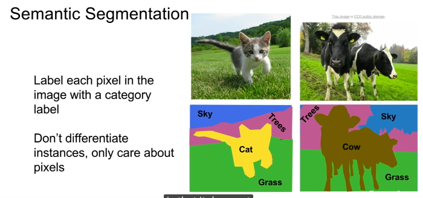
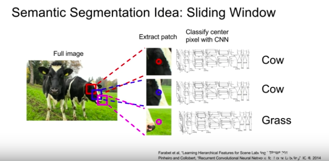
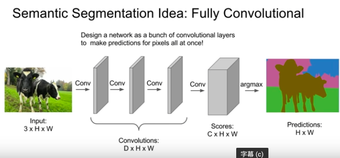
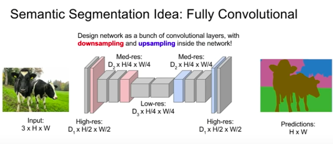
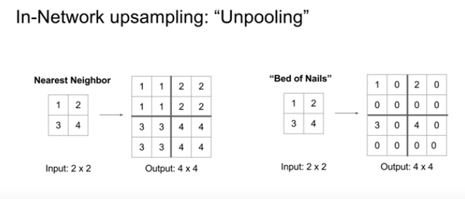
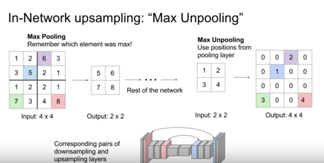

# detection and segmentation

</img>

</img>

</img>

# Semantic Segmentation
input : $N \times M \times 3$
output : $N \times M \times c$ 

* 對於semantic segmentation這樣的任務一個有趣的地方是，他並不是要區分實體
* 所以在下圖中，右邊兩張圖都是牛(cow)，但我們不care這兩隻牛有沒有分開，這樣能夠比較好的處理整個任務(當然，把牛分開應該就是所謂的instance segmentation)
</img>

* 所以你可以想像，做semantic segmentation一種可能的做法是Sliding window，當作分類問題，這樣可以work，但是基本上有一堆缺點。

</img>
  * 計算量超級超級大
  * 各個小塊與小塊之間會重疊計算很多次
  * 所以這是一個糟糕的idea但是開始思考semantic segmenation時會想到這一步

</img>
* 第2個想法則是Full Convoliutional Network(FCN)
  * 然後用個zero padding，直接學爆他
  * 最後一層Convolution layer就直接output $w \times h \times c$
  * 然後我們可以想像loss function就是pixel level cross entropy然後average(sum) over all pixels，per data or per mini-batch。
  * 接著就back propagation
  * QA1 : training data怎麼拿? 
    * 基本上非常貴，所以我們會在網路上畫畫圖什麼的，然後把區域圈出來說，這是貓，這樣子
  * QA2 : loss function可以在講細一點嗎?
    * 就是上面我理解的這樣，沒啥新的
  * QA3 : 這樣的做法是否藏著一個假設 : 我們知道model推論時的圖片會看到什麼，就好像我們知道所有的訓練類別一樣
    * 是的，所以如果沒看過的class，就會fail掉
  * 在實務上，CNN的架構會稍作調整，不會全部的size都是跟input image相同，通常會做一些down sampling以及up sampling

</img>

### Upsampling?
你可能會好奇說，upsampling這種東西!?!?!?!?
1. 在網路裡面到底長怎樣?
2. 參數增加時是不是有什麼可用的策略或是思考的著力點?
好的現在我們來講Upsampling的策略
其中一招叫做**Unpooling**

#### Unpooling
* 有pooling，那當然upsampling就要有unpooling囉
* 這裡我們舉例max pooling or average pooling

下兩張圖對應到 input 2x2 output 4x4的 upsampling
1. 下左圖對應到的是使用average pooling，我們先把output展開，然後怎麼做呢，就取展開點的那個值，就是一個**anti average pooling**，稱作Nearest Neighbor
2. 下右圖則是對應到max pooling，因為已經取了max，所以基本上也回不去了，其他的就補0(這稱作Bed of Nails)，這樣取名是因為你會有一大堆0，然後這些max pooling的值會是一些peak，整張圖就會變成很平坦但是每過幾格就會有peak這樣

</img>

所以說基本上你會在網路架構中看到Encoder的部分有一個Max pooling，那麼Decoder那邊就會有一個Unpooling(Bad of Nails)，而且還要記得對應做max pooling的位置，因為Unpooling的時候要用到(the corresponding max pooling step earlier in the network)，在下圖中用特別的顏色做標示

</img>

[TBD : 20:00](https://www.youtube.com/watch?v=nDPWywWRIRo&list=PLf7L7Kg8_FNxHATtLwDceyh72QQL9pvpQ&index=12&t=0s)

# Other Resource
* [semantic segmentation](https://kknews.cc/zh-tw/tech/mgqvl9.html)
  * 傳統使用Clustering，像是Mean shift，15年之後隨著FCN的發展，將DL帶入semantic segmentation
* [SEMANTIC IMAGE SEGMENTATION WITH DEEP CONVOLUTIONAL NETS AND FULLY CONNECTED CRFS - 菜逼八看論文
](https://ithelp.ithome.com.tw/articles/10223557)
  * FCN, 2014年, citation : 2215 - 從圖片萃取feature vector相對容易，從feature vector重建image則相對難，CNN界的AutoEncoder!