# detection and segmentation

</img>

</img>

</img>

# Semantic Segmentation
input : $N \times M \times 3$
output : $N \times M \times c$ 

* 對於semantic segmentation這樣的任務一個有趣的地方是，他並不是要區分實體
* 所以在下圖中，右邊兩張圖都是牛(cow)，但我們不care這兩隻牛有沒有分開，這樣能夠比較好的處理整個任務(當然，把牛分開應該就是所謂的instance segmentation)
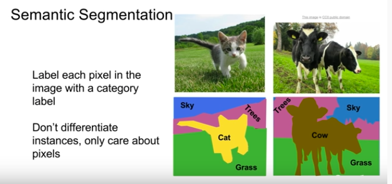</img>

* 所以你可以想像，做semantic segmentation一種可能的做法是Sliding window，當作分類問題，這樣可以work，但是基本上有一堆缺點。

</img>
  * 計算量超級超級大
  * 各個小塊與小塊之間會重疊計算很多次
  * 所以這是一個糟糕的idea但是開始思考semantic segmenation時會想到這一步

</img>
* 第2個想法則是Full Convoliutional Network(FCN)
  * 然後用個zero padding，直接學爆他
  * 最後一層Convolution layer就直接output $w \times h \times c$
  * 然後我們可以想像loss function就是pixel level cross entropy然後average(sum) over all pixels，per data or per mini-batch。
  * 接著就back propagation
  * QA1 : training data怎麼拿? 
    * 基本上非常貴，所以我們會在網路上畫畫圖什麼的，然後把區域圈出來說，這是貓，這樣子
  * QA2 : loss function可以在講細一點嗎?
    * 就是上面我理解的這樣，沒啥新的
  * QA3 : 這樣的做法是否藏著一個假設 : 我們知道model推論時的圖片會看到什麼，就好像我們知道所有的訓練類別一樣
    * 是的，所以如果沒看過的class，就會fail掉
  * 在實務上，CNN的架構會稍作調整，不會全部的size都是跟input image相同，通常會做一些down sampling以及up sampling

</img>

### Upsampling?
你可能會好奇說，upsampling這種東西!?!?!?!?
1. 在網路裡面到底長怎樣?
2. 參數增加時是不是有什麼可用的策略或是思考的著力點?
好的現在我們來講Upsampling的策略
其中一招叫做**Unpooling**

#### Unpooling
* 有pooling，那當然就要有unpooling囉
* 這裡我們舉例max pooling or average pooling

下兩張圖對應到 input 2x2 output 4x4的 upsampling
1. 下左圖對應到的是使用average pooling，我們先把output展開，然後怎麼做呢，就取展開點的那個值，就是一個**anti average pooling**，稱作Nearest Neighbor
2. 下右圖則是對應到max pooling，因為已經取了max，所以基本上也回不去了，其他的就補0(這稱作Bed of Nails)，這樣取名是因為你會有一大堆0，然後這些max pooling的值會是一些peak，整張圖就會變成很平坦但是每過幾格就會有peak這樣

</img>

所以說基本上你會在網路架構中看到Encoder的部分有一個Max pooling，那麼Decoder那邊就會有一個Unpooling(Bad of Nails)，而且還要記得對應做max pooling的位置，因為Unpooling的時候要用到(the corresponding max pooling step earlier in the network)，在下圖中用特別的顏色做標示

</img>

* QA : 為甚麼這樣會是有用的? - 因為pooling丟失了圖片的空間訊息，但是我們的預測希望在pixel level，因此我們希望把空間訊息補回來，所以才使用unpooling
* QA : 這樣的設計對backpropergagtion有什麼影響嗎 - 基本沒對參數傳遞沒有造成什麼影響


#### Transpose Convolution
* 另一種你會看到拿來做Upsampling的方法 - Transpose Convolution
* 剛剛講到的unpooling，都只是固定形式的函數，他們並沒有辦法被更改(或稱為被學習)，那麼convolution應該要對應到什麼? inverse convolution?
* 有的，有這樣的東西，而且說穿了其實只是另一種convoltuion

* Recall 最簡單的3x3 convoltuion stride 1 pad 1
</img>

* 以下則是3x3 convoltuion **stride 2** pad 1
</img>
* 我們可以看到當stride = 2時，基本上就是對原本的圖做down sampling，factor為2

* 所以說我們想要剛剛上面提到的反操作，怎麼做呢?
* 這次我們不做內積，對於input的pixel，將其當作weight，經過一個filter，基於一個scaler x vector 的乘法丟到output裡面，然後把重疊的部分加起來

</img>

所以2D的版本就長成這樣

</img>
同樣地, stride就會變成input和output之間的放大倍率，而他有多種名稱，`Deconvolution`, `Upconvolution`, `Fractionally strided convolution`, `Backward strided convolution`，但其實你可以看到，他就只是一種convolution

##### Convolution as Matrix Multiplication(1D)
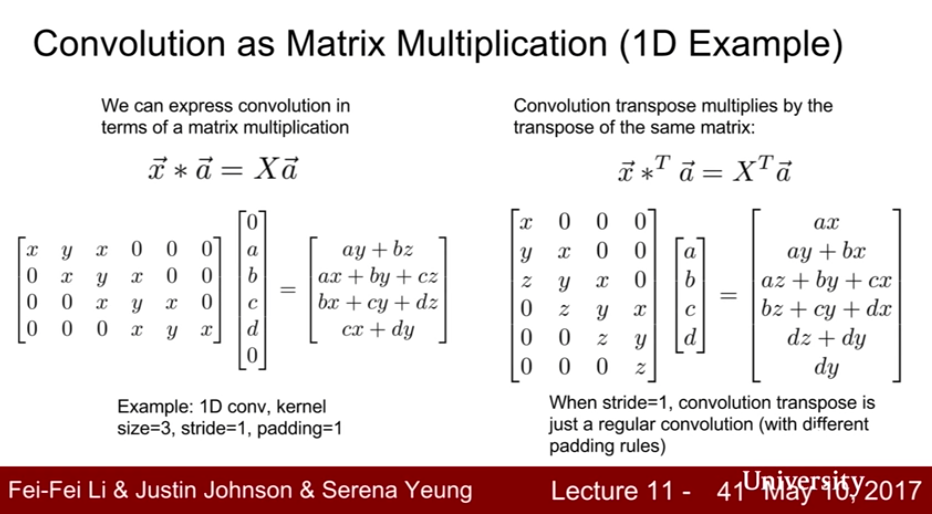</img>

</img>

* QAs : 重疊的部分為什麼是sum而不是average? - 這是一個好問題，其實sum只是為了符合tranpose convolution，但是這樣確實有一個問題就是重疊的部分會有比較大的scale，所以在upsampling的部分也有學者去探討這個問題

</img>

以上就是semantic segmentation的基本概念，接下來我想談談Classification + Localization的方法

</img>


# Classification + Localization
* 基於一個基本的假設，圖片中有一個或是多個你想尋找的物體
* 同樣的，我們會有一個巨大的網路(這裡假設一個全監督的情況)，例如這邊是AlexNet，但這次我們希望輸出的是Class Scores以及Box Corrdinates，如此一來我們產生了兩項loss, 一項是classification loss(這裡使用Softmax-loss)，另一項則是localization loss(這裡使用L2 loss)，會有其他人用L1, smooth L1，或是其他的，但是基本上就是在處理regression loss
* QAs:
  * Q : 一次做兩件事沒有問題嗎? 例如分錯的時候?
  * A : 大部分的時候運作起來沒什麼問題，但是分錯類的時候就會有問題了，所以有些人對此做了改進
  * Q : 這兩種loss的單位不同，是不是貢獻到total loss的時候需要經過一些normolizarion?
  * A : 在這樣的場景下，我們會將此稱為multi-task loss，這樣的場景下，我們會設置一組參數來控制兩組loss，在貢獻到total loss當中，然後把最後的loss取gradient，這挺tricky的，因為這組weight是一個你必須給定的參數，但這個參數和以前你看到的超參數不太一樣，這組參數的變更會更改整個loss function，所以要設置這一組參數其實有一些困難的地方，在實務場景上，case by case，通常會用最後的performance metric來選這個值要是多少
  * Q : 為什麼不分開作要一起做?
  * A : 也可以分開做，但是一起做可以更充分的利用資訊

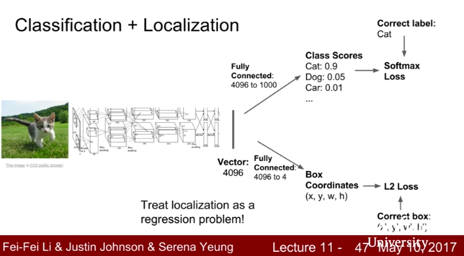</img>

## Human Pose Estimation

</img>

* 也有另一種形式的定位，就是Pose Estimation

作法基本上就是一樣經過一個大的網路，最後出了一個feature vector，然後分成14x2的matrix，接著用regression loss來進行處理，這裡有趣的是，應該會針對點座標做L2 loss，在全部相加起來

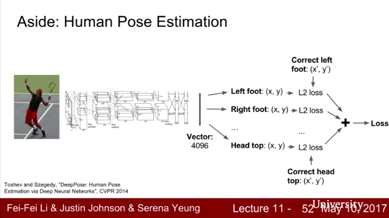</img>

* localization有一個令人困擾的地方是，你不總是知道圖片中有幾個你想辨識的物體

# Object Detection

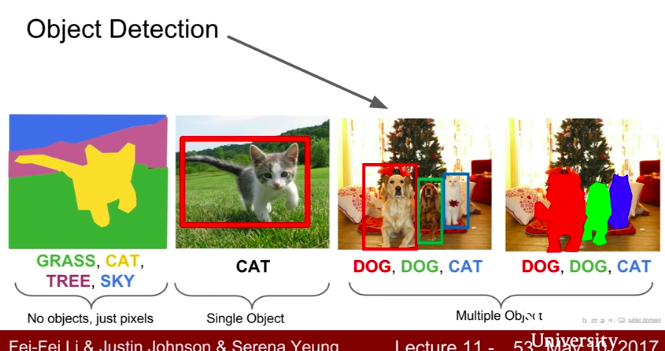</img>

* 這是一個很有料的主題，幾乎是電腦視覺的核心
* 同樣地我們先從一個固定種類的方法開始講起
* 下圖是一個在conv 出現之前的PASCAL VOC 物件偵測比賽的準確度，我們可以看到自從conv出現之後持續上升!

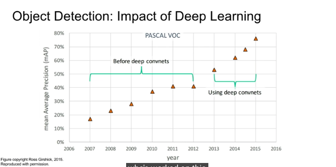</img>

* 所以至今來說，在此Dataset或許已經被屠榜了，現在更常提的是COCO dataset

## Challenging problem - how many objects?
* object detection 和 object localization 有一個差異在於，後者通常只有一個，前者你不確定有幾個，也有可能沒有

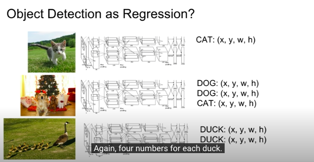</img>

* 所以把它想成一個regression問題會覺得還缺少了某些東西，接下來介紹一下歷史

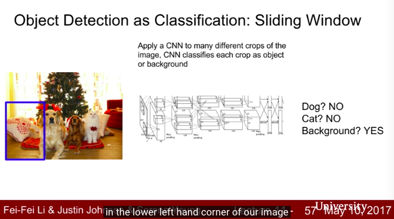</img>
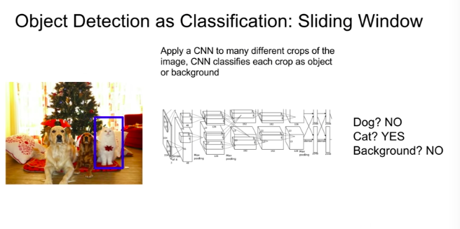</img>

* No dog, no cat, background yes

```
How do you chooce the crop?
* size?
* stride every time? 
```
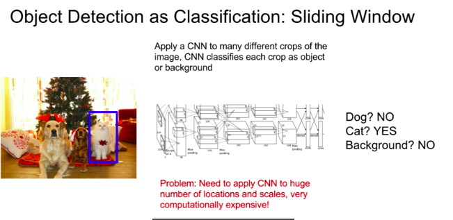</img>

# Region Proposals

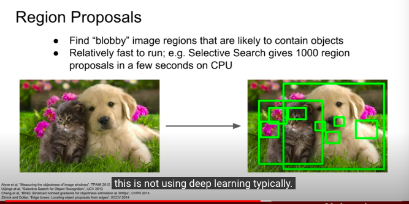</img>

* use pixel similarity to choose some crop, then do classification - Selective search
* kinds of these methods call regional proposals network method

* 2s CPU, 2k bboxes
* 雖然雜訊很多，但是recall很高，幾乎一選都會包含到 :P

## Which is R-CNN
* get Regions of Interests (RoI) from a proposal method(~2k)
* Warped image regions due to difference size of ROI, normalize them, then feed into cnn 

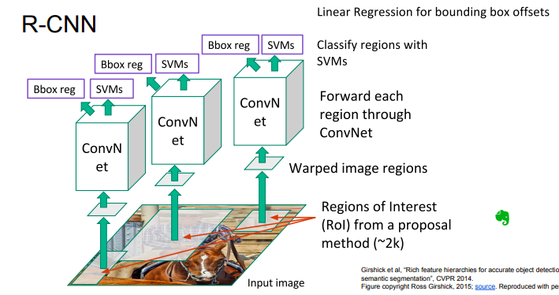</img>

* multi task loss conbine localization and classification

* QA - 長寬比對準確度的影響? 有一些實驗去做，但是我不確定
* QA - RoI一定要長方形嗎? 其實沒有只是因為長方形比較方便，你去看一些instance segmentation的論文他們的RoI並不是方形的
* QA - R-CNN確切來說有學習嗎? 你也可以說沒有，這些確實都是確定的算法 - imagenet, ss, svm
* QA - final nn pred一定會比RoI小嗎? 不一定，有些時候RoI只有選到部分，但是NN覺得他是殘缺，會把他補上
* QA - RoI一定會框架到gt嗎? 大部分的時候是，但是你其實加一個叫做背景的class一起辨識
* QA - 資料長相? - 要有物件名稱跟標籤，當然會有很多論文去說明，資料不齊全時，資料不夠時，資料很髒時，是否有對應方法去處理

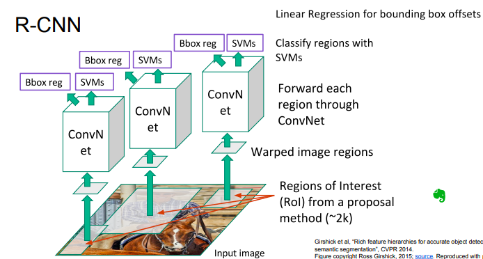</img>

## Fast R-CNN
* 這次RoI不用Rule-Based的方法做了(至少不是全部做)，用CNN，我們先得到一層feature map，然後再用Selective Search，對 feature map來取crops!
* 接著同樣的，把所有的RoI變成同樣的fix size - 取個名字叫做ROI Pooling layer，其實就是加上padding, scale down 等等的，但這裡需要讓這一層也可能做BP，所以做了一些修正
* 然後塞進fc layer, predict softmax classifer and boundingnox regressors

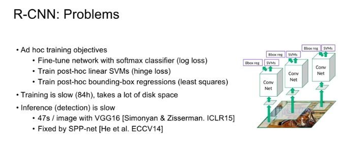</img>
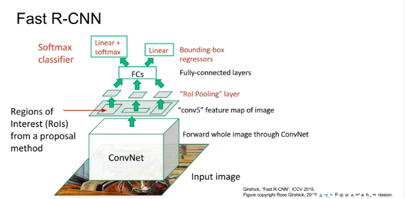</img>
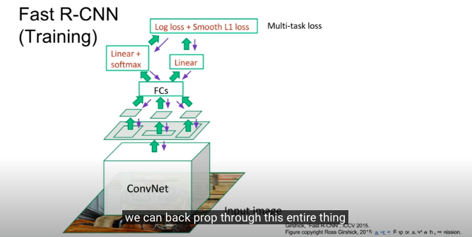</img>
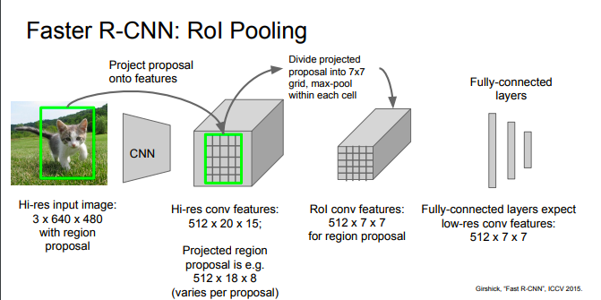</img>
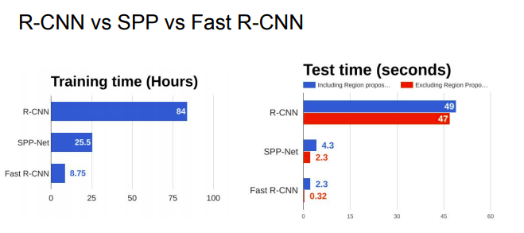</img>

* R-CNN -> Fast R-CNN 的bottleneck再也不是網路本身而是Selective Search! what a succeed!

## **Faster** R-CNN
**Make CNN do proposals!**
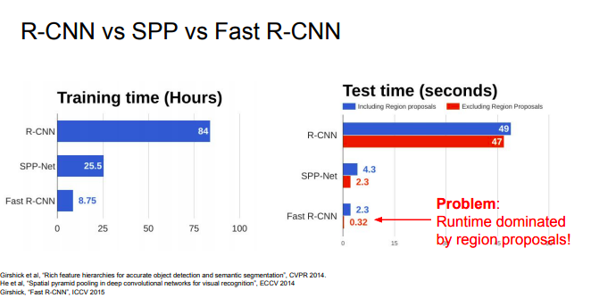</img>

* use a subnetwork - Region Proposal Network(RPN) to predict proposals from feature maps

* RPN do object/no object
* RPN regress box coordinates
* output ROI pooling
* final classification loss and bounding box loss
* **4 task network!**

* QA 多任務網路是一種regularization? - 不全然是，有一些實驗去做這個，但講師無法回答，但是在faster R-CNN的paper中，有一節是在實驗

```
What if share RPN network output as feature?
What if do it separately?
end up in minor difference, not a dramatic difference :P
the conclusion is learning it in one, it is computartionally cheaper
```

* QA regional proposal network怎麼train? 沒有gt啊! 其實有的，不那麼細節地說， 你可以拿著框好的ground truth去做selective search，IoU在某個threshold以上就是true regional proposal, 小於則是negive，但是這裡面有很多dark magic，真的有興趣可以去研究XD，這算是minor issue
* QA RPN的classification loss? - 通常用binary，但也有不用的，這裡也是毛有點多 hairy通常在英文裡面也表示為恐怖的，驚險刺激的XD

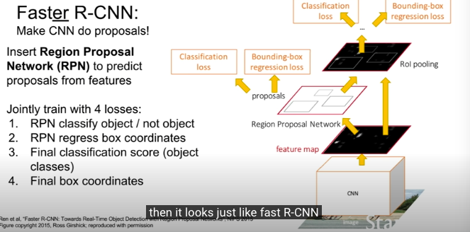</img>

* 這些就是 R-CNN family or called region-based methods for object detection

# Detection without Proposals : YOLO / SSD

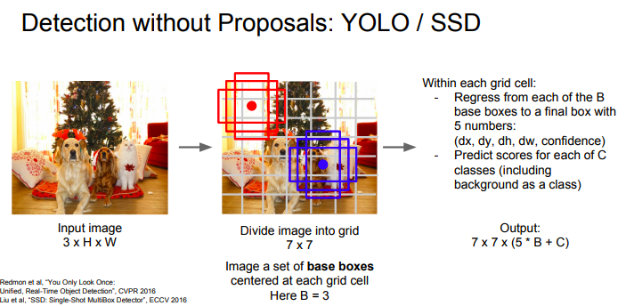</img>

* YOLO / SSD - came out almost the same time
* 不針對每個獨立的區塊做處理，想要一次ok，採用regression的思維來處理
* 讓NN只對圖片做一次預測，這樣就快起來了

1. 把圖切分成grid, $S$, 每一個grid會有base bounding box，number of bbox $B$，這裡$B=3$，in practice, use more than 3

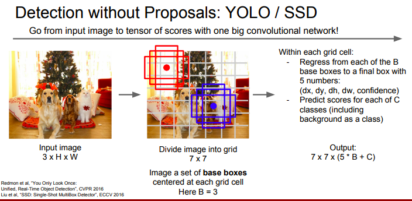</img>
input : image 
output : 3 dimensional tensor : $7 \times 7 \times (5B+C)$

* RPN和這兩種網路有一四類似觀念的味道
* faster R-CNN : treating the regional proposal step as kind of an end to end regression problem
* Single shot / yolo : do once with a single forwar pass

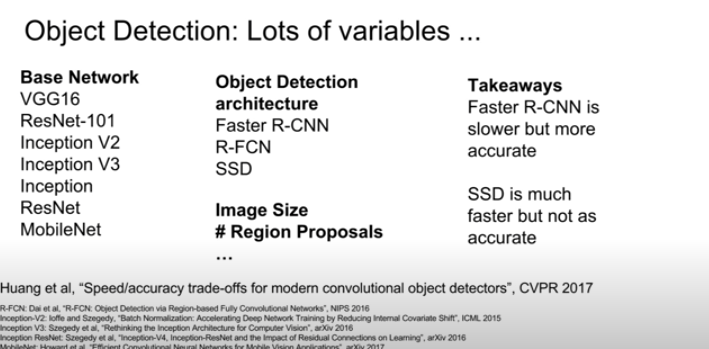</img>

# Oject detection + captioning = Dense Csaptioning

</img>
* 做了Region proposal之後，不放到classification，放到RNN裡面，變成caption
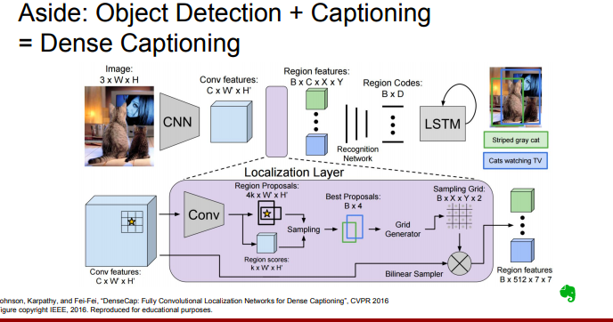</img>


# Instance Segmentation

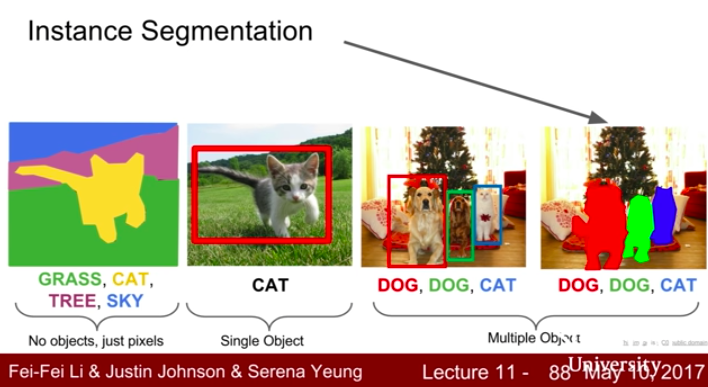</img>

* Combine RPN-like and segmentation!

Mask R-CNN !

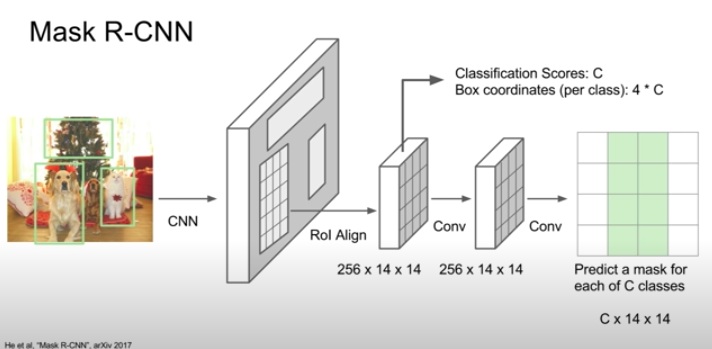</img>

* RPN -> 不做 regression, classification
* anti-convolution!

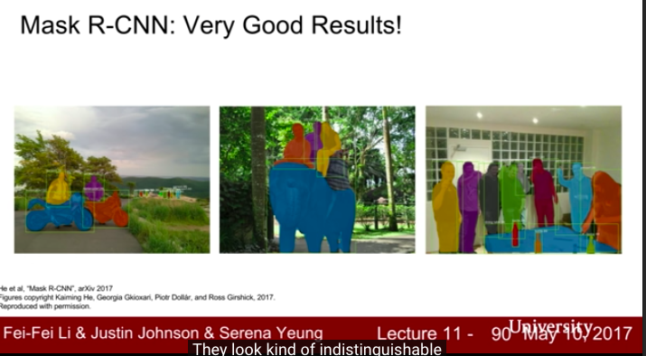</img>

* the mask R-CNN unified everything today!

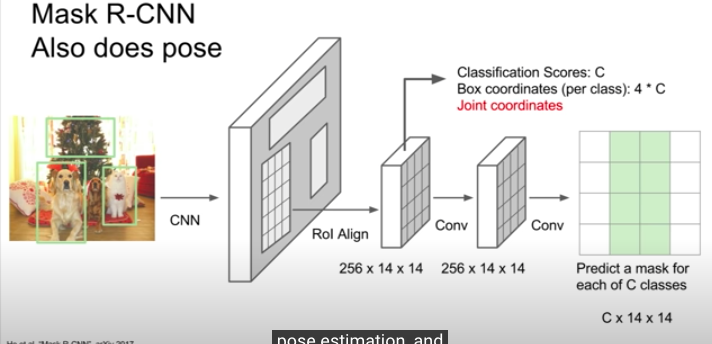</img>

* only could do pose!

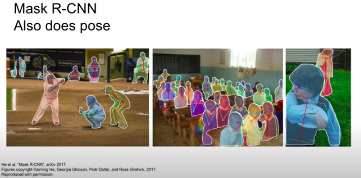</img>

* maybe 5 frames per second!

* QA how much training data do we need?
  * trained on MS COCO, 200,000(20萬筆data)，80 category，on average 5 or 6 instance per image, each category 1.25w筆data
  * transfer learning is hot, less data, same performance


# Other Resource
* [semantic segmentation](https://kknews.cc/zh-tw/tech/mgqvl9.html)
  * 傳統使用Clustering，像是Mean shift，15年之後隨著FCN的發展，將DL帶入semantic segmentation
* [SEMANTIC IMAGE SEGMENTATION WITH DEEP CONVOLUTIONAL NETS AND FULLY CONNECTED CRFS - 菜逼八看論文
](https://ithelp.ithome.com.tw/articles/10223557)
  * FCN, 2014年, citation : 2215 - 從圖片萃取feature vector相對容易，從feature vector重建image則相對難，CNN界的AutoEncoder!
* [YOLO you only look once](https://www.cv-foundation.org/openaccess/content_cvpr_2016/papers/Redmon_You_Only_Look_CVPR_2016_paper.pdf)
* [you only look once keras implementation, check network and loss function](https://www.google.com/search?q=you+only+look+once+keras+source+code&oq=you+only+look+once+keras+source+code&aqs=chrome..69i57j69i64.10155j0j1&sourceid=chrome&ie=UTF-8)
* [Speed/accuracy trade-offs for modern convolutional object detectors 2017](http://openaccess.thecvf.com/content_cvpr_2017/papers/Huang_SpeedAccuracy_Trade-Offs_for_CVPR_2017_paper.pdf)