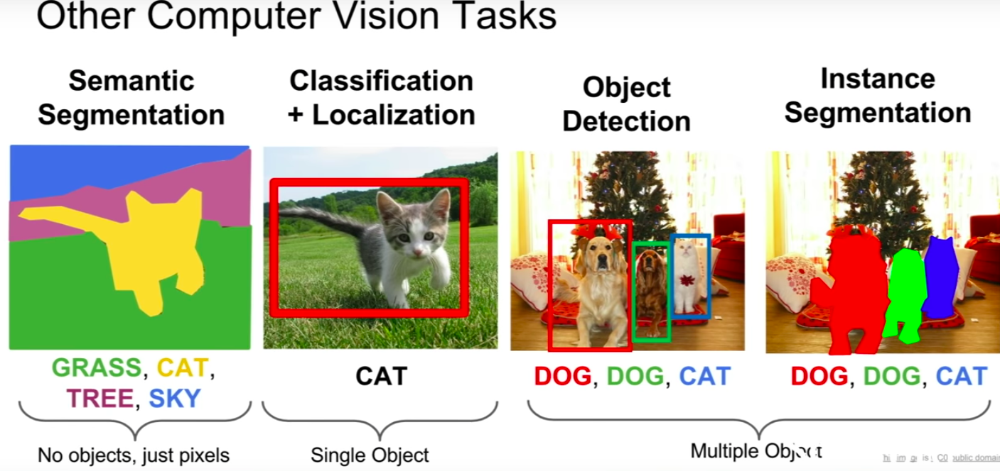

# detection and segmentation

</img>

</img>

</img>

# Semantic Segmentation
input : $N \times M \times 3$
output : $N \times M \times c$ 
* c is the category the pixel belong to.
* 對於semantic segmentation這樣的任務一個有趣的地方是，他並不是要區分實體
* 所以在下圖中，右邊兩張圖都是牛(cow)，但我們不care這兩隻牛有沒有分開，這樣能夠比較好的處理整個任務(當然，把牛分開應該就是所謂的instance segmentation)

[TBD : 10:48](https://www.youtube.com/watch?v=nDPWywWRIRo&list=PLf7L7Kg8_FNxHATtLwDceyh72QQL9pvpQ&index=12&t=0s)

# Other Resource
* [semantic segmentation](https://kknews.cc/zh-tw/tech/mgqvl9.html)
  * 傳統使用Clustering，像是Mean shift，15年之後隨著FCN的發展，將DL帶入semantic segmentation
* [SEMANTIC IMAGE SEGMENTATION WITH DEEP CONVOLUTIONAL NETS AND FULLY CONNECTED CRFS - 菜逼八看論文
](https://ithelp.ithome.com.tw/articles/10223557)
  * FCN, 2014年, citation : 2215 - 從圖片萃取feature vector相對容易，從feature vector重建image則相對難，CNN界的AutoEncoder!