# Resource
https://www.youtube.com/watch?v=eZdOkDtYMoo&list=PL3FW7Lu3i5JvHM8ljYj-zLfQRF3EO8sYv&index=15

</img>

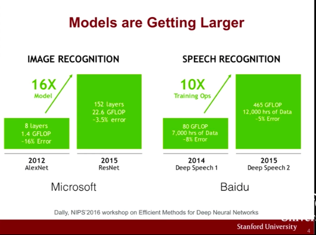</img>

</img>

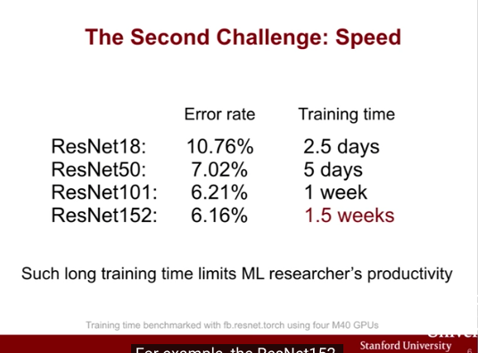</img>

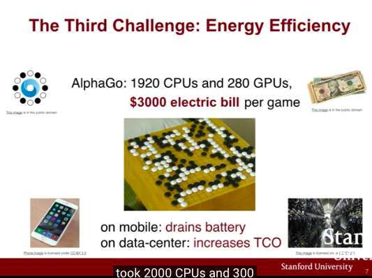</img>

</img>

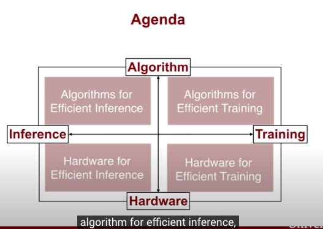</img>

* dive to 4 parts 

# Hardware 101
## Device
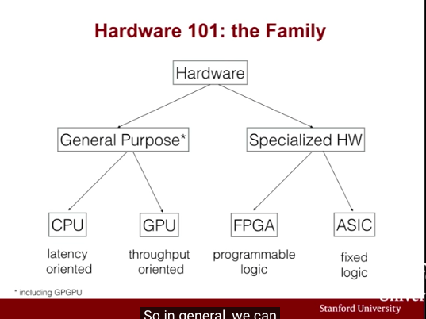</img>

* GPU weak memory
* CPU weak single thread

## Number Rrpresentation

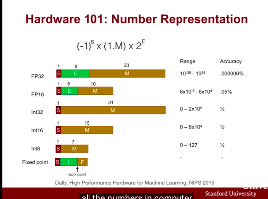</img>

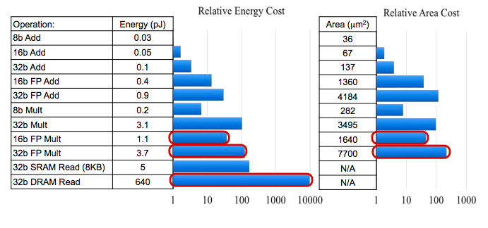</img>

## Algorithm for Efficient Inference

### Network Puring

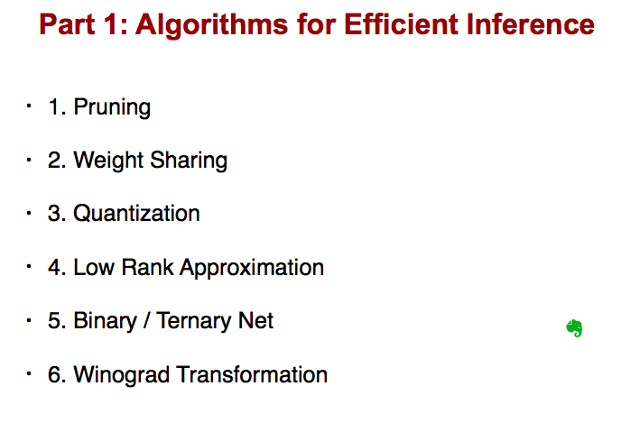</img>

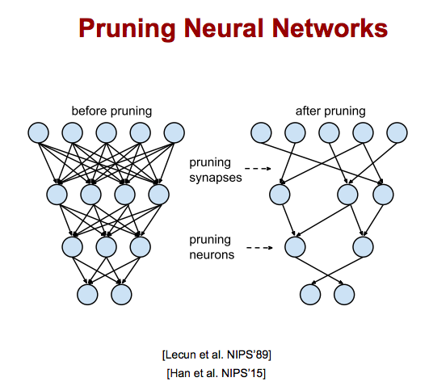</img>

* 1986年第一次發表，現在被從新拿出來探討
* AlexNet -> 10x less connection with 6m

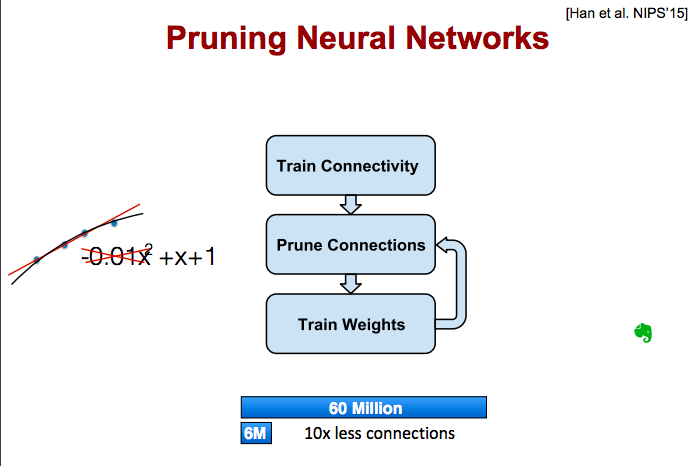</img>

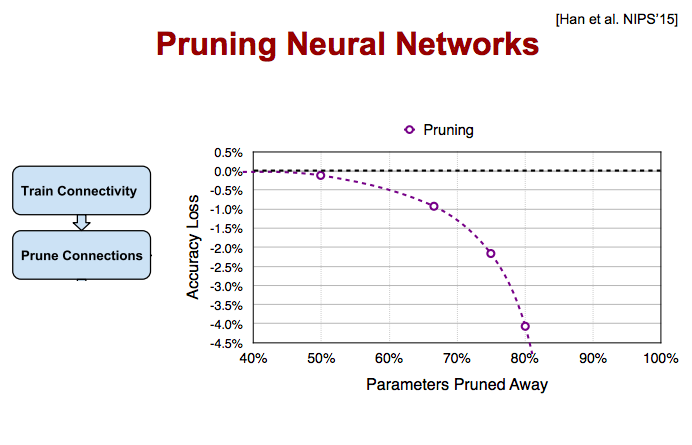</img>

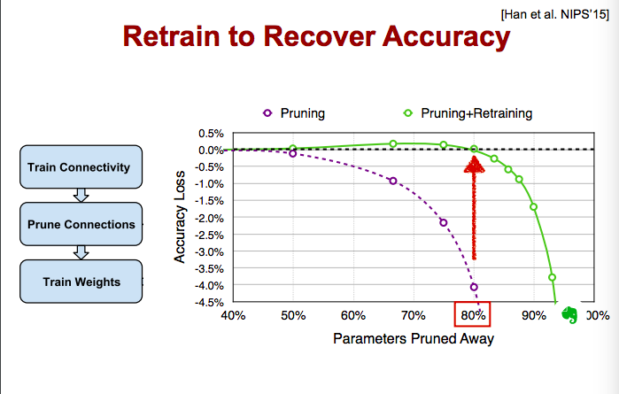</img>

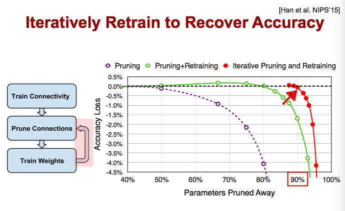</img>

* CNN, RNN, LSTM also works!

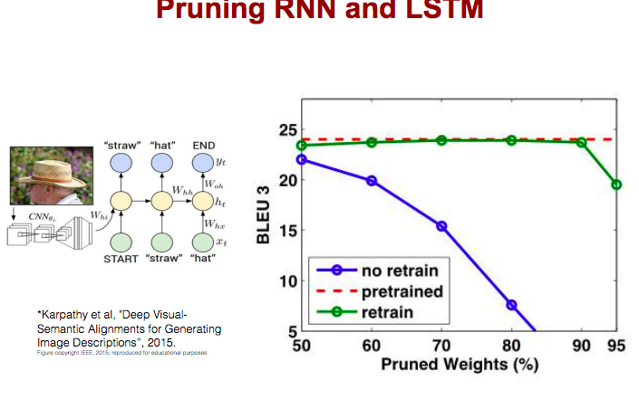</img>

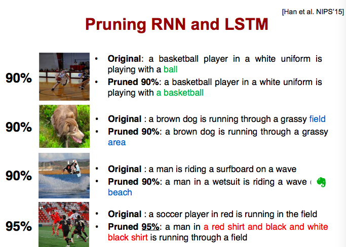</img>

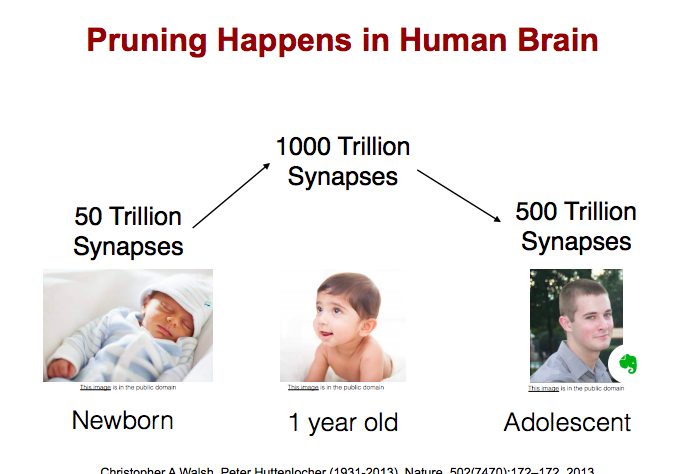</img>

* QA  how do we deal with zero connections? - force them(the output) to zero
* QA how do you decide which weight to drop?
  * so very simple, sort all weight, small weights, drop it - maybe not, the figure show not exactly
  * QA any threshold that I decide?

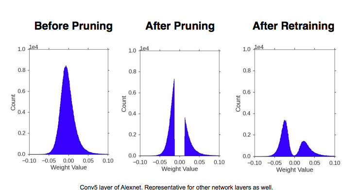</img>
### Weight Sharing

[TBC, 14.04](https://www.youtube.com/watch?v=eZdOkDtYMoo&list=PL3FW7Lu3i5JvHM8ljYj-zLfQRF3EO8sYv&index=15)****

# Other Resource
[Learning both Weights and Connections for Efficient
Neural Networks by Song Han 2015, 2336](http://papers.nips.cc/paper/5784-learning-both-weights-and-connections-for-efficient-neural-network.pdf)