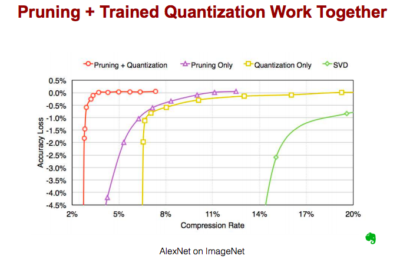

# Resource
Stanford University
https://www.youtube.com/watch?v=eZdOkDtYMoo&list=PL3FW7Lu3i5JvHM8ljYj-zLfQRF3EO8sYv&index=15

</img>

</img>

</img>

</img>

</img>

</img>

</img>

* dive to 4 parts 

# Hardware 101
## Device
</img>

* GPU weak memory
* CPU weak single thread

## Number Rrpresentation

</img>

</img>

## Algorithm for Efficient Inference

### Network Puring

</img>

</img>

* 1986年第一次發表，現在被從新拿出來探討
* AlexNet -> 10x less connection with 6m

</img>

</img>

</img>

</img>

* CNN, RNN, LSTM also works!

</img>

</img>

</img>

* QA  how do we deal with zero connections? - force them(the output) to zero
* QA how do you decide which weight to drop?
  * so very simple, sort all weight, small weights, drop it - maybe not, the figure show not exactly
  * QA any threshold that I decide?

</img>

### Weight Sharing
* similar weights -> get it into one!
* details weight leads big model, reduce them, and might slightly release overfitting

</img>

* using simple clustering method to do it, or just rule based
</img>
</img>
16 times saving!

* How to train this? - when we do BP, they are binind together

* trained quantization if we have centroids, groupby the gradient -> sum it to get quantization gradient

* add graident to previous centroids
</img>
</img>

* result
</img>
</img>
only sixteeen discrete number, means we can use four bits to represent

</img>

* more bits, more precision weight, when we decrease to 4 bits, accuracy drop very fast on **conv and fc layer**

</img>

* combine them together
* note that, if we do not have much time, do the SVD!

# Huffman Coding

</img>

in short,
In-frequent weights : use more,
Frequent weights : use less

</img>

</img>

compression ratio 10x ~ 40x without accuracy decrease

# Compact model - training our own small model

</img>

</img>

we can do that! SqueezeNet + Deep Compression

</img>
</img>

# Quantization

* why/how do thwy use in TPU design
* All the TPU designs use only eight bit for inference
* max number, min number, how many bits are enough to represent this dynamic range

</img>
</img>
* basically good to fix8

# low rank Approximation
turns one conv to 2 conv

</img>
</img>

* kind of dimension reduction using **1x1 conv**
* 講的不是很清楚，基本上speed up 5x大概也只減少了7% err

[TBC, 22.43](https://www.youtube.com/watch?v=eZdOkDtYMoo&list=PL3FW7Lu3i5JvHM8ljYj-zLfQRF3EO8sYv&index=15)****
1. Pruning(checked)
2. Weight Sharing(checked)
3. Quantization(?)
4. Low Rank Approximation(?)
5. Binary / Ternary Net
6. Winograd Transformation

# Other Resource
[Learning both Weights and Connections for Efficient Neural Networks by Song Han 2015, 2336](http://papers.nips.cc/paper/5784-learning-both-weights-and-connections-for-efficient-neural-network.pdf)

[Deep Compression: Compressing Deep Neural Networks with Pruning, Trained Quantization and Huffman Coding by Song Han 2016, 3462](https://arxiv.org/pdf/1510.00149.pdf)

[SqueezeNet: AlexNet-level accuracy with 50x fewer parameters and <0.5MB model size 2017, 2564+](https://arxiv.org/pdf/1602.07360.pdf)
  * you could find tensorflow/keras/pytorch implementation

[Efficient and Accurate Approximations of Nonlinear Convolutional Networks 2015, 175+](https://www.cv-foundation.org/openaccess/content_cvpr_2015/papers/Zhang_Efficient_and_Accurate_2015_CVPR_paper.pdf)