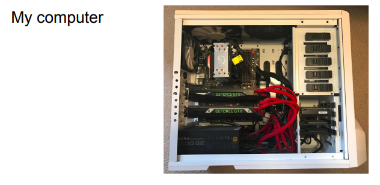
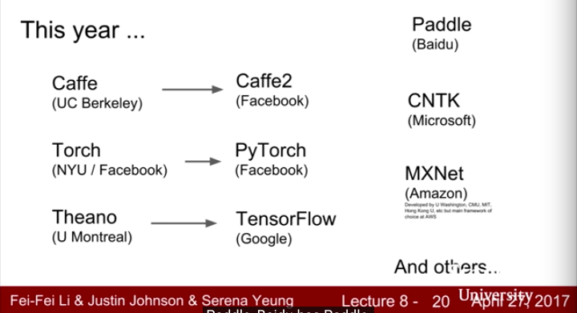

# Reousrce
Stanford University 
https://www.youtube.com/watch?v=6SlgtELqOWc&list=PL3FW7Lu3i5JvHM8ljYj-zLfQRF3EO8sYv&index=8

[all the slides](http://cs231n.stanford.edu/slides/2017/cs231n_2017_lecture8.pdf)

</img>
</img>
</img>
</img>
</img>

# GPU
Graphics Processing Uint, Graphics card, originally render computer graphics, especially around games

</img>

* almost NVIDIA in deep learning XD
* good solution when training...

</img> 

* CPU sharing memory with system
* GPU have their own memory(their own caching system)
* convolution is a matrix dot problem

</img>

* actually really hard to using write cuda, then they are higher-level APIs
* cudnn - almost all the operation in deep learning
* OpenCL
* in fact, never write any cuda code in your project, so. 

</img>

* commonly, 60x - 70x
* benchmark like that basically unfair, he might not tuning good performance on CPU, this is just a out-of-box benchmark like, tensorflow cpu vs tensorflow gpu, torch cpu vs torch gpu

</img>

* cudnn boost about 2x ~ 3x, make sure you're using cudnn!

</img>

</img>

* **might be a bottleneck when reading data and tranferring to GPU**

* most general solution is multi-processing data io
  * basically like reading data into quene
  * feed queue into gpu for train

* 2016...
</img>

* 2017...

</img>

* intesting things is, new generation library badically come from industry

</img>

# hello world about computational graph

</img>

# high level of tensorflow wrapper

</img>

</img>

</img>

# Pytorch

</img>

</img>

</img>

# high level wrapper pytorch nn
</img>

# Custom
</img>

# DataLoaders!

</img>

# Pretrained MODELS

</img>

# Visualization

</img>

# Static vs Dynamic Graph

</img>

</img>

</img>

## Conditional
</img>

## Loops

</img>

#  Caffe

</img> 

</img> 

# advice

</img> 

</img> 

