# Reousrce
Stanford University 
https://www.youtube.com/watch?v=DAOcjicFr1Y

# Deep Learning Frameworks
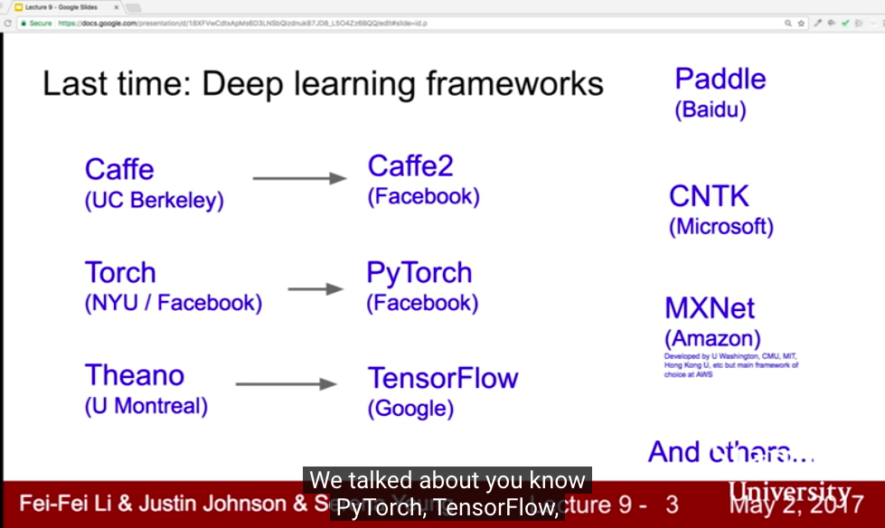</img>
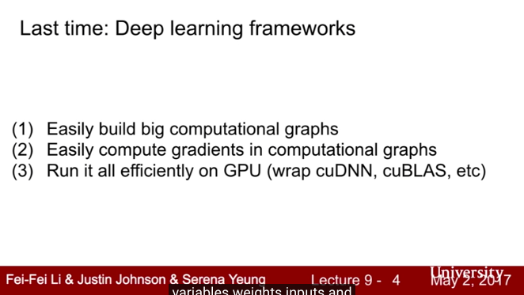</img>

# CNN architectures
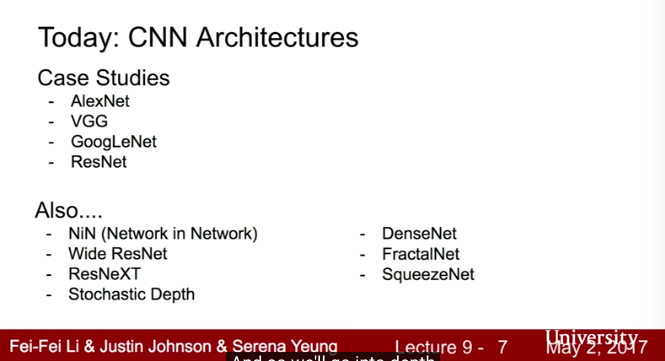</img>

# LeNet

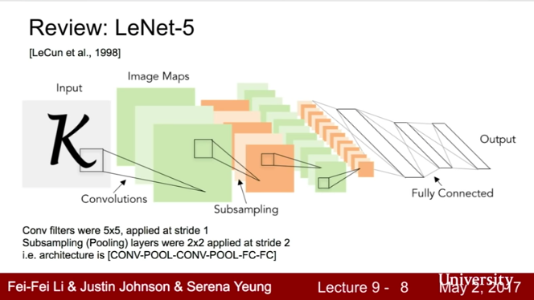</img>

# AlexNet - the first large cnn
* beat rest of non-deep learning based method on imagenet
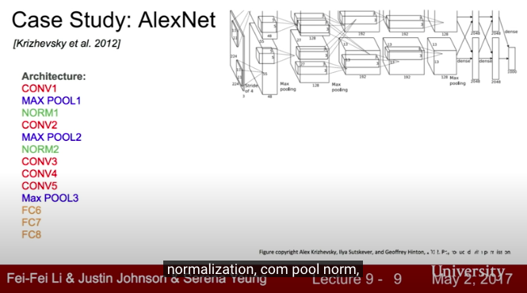</img>

* first layer $55 \times 55 \times 96$
* parameters $11 \times 11 \times 3 \times 96$ = 35K
* TODO feature map height? depends on how many filters you have in the layer =)
* Pooling layer $3 \times 3$ stride 2 output : $27 \times 27 \ times 96$
* parameters : 0
* first ues of ReLU

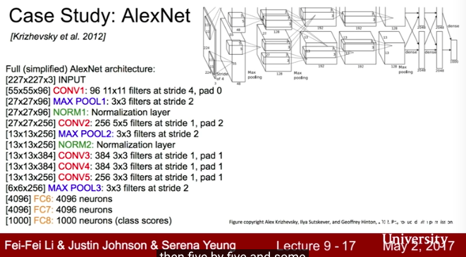</img>
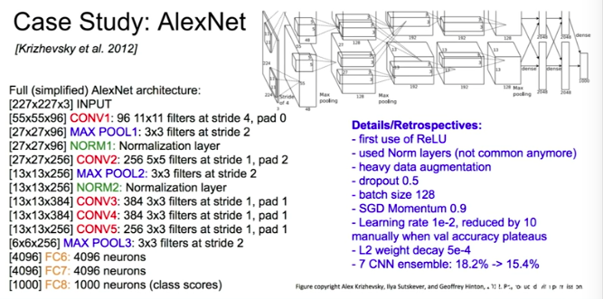</img>

* the second just because lack of GPU memory, then splits it into two parts
* 55 x 55 x 96 -> 55 x 55 x 48 x 2(two GPUS)

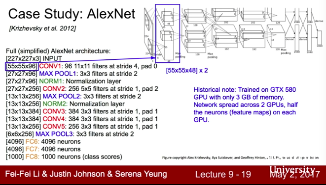</img>

* result

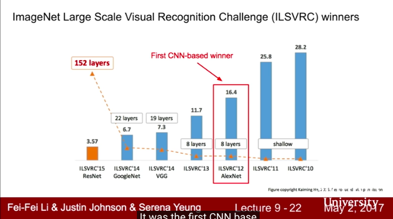</img>

* still be used in transfer learning task

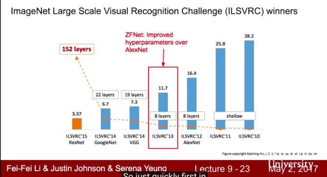</img>  

* QA why CNN beat all of them? - no idea, but it is the first deep learning based approach

# ZFNet - 2013 imagenet
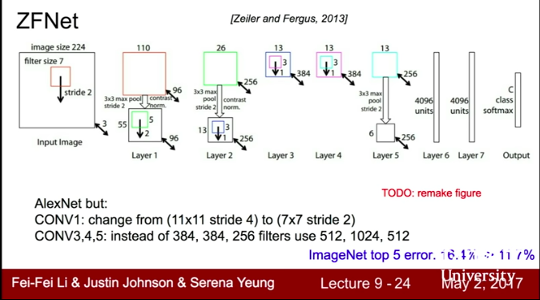</img>
* ZFNet basically tuning hyperparameter like strid, # of filters, and so on

# trands

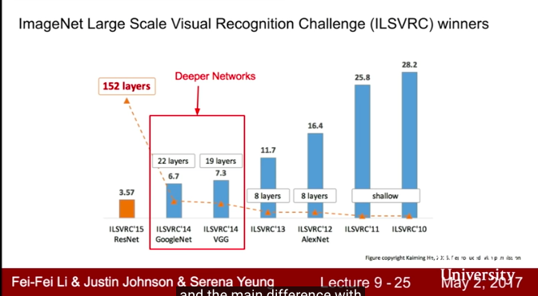</img>
8 layer -> 19 layer(VGG) -> 22 layer(GoogleNet) -> 152 layer (insane!)

# VGG
* small filters, deepper networks, catching more details :p
* also fewer params - which is interesting
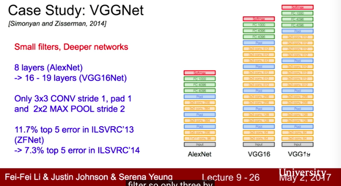</img>  
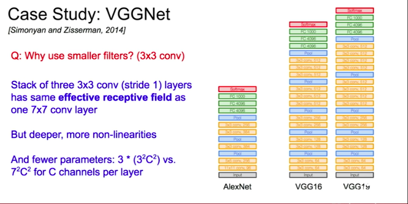</img>
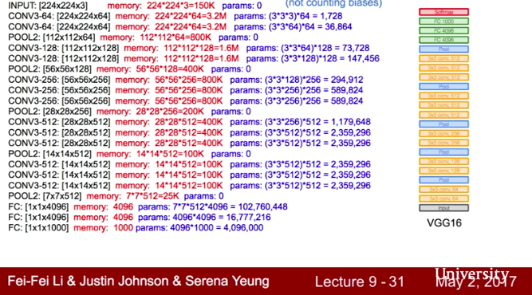</img>
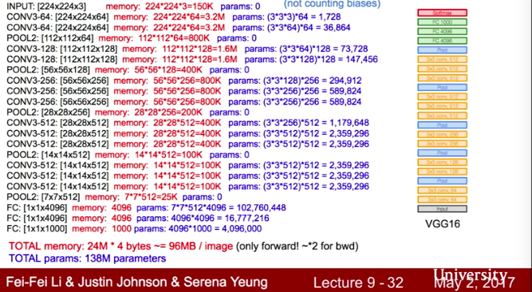</img>

* 4 bytes is float32 representation
* 100M / image when doing forward pass during whole training
* 138M parameters(VGG 19), 60M(AlexNet)
* QA depth of network / depth of img (channel)
* QA when people design network, deeper based on what?
  * basically more computational resource, better result
  * you could use pooling layer to decrease the params - maybe check 李弘毅(Why Deep)
  * abc
* QA we don't need params them all right? - true, but we also do BP to update weights, means update them in memory is more efficient

</img>

* Some complexity analysis

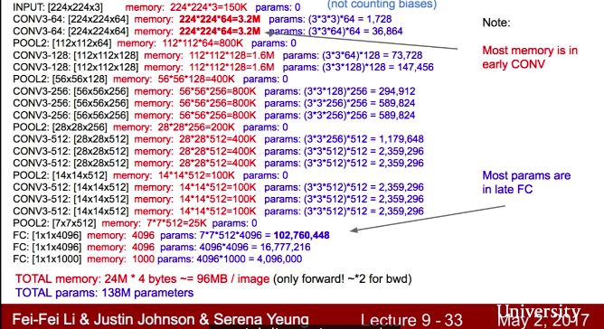</img>
* standard graph representation like 3x3 conv, 64, conv1-1(3x3 filter, 64 kernels)

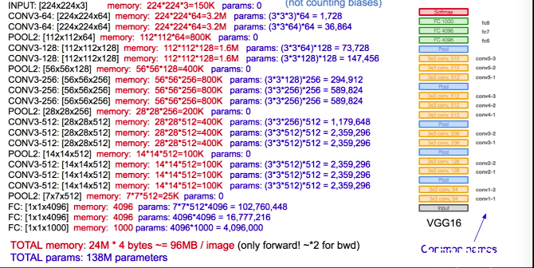</img>

* some details
* fc7 is a good feature representation(may uesd in transfer learning)
* QA - localization / detection difference? only one object / multiple objects

# GoogleLent

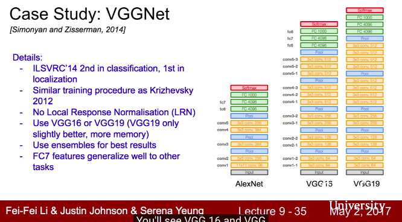</img>

* New design - inception module
* no FC layer
* only 5M params 12x less than AlexNet

## Inception module
* local network topology

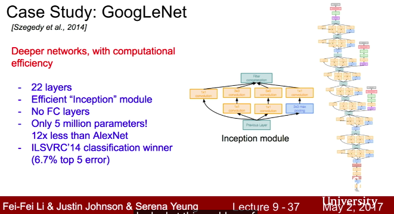</img>

* concatenate all filter outputs together depth-wise
* QA if we want to do this - computational exprensive

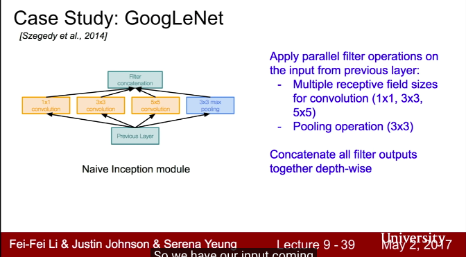</img>
* $f \times f$ then padding with zero
* QA what is $1 \times 1$conv?

[TBC 36:01](https://www.youtube.com/watch?v=DAOcjicFr1Y)

# Other Resource
* [if gary still coming.... show him this](https://brohrer.mcknote.com/zh-Hant/how_machine_learning_works/how_convolutional_neural_networks_work.html)