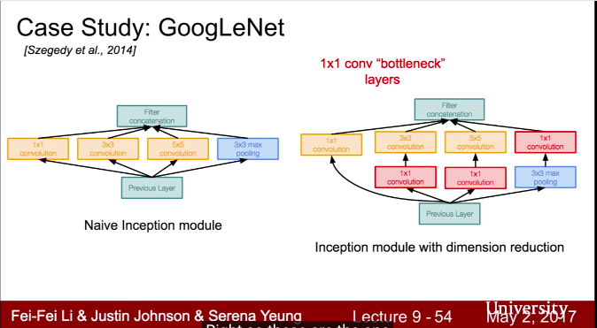
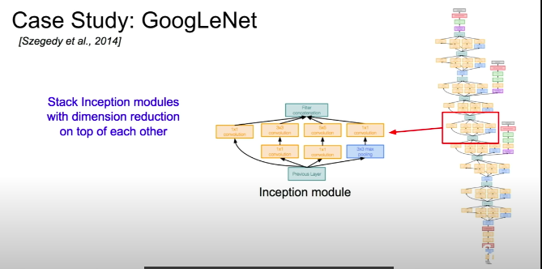
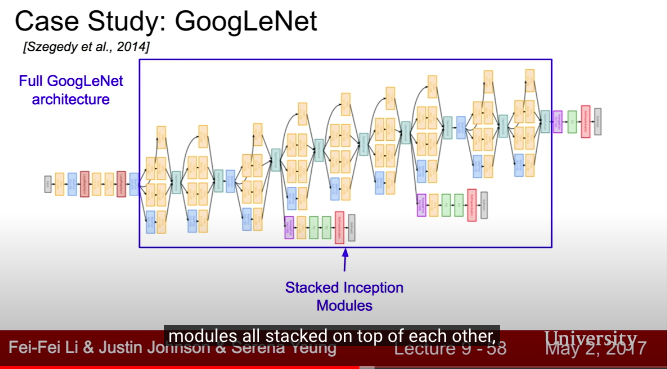

# Reousrce
Stanford University 
https://www.youtube.com/watch?v=DAOcjicFr1Y

# Deep Learning Frameworks
</img>
</img>

# CNN architectures
</img>

# LeNet

</img>

# AlexNet - the first large cnn
* beat rest of non-deep learning based method on imagenet
</img>

* first layer $55 \times 55 \times 96$
* parameters $11 \times 11 \times 3 \times 96$ = 35K
* TODO feature map height? depends on how many filters you have in the layer =)
* Pooling layer $3 \times 3$ stride 2 output : $27 \times 27 \ times 96$
* parameters : 0
* first ues of ReLU

</img>
</img>

* the second just because lack of GPU memory, then splits it into two parts
* 55 x 55 x 96 -> 55 x 55 x 48 x 2(two GPUS)

</img>

* result

</img>

* still be used in transfer learning task

</img>  

* QA why CNN beat all of them? - no idea, but it is the first deep learning based approach

# ZFNet - 2013 imagenet
</img>
* ZFNet basically tuning hyperparameter like strid, # of filters, and so on

# trands

</img>
8 layer -> 19 layer(VGG) -> 22 layer(GoogleNet) -> 152 layer (insane!)

# VGG
* small filters, deepper networks, catching more details :p
* also fewer params - which is interesting
</img>  
</img>
</img>
</img>

* 4 bytes is float32 representation
* 100M / image when doing forward pass during whole training
* 138M parameters(VGG 19), 60M(AlexNet)
* QA depth of network / depth of img (channel)
* QA when people design network, deeper based on what?
  * basically more computational resource, better result
  * you could use pooling layer to decrease the params - maybe check 李弘毅(Why Deep)
  * abc
* QA we don't need params them all right? - true, but we also do BP to update weights, means update them in memory is more efficient

</img>

* Some complexity analysis

</img>
* standard graph representation like 3x3 conv, 64, conv1-1(3x3 filter, 64 kernels)

</img>

* some details
* fc7 is a good feature representation(may uesd in transfer learning)
* QA - localization / detection difference? only one object / multiple objects

# GoogleLent

</img>

* New design - inception module
* no FC layer
* only 5M params 12x less than AlexNet

## Inception module
* local network topology

</img>

* concatenate all filter outputs together depth-wise
* QA if we want to do this - computational exprensive

</img>

</img>

* such a lot of computation - google use dimension reduction before doing conv ops
* $f \times f$ then padding with zero
* QA what is $1 \times 1$conv?

<!-- </img> -->

* under proper usage, 1x1 conv reduce depth to lowe of dimension!

</img>
</img>

* check the result! google called that bottleneck layer

</img>

* QA what will we loss by appling 1x1 conv?
  * basically no idea, but it helps model works well

</img>

</img>

</img>

</img>

</img> 

</img> 

* 3 place to train, whole network, 2 axuxiliary at lower layers
* The reason is that it is a deep network, inject at middle layer could give more gradient to earlier layer, intesteing :P
* 22 layers
* QAs : are the auxiliary outputs actually useful for final classification?
  * they do average all theses for losses coming out, but basically not sure, might check it the paper
* QAs : in the bottleneck layer, is it possible to use other dimension reduction techinique?
  * yes you could do that, but 1x1 conv si really convininent here
* QAs : why do we need to inject gradient to earlier layer?
  * basically they have a gradient vanish problem even they use a ??? activation func?

</img> 

</img> 

# ResNet

</img> 

* this network basically won evertying, COCO, ILSVRC...
* what happens when we contibue stacking deepper layers on a "plain" cnn?

</img> 

* deeper network do more worse
* and it is not about overfitting, because in training error, they are still bad
* **then the creator has a hypothesis!**

</img>

* deep network should perform at least as shallow network, copy shallow and the rest are identify function

* ok, how could we design our model more easier

</img>

* QAs : when you use the word residual, what are you talking about exactly?

* $F(x)$ a transfomation of $x$
* suppose $H(x)$ is transfomation + input, which is $H(x) = F(x) + x$
* we want to learning something like $H(x)$ which is hard to learning
* how about we learn it partially? we learning $F(x)$
* then plus x, we get $H(x)$
* so the residual means $F(x)$

* QAs : in practice, do we still learning a weight?
  * ????? can't tell
* QAs: why learning residual is more easiler?
  * just their hypothesis, and it worked well, it also imply the most layer is close to the identity$X$
  * it is not proving anything, just initution and hypothesis
* QAs : how people try other ways to combine input layer and output layer?
  * it's a active area, and basically she don't know

</img>
</img>
</img>

* they also use 1x1 conv to control computational complexity
</img>
</img>
</img>

* beat human, human metric came from 李飛飛lab的研究生，他花了一整週....

</img>

* all right, they are main classfication network to use

# Compareing complexity

</img>
</img>
</img>
</img>

</img>
* VGG is heavy!

* inference time

</img>
</img>

# Other architectures to konw

[TBC 36:01](https://www.youtube.com/watch?v=DAOcjicFr1Y)

# Other Resource
* [if gary still coming.... show him this](https://brohrer.mcknote.com/zh-Hant/how_machine_learning_works/how_convolutional_neural_networks_work.html)
* [Why we need top5 error and top1 error in imageclassfication error?](https://www.zhihu.com/question/36463511)
* [Deep Residual Learning for Image Recognition, 2016, 48669](http://openaccess.thecvf.com/content_cvpr_2016/papers/He_Deep_Residual_Learning_CVPR_2016_paper.pdf)
* [AN ANALYSIS OF DEEP NEURAL NETWORK MODELS
FOR PRACTICAL APPLICATIONS, 2016, 543](https://arxiv.org/pdf/1605.07678.pdf)