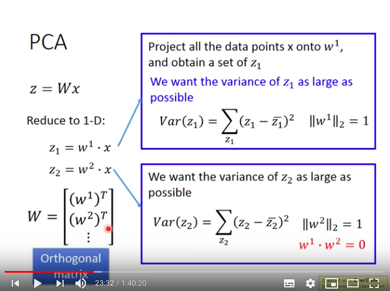

# ML Lecture 13: Unsupervised Learning - Linear Methods
* 李宏毅
* 目的 : 快速掃過一遍相關算法，原理，關鍵字，評估方式，不求完整理解，但求知道這些名詞
* [Video](https://www.youtube.com/watch?v=iwh5o_M4BNU&list=PLJV_el3uVTsPy9oCRY30oBPNLCo89yu49&index=22)

## Unsupervised Learning
* 三種用途，大約分成兩種概念
* 化繁為簡(Clustering & Dimension Reduction(Feature Extraction))
* 無中生有(Generation)

這裡focus在Feature Extraction上，而且是Linear的方法

</img>

## Clustering
### KMeans 

</img>

## Hierarchical Agglomerative Clustering(HAC)

* 先排列data，計算similarity(最像的，或是所謂距離最小的)
* 兩個最像的merge起來，做出一個虛擬的代表(例如把vector做平均)
* 做一顆樹出來
* 接著選個threshold，就可以決定你想分幾群
* [Demo case on Iris dataset](/demo/demo_plot_agglomerative_dendrogram.py)

</img>
* 優 : 和distance matrix一樣，可以清楚地觀察inner cluster的相似以及outer cluster的相似，在多維情況也適用
* 比KMneas優的地方，可以看著樹狀結構來決定要幾個群數，因為KMenas的決定方式比較數學，有時候不一定符合實際情況，解釋性也比較差

## Soft Cluster(Distirbuted Representation)
* 上述兩個招式(KMenas, HAC)都是硬分類，有時候容易遇到以偏概全的感覺，軟性分類可以mix屬於各種cluster的比例
* 舉例，如果只說小傑是強化系，會丟失很多資訊，應該要像一個表格搬來表示小傑，用一個分佈(或是你說是一個vector)
</img>
* 所以如果用圖片(high dimension) -> 變成一個6,7維度的vector，那就是所謂feature extraction
* feature extraction其實和soft clustering是同一件事情，只是有不同的稱呼而已

## Dimnesion Reduction
* 3D空間中的地毯其實2D就能夠表示得很好，那幹嘛不用2D呢?
</img>
* 更具體來說，來看看MNIST
* 如果我們假設有1排3，
  * 原本 : 28*28，但是其實根本沒必要
  * 只要用1個維度，因為其實表示角度就可以了

</img>

* 一些方法
  * Feature selection
  * PCA

## PCA 觀點1
* max variance 
</img>

</img>

</img>
* 解法一 Lagrange Multiplier
* 解法二 Gradient Descent using linear network

## PCA的性質
* eigen-vectors是一組orthonormal set
* 會把原本的feature set 去相關性(去耦合) decorrelation
  * 不同eigen vector相乘為0，同時covariance也為0，這樣做有什麼好處，有些model是假設Gaussian distribution而且不**互相影響**，特徵數量可以減少，避免overfitting

</img>

## PCA另一種直觀的解釋
Key : min Reconstruction error
* 從手寫數字來看，Basic Component可能是人的一些筆畫
* 例如下式，$x=7 = c_1u^1 + c_2u^2 + c_3u^3$

</img>

</img>

解min Reconstruction error是一個SVD問題

</img>

## PCA的弱點
* Unsupervised，很難真正了解該群，這時候引入Label data會比較好，即LDA，LDA是一種Supervised Feature Extraction方法(LDA : linear discriminant analysis)
* Linear
* 想要把流線型曲線拉直，其實是強人所難的，是一個NonLinear tranformation，PCA是做不到的，只能產生下面這種藍色跟紅色疊再一起的情況

</img>

## PCA - Pokemon
* 800 Pokemons, 6 features(HP, Atk, Def, Sp Atk, Sp Def, Speed) 
* 要有幾個PC就像要有幾個hidden layer，要有幾個neuron一樣，是要自己決定的，data viz時或許需要直接放到2維或是3維，可以透過eigen value ratio來表示解釋度

</img>

## PCA on Pokemon
* input 6維度可解釋性feature
* output 使用4個PC來做projection，而且可以先針對4個PC進行解釋
  * 因為4個PC都會是原始6個feature的linear combination
  * 只要PC是能夠被原始特徵解釋的，那麼PC軸仍然能夠具有足夠解釋性

</img>

</img>

## PCA on MNIST

</img>

有些PC看起來看得懂有些則不，第一個PC看起來像1，第2個看起來像9

* 基本上，上面這些PC會被稱為eigen digits

## PCA on Face
 
</img>

* 每個PC都是完整的臉? 為什麼不是筆劃?或是子部分?
* 因為線性疊加的係數可正可負，這意味著可以先很複雜，在扣除
* 舉例來說我想要畫一個9，我可以先畫一個8，然後把下面的圈圈扣掉，然後在畫上一槓
* 如果你想要的是筆畫而不是很多瑪雅文字?那麼你就要限定你的線性疊加係數壹定要是正的，這樣的技術是Non-negtive matrix factorization(NMF)

## PCA vs NMF
* PCA其實可以視為對Covariance matrix做SVD，係數可正可負
* 但是NMF會強迫係數都是正的
* 如此一來就不能說，先畫一個複雜的東西，然後再去掉
* 並且，eigen vector的每一個component也都會強迫是正的，這樣，就會更像筆畫!

## NMF on MNIST

</img>

* 如同我們講的，更像是筆劃了

## NMF on Face

</img>

* 可以看到更多局部，例如第5個是人中，第6個是眉毛
* 這樣的結果更接近我們想要找的，像是人臉的各個局部

## Matrix Factorlization
* 調查每個人中有動畫公仔的數目，基本上我們點找出每個人對公仔的偏好，但又並非是喜歡涼宮春日這麼直接，而是說A可能喜歡某個類型的
* 有買涼宮春日的，很有可能也有買御凡美琪的，有姐寺的就很有可能有小維，這並不是巧合，feature之間具有相關性

</img>

* 拿Domain Knowledge來說，動漫宅，或許可以分成兩種，喜歡傲嬌的跟喜歡天然的
* 每個宅可以用一個傲嬌跟呆萌的vector來表示屬性，同樣地，每個動漫人物也是，而inner product越大，則越有可能喜歡

</img>

* 但是這樣的vector是沒人知道的，是latent vector

</img>

* 我們有的資料就是一個這樣的購買matrix

</img>

我們的假設，matrix中的每個element都來自一兩個二維向量的inner product
$$
r^A r_1 = 5
$$

$$
r^B r_2 = 4
$$

數學式

$$
X_{M, N} = R_{N, K} T_{K, N} 
$$
然後 min reconstruction error 其實就是SVD
你說SVD不是有三個Matrix嗎? 其實你就看你要把中間的$\Sigma$併到左邊還是右邊就可以了

</img>

## Missing information
* 當然你也可以把missing填0硬幹一波，不過這就假設他們都不買那些missing的

</img>

* 但其實可以用另一種做法，依樣假設latent vector，然後只對那些有值的寫一個loss function，接著用Gradient descent做

</img>

* 你無法知道1, 2維度具體來說代表什麼意思，但是可以表達為什麼$A$買了$1,2$比較多

</img>

* 同樣的你可以透過把$r^A$跟$r^3$內積來得到可能的購買數量

Netflix的比賽在最初的版本就會用這樣的技術來做一個推薦系統

## More about Matrix Factorization
* 考慮角色或是買家本身自己有偏好(bias)
  * 例如$b_{A}$代表該買家本身喜歡買公仔的程度
  * 例如$b_{1}$代表該角色本身在市場上的受歡迎度
* 我們就可以改一下Loss function
* 同樣地就是GD硬解一波即可，你也可以加上regularization，例如你覺得買家要馬都是萌系要馬都是傲嬌系那就加上L1 regularizer

</img>

## Matirx Factorization for Topic analysis

* 把矩陣分解用在文字探勘中，就叫做LSA，完全一模一樣，只是換矩陣的標的物
* 值 TFIDF，row : 詞彙，column : 文本
* latent vector : 主題 : 財經，政治，娛樂，...
* 有各種變形，例如Probability LSA，以及LDA(latent Dirichlet allocation)

</img>

## References
* Dimension reduction的方法多如牛毛，這邊列出一些跟PCA比較像的

</img>

* MDS : 不需要每一個data的feature vector，只需要data之間的distance : 一般是舉例城市的距離，其實PCA會保留data point的距離，在高維空間中是接近的，在低維空間終究會是接近的
* PCA 機率版
* PCA 非線性版
* CCA 有聲音訊號，有圖片訊號
* ICA 
* LDA