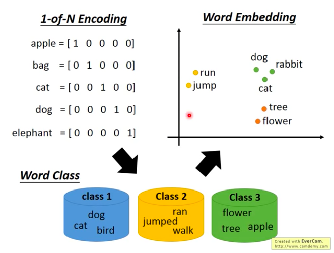

# Unsupervised_Learning_WordEmbedding_HungYiLee
* 李宏毅
* 目的 : 了解其他非線性clustering, 快速掃過關鍵字
* [Video](https://www.youtube.com/watch?v=X7PH3NuYW0Q&list=PLJV_el3uVTsPy9oCRY30oBPNLCo89yu49&index=23)

## 1-of-N Encoding
用向量表示文字
* 資訊量少 - 例如cat和dog都是動物
* 怎麼辦呢，World Class，把同樣性質的分到一群，就是Clustering
* 但是Word Class之間的關係，一樣沒有辦法被表示
* 所以Projection到Low dimensional space
  * x軸可能代表了會動的生物的dimension
  * y軸代表了是否是會動的，的dimension
</img>

## Word Embedding

</img>

* AutoEncoder是沒辦法用的

TBD 07:55 - 40:38