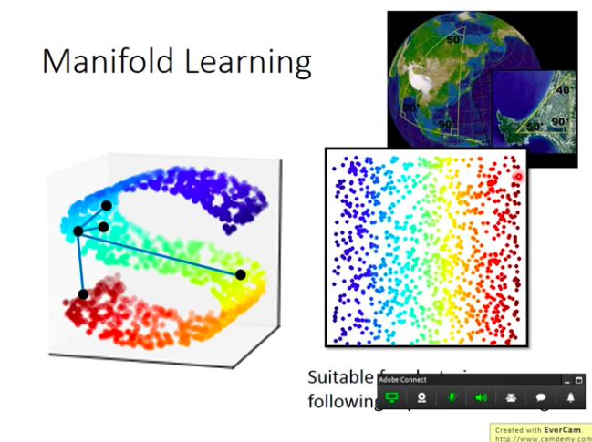
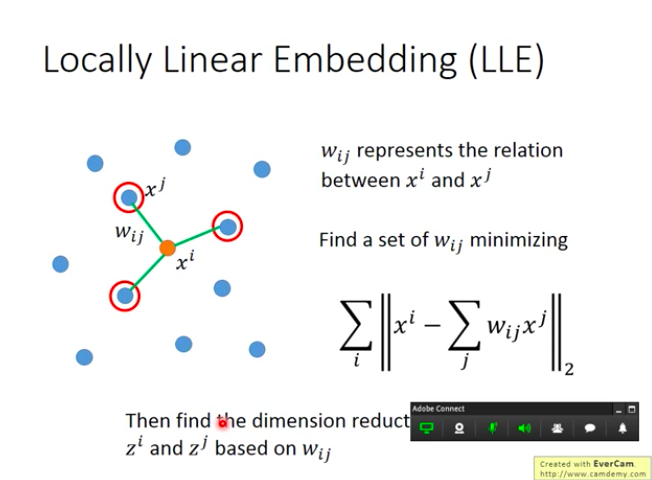
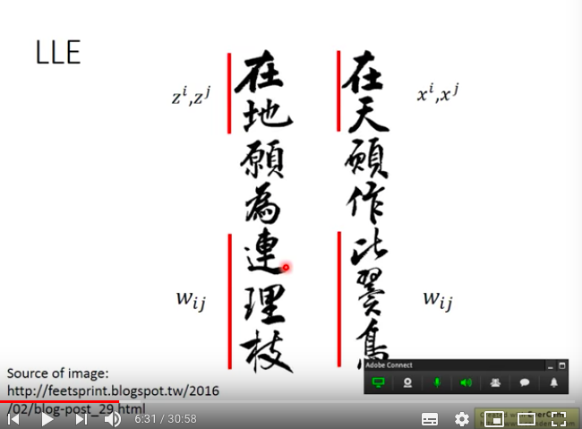
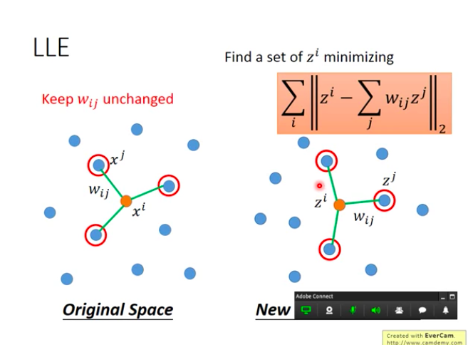
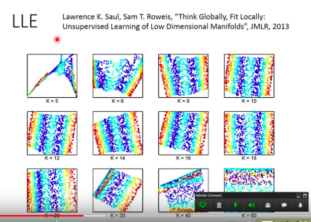

# ML_15_UnLearning_NeiborhoodEmbedding_HungYiLee.md
* 李宏毅
* 目的 : 了解其他非線性clustering, 快速掃過關鍵字, 特別是流型(manifold)，以及t-SNE
* [Video](https://www.youtube.com/watch?v=GBUEjkpoxXc&list=PLJV_el3uVTsPy9oCRY30oBPNLCo89yu49&index=24)

# Manifold Learning
* 資料點的分佈其實是在低維度空間，只是被扭曲到了高維度空間
* 常常舉例的就是地球
  * 地球的表面就是2D，但是我們看地球儀是3D的，因此在這樣的情況下，地球表面就被稱為Manifold
  * 在這樣的情況下，只有很近的點，Euclidean distance才會成立
  * 距離很遠時，就不會成立

* 淺藍色處可以做距離的比較，make sense
* 但是比較前藍色跟紅色以及淺藍色跟黃色，就不能用了，因為在高維空間裡面，算出來會跟黃色點比較近，紅色點比較遠，但是事實其實是反過來的

* Manifold要做的事情就是把Ｓ型展開成平面，Euclidean distance就能夠make sense
</img>

# LLE (Locally Linear Embedding)
* 假設 : 每一個點都可以被其鄰近點的線性組合而成
* 先選一個點$x^{i}$
* 找出他的neibor $x^{j}$
* 計算他們之間的關係或是距離$w_{ij} = dist(x^{i}, x^{j})$ or $w_{ij} = sim(x^{i}, x^{j})$
* 這個$w_{ij}$怎麼找? 
$$
min~~ \sum_{i} |x^{i} = \sum_{j}w_{ij}x^{j}|^{2}
$$
* 找到之後，做dimension reduction，把$x^{i}$和$x^{j}$轉成$z^{i}$和$z^{j}$

</img>

</img>

* 最精髓的地方，就算轉換到$z^{i}, z^{j}$但是point$i,j$之間的關係$w_{ij}$是不變的

* $z$要怎麼做? 大概是這樣的概念
</img>
* 但是要特別注意的是，LLE並沒有一個明確的算法說明數學上怎麼做
* 所以需要好好的調整LLE的參數，鄰居數(neibor)

</img>

原始論文標題很潮 : Think Globally, Fit Locally

* k太小，k太大都不太好
  * k選很小，使得$x_i$不容易被有限個數的$x^{j}$來表示，所以$w_{ij}$很爛，keep住也沒用
  * k選很大，原本都不太鄰近了，使得$w_{ij}$很爛，那keep$w_{ij}$也沒啥用

# Laplacian Eigenmaps

TBD 10:03 ~ 30:58