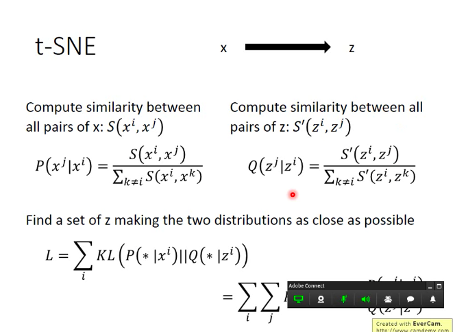
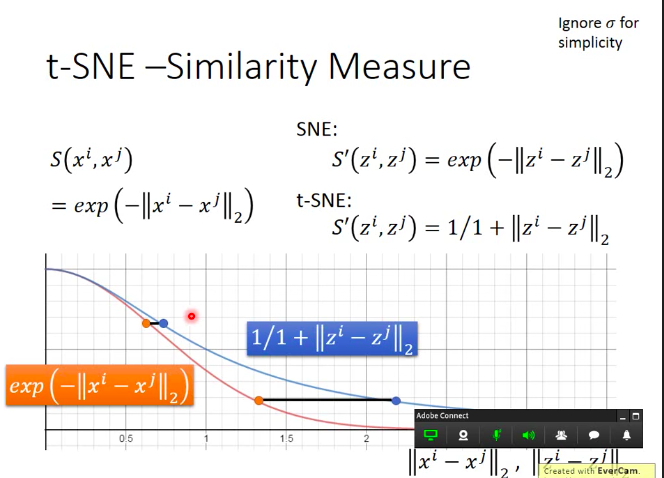
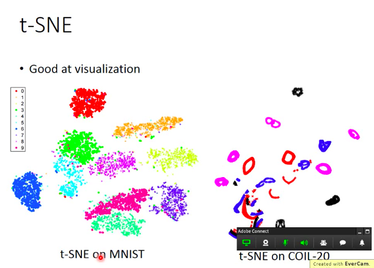

# ML_15_UnLearning_NeiborhoodEmbedding_HungYiLee.md
* 李宏毅
* 目的 : 了解其他非線性clustering, 快速掃過關鍵字, 特別是流型(manifold)，以及t-SNE
* [Video](https://www.youtube.com/watch?v=GBUEjkpoxXc&list=PLJV_el3uVTsPy9oCRY30oBPNLCo89yu49&index=24)

# Manifold Learning
* 資料點的分佈其實是在低維度空間，只是被扭曲到了高維度空間
* 常常舉例的就是地球
  * 地球的表面就是2D，但是我們看地球儀是3D的，因此在這樣的情況下，地球表面就被稱為Manifold
  * 在這樣的情況下，只有很近的點，Euclidean distance才會成立
  * 距離很遠時，就不會成立

* 淺藍色處可以做距離的比較，make sense
* 但是比較前藍色跟紅色以及淺藍色跟黃色，就不能用了，因為在高維空間裡面，算出來會跟黃色點比較近，紅色點比較遠，但是事實其實是反過來的

* Manifold要做的事情就是把Ｓ型展開成平面，Euclidean distance就能夠make sense
</img>

# LLE (Locally Linear Embedding)
* 假設 : 每一個點都可以被其鄰近點的線性組合而成
* 先選一個點$x^{i}$
* 找出他的neibor $x^{j}$
* 計算他們之間的關係或是距離$w_{ij} = dist(x^{i}, x^{j})$ or $w_{ij} = sim(x^{i}, x^{j})$
* 這個$w_{ij}$怎麼找? 
$$
min~~ \sum_{i} |x^{i} = \sum_{j}w_{ij}x^{j}|^{2}
$$
* 找到之後，做dimension reduction，把$x^{i}$和$x^{j}$轉成$z^{i}$和$z^{j}$

</img>

</img>

* 最精髓的地方，就算轉換到$z^{i}, z^{j}$但是point$i,j$之間的關係$w_{ij}$是不變的

* $z$要怎麼做? 大概是這樣的概念
</img>
* 但是要特別注意的是，LLE並沒有一個明確的算法說明數學上怎麼做
* 所以需要好好的調整LLE的參數，鄰居數(neibor)

</img>

原始論文標題很潮 : Think Globally, Fit Locally: Unsupervised Learning of Low Dimensional Mainifolds, JMLR, 2013

* k太小，k太大都不太好
  * k選很小，使得$x_i$不容易被有限個數的$x^{j}$來表示，所以$w_{ij}$很爛，keep住也沒用
  * k選很大，原本都不太鄰近了，使得$w_{ij}$很爛，那keep$w_{ij}$也沒啥用

# Laplacian Eigenmaps
* Graph-based
* 在下圖中，要計算兩點之間的距離，只計算Euclidean distance，是不實際的，應該要計算具有density connection的距離(在下圖中為曲線距離，才能真正表達兩點之間的關係)
* 在這樣的想法中，點和點之間建造Graph就可以比較好的計算這個距離，因為graph基本上是基於密度的

</img>

* Review semi-supervised learning，如果$x^{1}$及$x^{2}$在一個high density region是相近的，那麼他們的標籤，極可能是一樣的，或極其相似

$$
Loss = \sum_{x^{r}}C(y^{r}, \hat{y^{r}}) + \lambda S
$$
  
</img>

所以回到Dimension Reduction
如果$x^{1}$和$x^{2}$在high density region相近，那麼$z^{1}$和$z^{2}$也必須是相近的

$$
S = \frac{1}{2}\sum_{i,j}w_{i, j}|z^{i} - z^{j}|^{2}
$$

不過這樣做是有問題的?

$z^{i}=z^{j}=0, S=0$ 

必須加上一些限制，如果$dim(z)=M$
我們希望dimension reduction之後，z就可以佔滿整個空間

$$
Span \{z^{1}, z^{2}, ...z^{N}\} = R^{M}
$$
其實最後就會去找Laplacian Matrix的Eigen vector

</img>

# t-SNE
* 前面兩個方法，只假設，相近的點，應該要是接近的，**但是沒有假設，不相近的點，要分開!**
* 如下圖，LLE會把同個class的點聚在一起，但沒有防止不同的class疊在一起(LLE on MNIST)

* COIL-20 是一個玩具車的dataset，轉了各種不同的角度，然後拍很多照片
</img>
* t-SNE 企圖解決這個問題，近的點近量近，遠的點，盡量遠
* Similarity pair of $x^{i},x^{j}$ :  $S(x^{i}, x^{j})$
* 計算一個normolization，此$P < 1$，做這個scale是希望在high dimension以及local dimension的Similarity是一樣的scale
$$
P(x^{j}|x^{i}) = \frac{S(x^{i}, x^{j})}{\sum_{k \neq i}S(x^{i}, x^{k})}
$$

* 假設在$z$空間已經找到了$z^{i}, z^{j}$
* 依定計算 Similarity pair $z^{i},z^{j}$ :  $S'(z^{i}, z^{j})$
$$
Q(z^{j}|z^{i}) = \frac{S'(z^{i}, z^{j})}{\sum_{k \neq i}S'(z^{i}, z^{k})}
$$

* 建構一組loss function，找出一組$z$，希望$P$和$Q$越接近越好
* 實際上優化就是使用gradient descent，把$z$對$x$微分
</img>

* t-SNE會計算所有data point之間的simalarity，會比較慢
* 通常的做法是為了減少時間，先做一個PCA(任何一種Dimension Reduction)，降到比較小的維度然後在此Basis上在做t-SNE(讓計算similarity的時間變短)，例如先降到50維，再降到2維
* **注意，給予新的$x$，是沒辦法transform的，通常會是做Visualization的task**

# t-SNE -Similarity Measure
* t-SNE 的相似度選擇，是非常神妙的
* 在通用的t-SNE中，similarity是使用RBF kernel
$$
S(x^{i}, x^{j}) = exp(-|x^{i} - x^{j}|^{2})
$$
* 我們之前有說過，如果要再Graph上面算相似度，這種作法很好，因為只有非常相近的點才會有值
* 在t-SNE之前，有一個方法，叫做SNE
* 差別在於說，SNE在$x$space和$z$space用一樣的similarity measure，而t-SNE是不同的measure，t-SNE在$z$ space中使用的相似度是t distribution的其中一種
$$
S(x^{i}, x^{j}) = \frac{1}{1 + |z^{i}-z^{j}|^{2}}
$$
* 這裡提供一個很直覺的想法
  * 原本在高維空間，距離近的，在低維空間，差距不大，還是很近
  * 原本在高維空間，距離遠的，在低維空間，就會被拉得很遠
  * 所以他可以把群跟群之間的差距拉開，因為群跟群之間只要有Gap，那麼他的Gap就會被t-SNE強化

</img>

* 下左圖是t-SNE在MNIST，其實不是直接對pixel，先做了一層PCA，在t-SNE
* 在COIL-20上則是很驚人，圈圈是同個物體，但是角度不同
* 而扭曲的圈圈是因為像是杯子，杯子轉來轉去常常很像
</img>