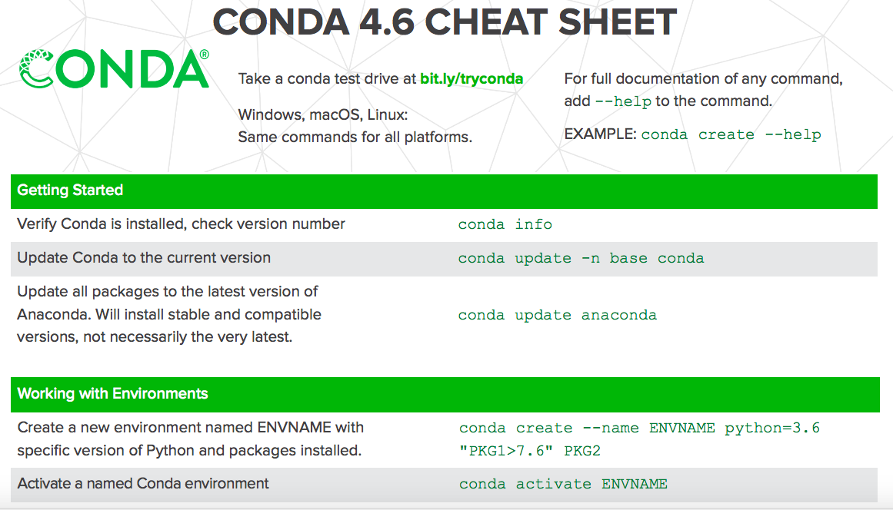
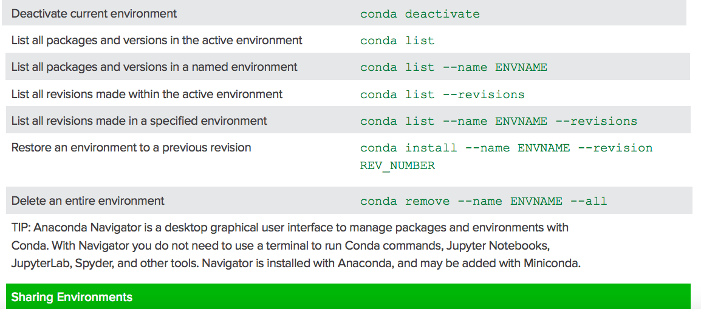
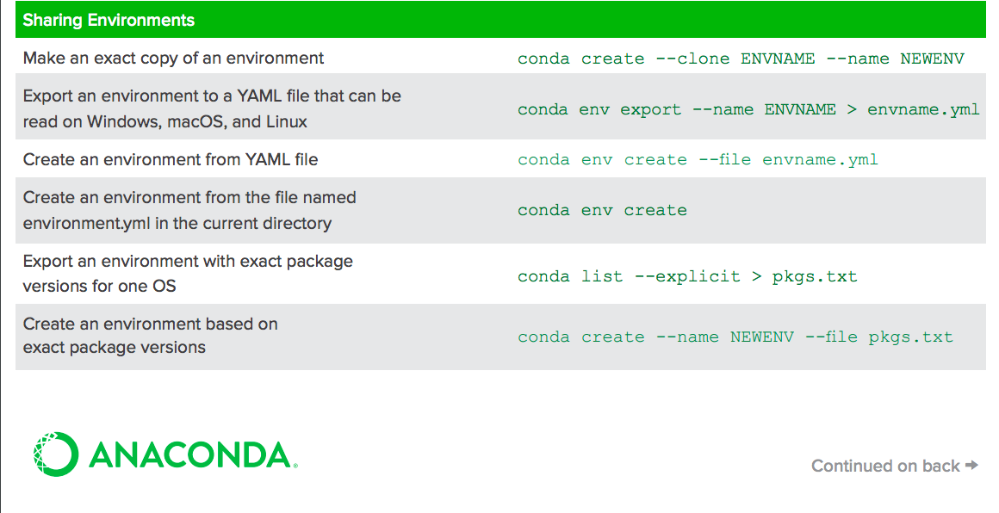
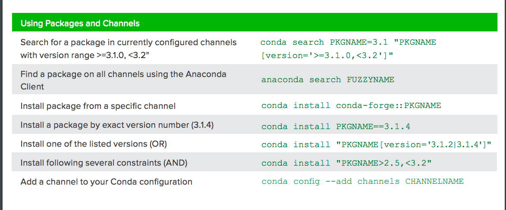
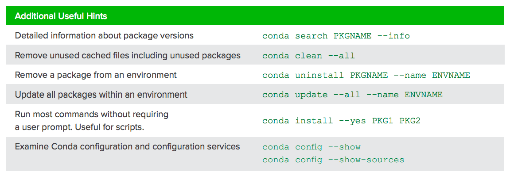

# Conda cheet sheet
google search conda cheat sheet **your version**, there are always there. Because maintainer is ANACONDA

4.6.0 here
</img>
</img>
</img>
</img>
</img>
# 背景
* 使用Conda做環境管理比起pip + pyenv, 或是 pipenv 來說，優勢在於:
  * 將非python 底層的package compile好 - 例如tensorflow, dlib
  * 處理package矛盾
* 使用conda的壞處? 即安裝一個pkg會多安裝很多，有些並非是開發者要安裝的東西

## Conda的更多用途
1. 多個channel安裝多個package
   * conda create -dn env_name -c channel_1 channel_2 python=your_version pkg_1 pkg_2
2. 解矛盾很慢: 
   * 從官網了解conda install時做了什麼事
   * 下 --override channel 舊的channel就不要搜尋了
3. conda的環境能不能重新命名? 直接改anaconda3/env/的資料夾名稱可以嗎?
   * 可以啊只是會有一大堆路徑問題讓你哭出來
   * [參考stackoverflow上 356 thumb up 的解答](https://stackoverflow.com/questions/42231764/how-can-i-rename-a-conda-environment?fbclid=IwAR3kurjkgrf_GcIcWKi1_kVYaTsfvwoOLDXJhoLLwm-vPOUI-hhtyBZ0eyY)
   * 基本上概念就是 create cloned env, remove 原本的
     * Note : 就算原本的env有一些pip install的套件，conda clone still work well.
     * 實例 : conda install tensorflow-gpu=1.14.0 cudatoolkit=10.1 cudadnn=7.6.4 pip install dlib with python=3.6，可以被clone。
```
conda create --name new_name --clone old_name
conda remove --name old_name --all # or its alias: `conda env remove --name old_name`
```
4. conda 矛盾解不開的就表示無法做到了嗎?
   * 並不是，這時候google, stackoverflow, github issue查查看就對了，通常我們不是第一個遇到問題的人
     * 實例 : python 3.6 with dlib, conda failed, but pip work well。 

5. conda界的`pip install -r requirements`
   * environment.yml
   * [check on stackoverflow](https://stackoverflow.com/questions/51042589/conda-version-pip-install-r-requirements-txt-target-lib/51043636) 
   * 有一項demo.yml放在[這裡](/demo/py_36_dlib_envirment.yml)
   * 可以選擇預設channel，也可以每個安裝都選好特定的channel，最後再執行pip安裝