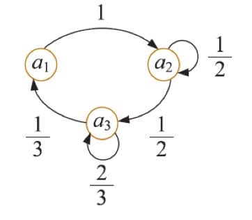
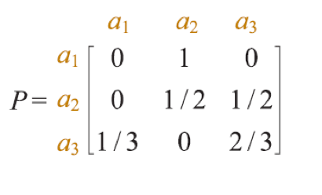
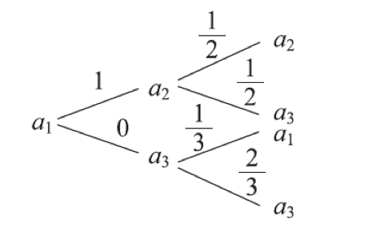
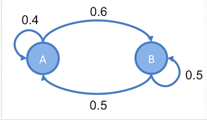
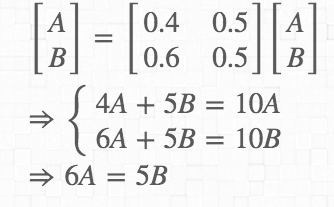
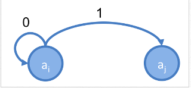

# Markov chain
## Outline
* Introduction
* 討論前提
* 轉移圖(transition diagram), 樹狀圖(tree diagram),轉移矩陣

* statinary distribution(穩定分配)
* [穩定分配 to Metropolis Hasting](http://cpmarkchang.logdown.com/posts/737249-pgm-metropolis-hasting)

* regular Marcov chain
* 隨機矩陣
* 正規隨機矩陣(regular stochastic matrix)
* fix point (方陣固定點)
* absornig Markov chain (吸收馬可夫鏈)
* fundamental matrix of markov chain(馬可夫鍊的基本矩陣)
* 吸收馬可夫鍊的應用
  * 期望步數
  * 到達吸收狀態之機率
* 可逆性

## Introduction
1. 可以仔細觀察日常生活中所發現的事件，有些事件的未來發展或演變與該事件現階段的狀態全然無關，這種事件稱為獨立試驗過程(process of independent trials)
2. 另一些事件則會受到該事件現階段狀態的影響，這樣的事件演變可以表達成**隨著時間變動的數學模式**，通常稱之為**隨機過程(stochastic process)**，**馬可夫過程(Markov process)** 就是其中之一
### 數學化的描述馬可夫鍊
考慮一個序列的試驗(trial)，滿足下列兩大性質
1. 每一次試驗出現的元素，都是有限集合$S = {a_{1}, a_{2},...,a_{m}}$中之一，S稱為系統(system)的狀態空間(state space)，每一次出現的元素，則稱為當前狀態(state)
2. 任何試驗至多和前一試驗相關，而與其他試驗無關。
3. 對於每一對狀態$(a_{i}, a_{j})$有一已知機率$p_{ij}$表示前一試驗為$a_{i}$時，接下來的試驗出現狀態為$a_{j}$的機率，這樣的$p_{ij}$稱為轉移機率
以上的隨機過程即稱作馬可夫鍊
### 馬可夫練的討論前提
如同上述所講，需要注意探討的項目是否為一個馬可夫鍊
1. 在任何週期內，系統中的事件只存在於一種狀態內
2. 從一種狀態轉換到另一種狀態的機率，決定於前一週期

### 應用點
任何序列相關的場景，RNN, LSTM, HMM(Hidden Markov Chain),Google使用的PageRank網頁排序算法 或多或少都有思想上或是直接應用的場景出現

## 馬可夫鍊表示法
### 機率圖(轉移圖) transition diagram
</img>

### 矩陣

</img>

表示馬可夫鏈的矩陣稱為轉移矩陣

### 樹狀圖

</img>

### 小結
以上三種圖都能夠表示一Markov chain，但三種圖形都不僅限於表達Markov chain，例如矩陣就需要符合特定規則，e.g.
1. 必定為方陣
2. 橫著(或是直的加)加必定要 = 1 (機率向量)
機率圖，樹狀圖也必須滿足特定條件，才能斷定是馬可夫鍊

## 馬可夫鍊的穩定狀態
關於馬可夫鍊的穩定狀態，需要較複雜的數學證明
但總結來說，只要滿足以下條件，馬可夫練就會收斂到穩定狀態

1. 可能的狀態數是有限的
2. 狀態間的轉移機率是固定不變的
3. 任意狀態能夠轉變到任意狀態
4. 不能是簡單循環，例如不能是全部x到y再從y到x

滿足以上條件也就是滿足細緻平衡條件(Detailed Balance Condition)
延伸知識為方陣固定點，雖然不能直接證明，但提供了一種解釋方式

### 穩定狀態求解邏輯
求解穩定態，在給定轉移矩陣$P$的情況下，令statinary state $X$
由於下一個狀態和當前狀態有關，但為穩定態，也就是說，下個狀態也是$X$
因此我們有$X = PX$，因此我們可以求得各個狀態占比

## 馬可夫鍊與Metropolis Hasting
舉例一個Markov chain，具有穩定態比例$A:B = 5:6$

</img>

</img>

利用Markov Chian最後必定走道穩定狀態的特性，我們可以做這樣的事
先給訂一個機率分佈函數，從這個機率函數建立Markov Chain，接著再利用建立出來的Markov Chain來進行抽樣

設定一機率分佈$p(X)$，起始值為$x_{0}$。隨機變數的值為$ X = {a_{1},a_{2}, ..., a_{n}}$

設目前時間點$t$抽出的值$x_{t}=a_{i}$，然後，從一機率分佈(稱為proposal distribution)$q(x_{t+1}|x_{t})$中，抽出一個值，為$a_{j}$

### 馬上舉個例子
假設一個隨機變數$X$，有0.8的機率為1，有0.2的機率為0:
$$
p(x) = \left\{
  \begin{array}{lr}
    0.2 &  X = 0\\
    0.8 &  X = 1
  \end{array}
\right.
$$
則我們會產生一個馬可夫鍊，transition diagram如下圖
</img>
[TODO] 算一下矩陣的穩定狀態$X$是不是$[0.2, 0.8]$
