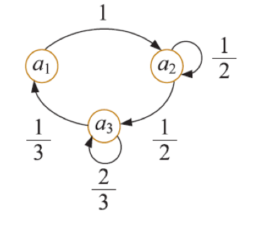
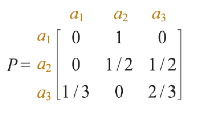
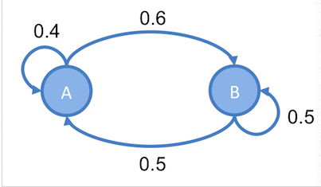

# Markov Chain I
## Outline
* Introduction
* 討論前提
* 轉移圖(transition diagram), 樹狀圖(tree diagram),轉移矩陣
* statinary distribution(穩定分配)
* Metropolis Sampler
* Metropolis Hasting

## Introduction
1. 可以仔細觀察日常生活中所發現的事件，有些事件的未來發展或演變與該事件現階段的狀態全然無關，這種事件稱為獨立試驗過程(process of independent trials)
2. 另一些事件則會受到該事件現階段狀態的影響，這樣的事件演變可以表達成**隨著時間變動的數學模式**，通常稱之為**隨機過程(stochastic process)**，**馬可夫過程(Markov process)** 就是其中之一
### 數學化的描述馬可夫鍊
考慮一個序列的試驗(trial)，滿足下列兩大性質
1. 每一次試驗出現的元素，都是有限集合$S = {a_{1}, a_{2},...,a_{m}}$中之一，S稱為系統(system)的狀態空間(state space)，每一次出現的元素，則稱為當前狀態(state)
2. 任何試驗至多和前一試驗相關，而與其他試驗無關。
3. 對於每一對狀態$(a_{i}, a_{j})$有一已知機率$p_{ij}$表示前一試驗為$a_{i}$時，接下來的試驗出現狀態為$a_{j}$的機率，這樣的$p_{ij}$稱為轉移機率
以上的隨機過程即稱作馬可夫鍊
### 馬可夫鏈的討論前提
如同上述所講，需要注意探討的項目是否為一個馬可夫鍊
1. 在任何週期內，系統中的事件只存在於一種狀態內
2. 從一種狀態轉換到另一種狀態的機率，決定於前一週期

### 應用點
任何序列相關的場景，RNN, LSTM, HMM(Hidden Markov Chain) 或多或少都有思想上或是直接應用的場景出現

## 馬可夫鍊表示法
### 機率圖(轉移圖) transition diagram
</img>

### 矩陣

</img>

表示馬可夫鏈的矩陣稱為轉移矩陣

### 樹狀圖

</img>

### 小結
以上三種圖都能夠表示一Markov chain，但三種圖形都不僅限於表達Markov chain，例如矩陣就需要符合特定規則，e.g.
1. 必定為方陣
2. 橫著(或是直的加)加必定要 = 1 (機率向量)
機率圖，樹狀圖也必須滿足特定條件，才能斷定是馬可夫鍊

## 馬可夫鍊的穩定狀態
關於馬可夫鍊的穩定狀態，需要較複雜的數學證明
但總結來說，只要滿足以下條件，馬可夫練就會收斂到穩定狀態

1. 可能的狀態數是有限的
2. 狀態間的轉移機率是固定不變的
3. 任意狀態能夠轉變到任意狀態
4. 不能是簡單循環，例如不能是全部$x$到$y$再從$y$到$x$

滿足以上條件也就是滿足細緻平衡條件(Detailed Balance Condition)
延伸知識為方陣固定點，雖然不能直接證明，但提供了一種解釋方式

### 穩定狀態求解邏輯
求解穩定態，在給定轉移矩陣$P$的情況下，令statinary state $X$
由於下一個狀態和當前狀態有關，但為穩定態，也就是說，下個狀態也是$X$
因此我們有$X = PX$，因此我們可以求得各個狀態占比

## 馬可夫鍊與Metropolis Hasting
舉例一個Markov chain，具有穩定態比例$A:B = 5:6$

</img>

</img>

## Metropolis Sampler
利用Markov Chian最後必定走到穩定狀態的特性，我們可以做這樣的事
先給訂一個機率分佈函數，從這個機率函數建立Markov Chain，接著再利用建立出來的Markov Chain來進行抽樣

設定一機率分佈$p(X)$，起始值為$x_{0}$。隨機變數的值為$ X = \{ a_{1},a_{2}, ..., a_{n} \}$

設目前時間點$t$抽出的值$x_{t}=a_{i}$，然後，從一機率分佈(稱為proposal distribution)  $q(x_{t+1}|x_{t})$中，抽出一個值，為$a_{j}$，其中$q(x_{t+1}|x_{t})$滿足以下對稱性 : 

$$
q(x_{t+1}|x_{t}) = q(x_{t}|x_{t+1})
$$

$q(x_{t+1}|x_{t})$可以是一個比較好計算的函數，用於快速產生下一個可能的樣本$a_{j}$，$a_{j}$為proposed state，意思是說，想要從$q(x_{t+1}|x_{t})$**提出**一個值，來看看這個值能不能成為$x_{t+1}$的值，事實上，這時候還不知道$a_{j}$適不適合為$x_{j}$，所以要做以下運算。

如果$p(a_{j})\geq p(a_{i})$，那就接受$a_{j}$為$x_{t+1}$

$$
x_{t+1} = a_{j}
$$

如果$p(a_{j})< p(a_{i})$，則我們還是有機會接受$a_{j}$，但是是機率性的接受(有一種穿隧效應的味道?)

$$
x_{t+1} = \left\{
  \begin{array}{lr}
    a_{j} &  with~probability~of~\alpha\\
    a_{i} &  with~probability~of~ 1 - \alpha
  \end{array}
\right.
$$
$$
where~\alpha = \frac{p(a_{j})}{p(a_{i})}
$$
其中，$\alpha$稱為acceptance probability，意思即為，接受$x_{t+1}$為$a_{j}$的機率有多少?

### the neat!
**此方法可以看成是在$a_{i}$以及$a_{j}$之間建立Markov Chain** : 
什麼意思呢？ 如果想從$a_{i}$轉移到$a_{j}$，而且$p(a_{j}) > p(a_{i})$，那麼則會建立出一個Markov Chain，如下 : 

</img>

由於$p(a_{j}) > p(a_{i})$，所以一定會接受$a_{i}$到$a_{j}$的轉移，但是如果想要從$a_{j}$轉移回到$a_{i}$，則建立出的Markov Chain，如下

</img>

由於$p(a_{j}) > p(a_{i})$，所以想要從$a_{j}$轉移回到$a_{i}$，不一定會成立，而是由acceptance probability來決定，把以上兩者合起來，得出$a_{i}$與$a_{j}$之間的Markov chain : 

</img>

假設在這個Markov chain上，隨機走動，設走到$a_{i}$的機率為A，走到$a_{j}$的機率為B，則達成平衡時

</img>

### 馬上舉個例子
假設一個隨機變數$X$，有0.8的機率為1，有0.2的機率為0:
$$
p(x) = \left\{
  \begin{array}{lr}
    0.2 &  X = 0\\
    0.8 &  X = 1
  \end{array}
\right.
$$
則我們會產生一個馬可夫鍊，transition diagram如下圖
</img>

在這個Markov chain上走，假設初始點在0，轉先走到1，走過的序列如下

> 01

到1之後，有0.75的機會留在1，有0.25的機會會在走到0，走到1和走到0的比率是3:1，假設走回1三次之後才走回0，那麼走過的序列為

> 011110

這樣一直走下去的話，則

> 011110111101111011110

(基本上每個0配4個1)，而整個序列取一個數，有0.8的機率是1，有0.2的機率是0，和$p(x)$的機率分佈一模一樣。

因此，只要建立了$a_{i}$與a_{j}之間的Markov Chain之後，就可以在這兩個點上面來回行走，抽出適當比例的樣本，整體的序列會滿足該機率分佈。

可以把$X$只有兩個值的機率分佈，推廣到多個值，在$X = {a_{1}, a_{2},...,a_{n}}$中的任意兩個值都能夠建立這樣的Markov chain，在這些Markov chain中來回行走，最後達到平衡時，抽出來的序列就等於從$p(X)$的機率分佈抽樣一般

### psudo code長這樣

1 set $t$ = 0
2 genetate an intial state $x_{0} \in \{a_{1}, a_{2}, ..., a_{n}\}$
3 repeat until $t = M$
4 genetate a proposal state $a_{j}$ from $q(x_{t+1}|x_{t})$
5 calculate the acceptance probability $\alpha$ = $min(1, \frac{p(a_{j})}{p(x_{t})})$
6 draw a random number $u$ from $Unif(0, 1)$
7 if $u \le \alpha$
8 accept the proposal state $a_{j}$ and set $x_{t+1} = a_{j}$
9 set
10 $x_{t+1} = x_{t}$

其中，$M$為抽出的樣本數，而從$Unif(0, 1)$抽出的$u$，目的是要讓$x_{t+1}=a_{j}$成立的機率為$\alpha$

## Metropolis Hasting
由於Metropolis Sampler的proposed distribution壹定要滿足對稱性
如果$p(x)$為**非對稱性的機率分佈**，例如[Gamma distribution](#further-reading)

Metropolis Hasting是一種更General的抽樣方式，它可以用於以下情形:
$$
q(x_{t+1}|x_{t}) \neq q(x_{t}|x_{t+1})
$$

如果$q_{x+1|x_{t}}$不對稱，例如$q(x_{t+1}|x_{t}) > q(x_{t}|x_{t+1})$這種情況，表示從$x_{t}$的位置"提出"走到 $x_{t+1}$ 的位置，機率會比從$x_{t+1}$“提出"走回$x_{t}$還要高。所以也要把這個機率的差異考慮到Markov Chain裡面，因此要加入correction factor $c$ : 
$$
c = \frac{q(x_{t}|x_{t+1})}{q(x_{t+1}|x_{t})}
$$

將$c$乘上proposed probability，來修改acceptance probability : 
$$\alpha = \frac{p(a_{j})}{p(a_{i})} \times \frac{q(a_{i}|a_{j})}{q(a_{j}|a_{i})}$$

如果要在$a_{i}$與$a_{j}$之間，建立Markov Chain，且$p(a_{j})q(a_{i}|a_{j}) > p(a_{i})q_(a_{j}|a_{i})$，則建立出來的Markov Chain，如下:

</img>

除了 acceptance probability要加上correction factor之外，Mestropolis Hastnig的抽樣過程，幾乎和Metropolis Sampler一樣，整個抽樣過程的psudo code如下 : 

1 set $t$ = 0
2 genetate an intial state $x_{0} \in \{a_{1}, a_{2}, ..., a_{n}\}$
3 repeat until $t = M$
4 genetate a proposal state $a_{j}$ from $q(x_{t+1}|x_{t})$
5 calculate the proposal correction factor $c$ = $\frac{q(x_{t-1}|a_{j})}{q(a_{j}|x_{t-1})}$
5 calculate the acceptance probability $\alpha$ = $min(1, \frac{p(a_{j})}{p(x_{t})} \times c)$
6 draw a random number $u$ from $Unif(0, 1)$
7 if $u \le \alpha$
8 accept the proposal state $a_{j}$ and set $x_{t+1} = a_{j}$
9 set
10 $x_{t+1} = x_{t}$

## demo case

[Show the demo using jupyter notebook](/demo/metropolis_sampler_metroplis_hasing.py)

# Further reading 
1. [LDA-math-MCMC and Gibbs sampling(1)]()
2. [LDA-math-MCMC and Gibbs sampling(2)](http://www.52nlp.cn/lda-math-mcmc-%e5%92%8c-gibbs-sampling2)
3. [Gamma function wiki](https://zh.wikipedia.org/wiki/%E4%BC%BD%E7%8E%9B%E5%88%86%E5%B8%83)
4. [LDA-math 神奇的Gamma函數](https://cosx.org/2013/01/lda-math-gamma-function)