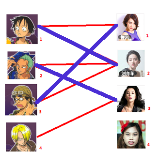

1. [多目標追蹤](https://blog.csdn.net/sinat_26917383/article/details/86557399)
2. [kalman numpy實現, YOLO辯識 + kalman + 匈牙利，追蹤](https://blog.csdn.net/xiao__run/article/details/84374959)
3. [Kalman + 匈牙利 + Gaussian Mix Modeling](https://blog.csdn.net/xiao__run/article/details/77478579)
4. [Object Tracking using OpenCV](https://www.learnopencv.com/object-tracking-using-opencv-cpp-python/)
5. [OpenCV中的目標追蹤算法介紹](https://kknews.cc/zh-tw/tech/jl2y94y.html)
6. [多目标跟踪：SORT和Deep SORT](https://zhuanlan.zhihu.com/p/59148865)

# Introduction
[多目標追蹤的Intro, SORT以及Deep SORT](https://zhuanlan.zhihu.com/p/59148865)
多目標追蹤，Multiple Object Tracking(MOT)，主要任務為給定一個圖像序列，找到圖像序列中運動的物體，並將不同Frame中的運動物體進行識別，也就是給定一個確定準確的id，當然這些物體可以是任務的，如行人，車輛，各種物體等等，而最多研究的是行人，由於人士一個非剛體的目標，且實際應用中行人跟蹤更具有商業價值
* SORT 與 Deep SORT的demo皆在reference中
## SORT
Simple Online And Realtime Tracking(SORT)對於現在的MOT，更多依賴的是檢測器的好壞，也就是說通過改變檢測器可以提高18.9%，本篇SORT算法儘管只是把普通的卡曼濾波(kalman filter)以及匈牙利算法(hungarian algorithm)，卻可以匹配2016年的SOTA算法，而且速度可以到260Hz, 比前者快了20倍，主要特色在於: 
1. 這樣的追蹤方式**並沒有使用任何跟蹤目標的外觀特徵**，**而僅僅使用了檢測框的位置和大小進行目標的運動估計以及資料關聯**
2. 所以當目標跟丟時，就找不回來，只能偷過檢測去重新更新ID
3. 所以這樣的做法追求的是極快的速度，記得嗎? 260Hz
4. 使用IOU而非距離來進行資料關聯有一個好處，能夠解決短時間被遮擋的問題，當目標物被遮擋時，檢測到了遮擋物，沒有檢測到原始目標，假設這時候上個Frame原始目標與遮擋物進行的資料關聯，那麼在遮擋結束之後，由於相近大小的目標IOU往往比較大，因此很快的可以恢復正確的關聯，而這個假設是建立在遮擋物面積大於該目標的基礎上

## Deep SORT
隨著近年來目標檢測領域的發展，這種tracking-by-detection方式的算法在MOT中越來越成為主流了，之前的算法如流行網路以及機率圖模型，是處理整個過程的全局優化問題，但不適用於在線場景，其目標標誌必須可用在每個時間步長，更為傳統的是假設跟中(MHT)以及聯合機率數據相關濾波器(JPDAF)，這些方法執行基於逐幀的資料關聯，最近，這些方法都被重新認識，由於檢測問題的成功!

之前的SORT使用簡單的kalman filter處理逐幀數據的關連線以及使用匈牙利算法進行關聯度量，這種簡單的方法在高幀速率下獲得良好的性能。**但由於SORT忽略了被檢測物體的表面特徵，因此只有在物體狀態估計不確定性較低的情況下才卻準確**，但在DeepSORT中，我們加入了更可靠的度量來代替關聯度量，並使用CNN網路在大規模行人數據集進行訓練，提取特徵，保障了對遺失以及障礙的魯棒性。

Deep SORT的作者們在狀態估計上多新增了像是**錯誤警告 tentative**，**再次匹配成功 confirm**，**假性軌跡，應刪除 delete**等等

Deep SORT怎麼處理資料連問題呢? SORT使用了匈牙利算法來進行數據關聯，而Deep SORT需要將運動特徵以及表面特徵訊息結合，分為Motion metric以及Appearance metric
1. 首先使用[馬氏距離](https://zh.wikipedia.org/wiki/%E9%A9%AC%E5%93%88%E6%8B%89%E8%AF%BA%E6%AF%94%E6%96%AF%E8%B7%9D%E7%A6%BB)來評估預測狀態以及新狀態的距離，並且使用卡方分佈的0.95分位數做為threshold
2. 接著使用**餘弦距離**當目標運動不確定性較低時，馬氏距離是一個很好的關聯度量，但是實際中，如相機運動會造成馬氏距離的大量不能匹配，進而讓該度量失效，因此，我們整合第二個度量標準，對於每個BBox檢測框$d_{j}$，我們計算一個表面特徵描述子$r_{j}$，並且透過cos相似度作為第二關聯度量，同樣的也可以加入threshold[註1](#%e8%a8%bb%e9%87%8b))

接著將上述指標合成一個指標來進行評估，寫一個psudo code來發論文XD

多目標追蹤的3種門派
[Ref 2](https://zhuanlan.zhihu.com/p/77111218)

# Hungarian Algorithm + kalman filter framework
[多目标跟踪：SORT和Deep SORT
](https://zhuanlan.zhihu.com/p/59148865)
## 2nd introduction
#### State vector
* 假設, frame與frame之間進行等速度運動(所以需要夠高的FPS來輔助)
$$
x = [u, v, s, r, \dot{u}, \dot{v}, \dot{s}]^{T}
$$
x表示每個目標狀態 : u, v 為目標中心的x座標, y座標, s, r為目標BBox的尺寸大小以及比例, 且長寬比應該為一個常數, 後3項則為相對應的速度項
#### data association
將該問題視為資料關聯問題，使用的cost matrix為**原有目標在當前frame中的預測框**與 **當前frame所測量到的實際框之間IOU**
小於特定IOU則是無效的，且作者發現使用IOU當作指標能夠解決目標短時間被遮擋的問題[解釋1]

##### IOU
IOU - intersection-over-union

#### Metrics
MOTA (Multi-object tracking accuracy)
MOTP (Multi-object tracking precision)
...
a lot, see in code

# Hungarian Algorithm 原理
Reference by
1. [wiki](https://zh.wikipedia.org/wiki/%E5%8C%88%E7%89%99%E5%88%A9%E7%AE%97%E6%B3%95)
2. [趣写算法系列之--匈牙利算法](https://blog.csdn.net/dark_scope/article/details/8880547)
3. [带你入门多目标跟踪（三）匈牙利算法&KM算法](https://zhuanlan.zhihu.com/p/62981901)
* 任務分配問題, 組合最佳化, 增廣路徑, 二分圖最大匹配
* 時間複雜度O($N^{3}$)
## 形象化描述
你通過數代人的努力，你終於趕上了剩男剩女的大潮，假設你是一位光榮的新世紀煤人，手上有$N$個剩男，$M$個剩女，每個人都可能對多名異性個有好感，如果一對男女互相有好感，就可以把這一對湊合再一起，現在讓我們暫且無視所有單相思，你會有一張圖，每一條連線都表示互相有好感

</img>

湊合勁量多對情侶的情況下
先給一號男生找妹子，發現第一個和它相連的1號女生還名花無主，got it!

</img>

接著發現2號可以相連到2號

</img>

接著要連線3號，但是3號喜歡1號，怎麼辦呢
我們先把1號男對1號女拆掉(黃色)，我們幫1號男重新找妹子

</img>

結果發現1號男第2喜歡的是2號女，但是2號女被2號男佔走了，怎麼辦呢？
我們把2號男對2號女拆掉，試著給2號男找新的妹子(和1號相比這是一個遞迴!)

</img>

接下來發現2號男要找的3號妹子，沒人選!太棒了，2號男找3號女，1號男找2號女，3號男找1號女，回溯回去解出答案!（藍色線表示配對成功!）

</img>

總結來說，3個步驟之後的配對結果

</img>

接下來是4號男，他喜歡3號妹子!但是如果按照上面弟回的步驟，沒辦法幫其他男生在找妹子了!
4號男gg，無法配對!

本版本的原則我們看得出來，有機會就上，沒機會，roll back看看有沒有機會，挪一挪有機會，就再上!

### 需要改進處
這裡顯示每一條連結是等價的，也就是1號男對1,2,3女喜歡程度相當，所以能夠輕易切換，我們可以給每一條連結加上權重，也就是所謂的Kuhn-Munkres演算法(KM算法)，基本上就是一種升級

## 數學工具
### 二分圖
匈牙利算法與KM算法都是為了**求解二分圖最大分配問題**
二分圖是啥，能夠分成兩組，$U$和$V$，其中$U$的點不能相互聯通，只能去連$V$的點，同理，$V$的點不能互相連通，只能連$U$的點，這樣的規則下，就稱為二分圖，我們可以發現，目標追蹤在上一個frame，時間$t-1$以及當前的frame時間$t$，各自為二分圖的一邊，目標追蹤即可視為一個二分圖問題，而目標跟蹤就演變成一個**二分圖的最大匹配問題**

</img>

## KM算法(Kugn-Munkres Algorithm)
## 形象化描述
這次我們將set $U$以及set$V$換成$frame_{t}$以及$frame_{t+1}$所被識別出來的物件
並且給每條連結關係加入權重，這也是我們算法中其他模組給出的confidence score置信分數值[註2](#%e8%a8%bb%e9%87%8b)
</img>

#### 第一步 - 初始化
對每個頂點賦值 - 稱之為**頂標**
左邊的圖$U$根據所連線的權重，取最大值給到頂標
e.g : 
* 1號老奶奶有兩條連結，分數為0.8, 0.6 - 頂標取值為0.8
* 2號大叔有兩條連結, 分數為0.3, 0.9 - 頂標取值為0.9
* 依此類推
右邊的圖$V$，頂標值全部給0

</img>

#### 第二步 - 開始匹配

> 匹配原則 : 紙盒權重與左邊頂點分數相同的邊進行匹配，如果找不到匹配邊，對此條路徑所有左邊頂點分數$-d$，所有右邊頂點分數$+d$，參數$d$我們在此處取值為$0.1$

對於左1, 與頂標值相同的邊標為藍色

</img>

接下來是左2, 與頂標相同的邊標為藍色

</img>

接下來是左3, 但是要配上連線時，發現右1已經和左1搭上藍色邊，這時候和原始匈牙利算法的不同 : 

匈牙利 : 把左1和右1的邊拆了，開始幫左1找secend option
KM : 暫且不拆邊，遇到衝突，所有遇到衝突的左邊頂標都$-d$，右邊頂標都$+d$
     note : 這樣的情況發生時，左邊衝突的頂標應該會有多個，右邊衝突的只會有1個，因為衝突是多個要搶一個造成的

</img>

接著發現左3多了一條可匹配的邊，因為此時左3對右2的匹配要求只需要權重大於等於$0.8+0$即可，所以左3配右2

</img>

接著進行左4的匹配，由於左4的唯一匹配對象右3已經被左2匹配，衝突發生
進行一輪$-d, +d$操作，在匹配，左4還是失敗，兩輪之後左4頂標降為0，放棄匹配左4

至此完成二分圖最大匹配

### 小結
KM算法流程結束，三對目標成功匹配，甚至左3目標在預測不夠精確的情況下(預測分數右1最高)，也能夠得到正確的匹配(因為左1配得更好!)
可見引入權重之後，匹配成功率大大提高
並且讀完了匈牙利以及KM兩算法之後，我們可以了解
**匈牙利算法得到的最大匹配並不唯一**，預設匹配邊，匹配順序不同，都會造成多種最大匹配情況，所以引入KM算法的想法是，我們用匈牙利算法找到最大匹配，接著比較每個最大匹配的權重，再選出最大權重的配邊方式，當然這種方法時間複雜度較高，隨著目標數越來越多(maybe > 100)，消耗的時間會大大增加，這是一個concern的點。

### 實作

# Code
[SORT star : 1.3k](https://github.com/abewley/sort)
[SORT 程式碼分析](https://blog.csdn.net/HaoBBNuanMM/article/details/85555547)
[Deep SORT star : 1.7k](https://github.com/nwojke/deep_sort/blob/master/LICENSE)

# 註釋
1. 只要有一個網路，提取目標的外觀特徵，我們就能夠透過embedding dimension來進行frame與frame之前的matching
2. 我們的Tracking Module是協助classification的，換句說我們沒有一個考靠的置信分數(confidence score)，我們需要用另外的值來取代這個link weight，例如predcition與actual frame的distance - 或許需要經過一層normolize，在SORT的論文中，score使用IOU(Intersection over union)