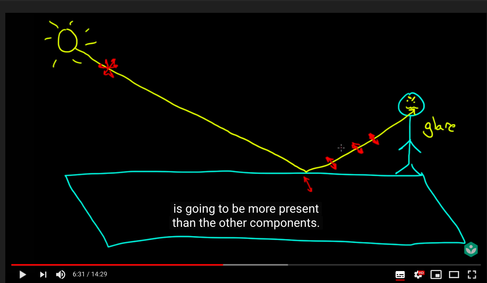
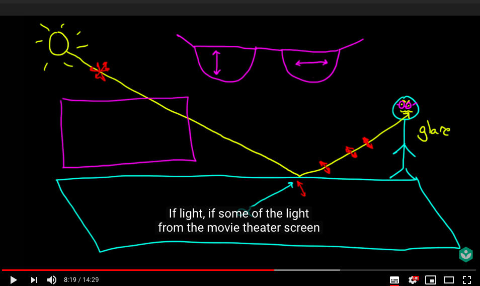
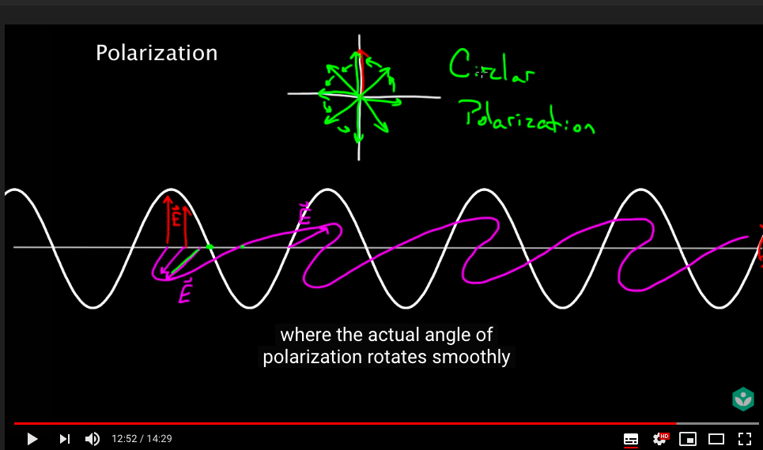
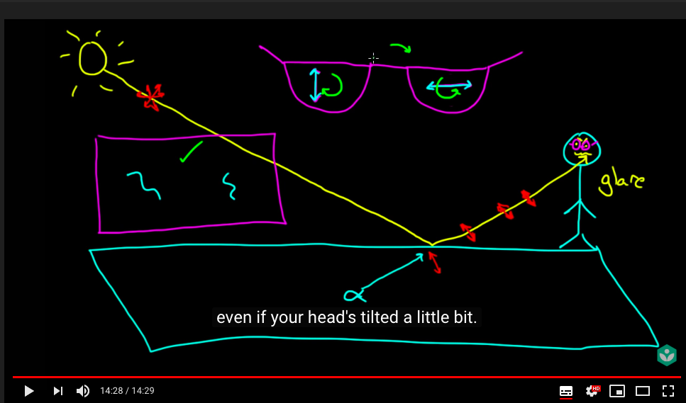
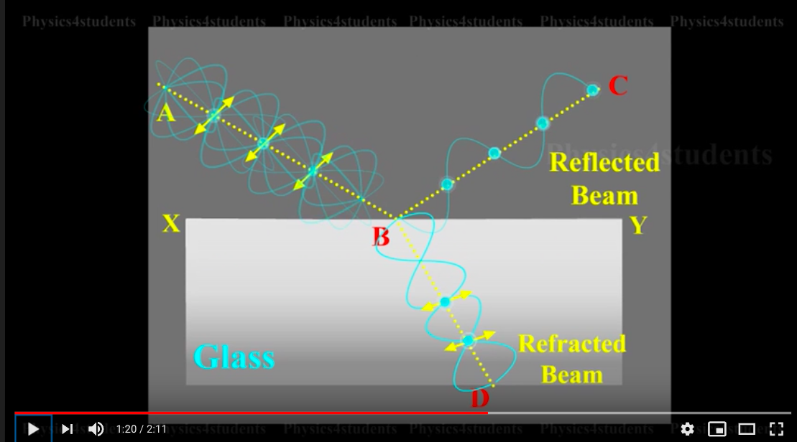
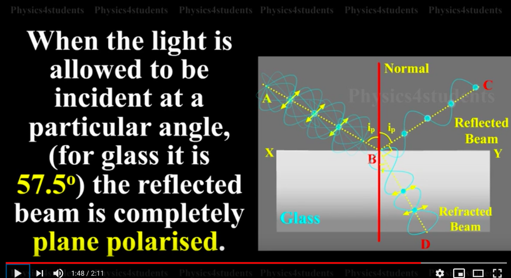

# Polorization by Reflection
## 背景
了解鏡片反光，更general來說，非金屬表面反光的物理原理，使得我們對於已向處理有更寬闊的視野

> e.g. 對於臉部偵測的問題，可以使用硬體解，不一定要使用軟體解，反光是一種藉由**反射**發生的極化現象
我們只要在鏡頭前掛一片偏光鏡，就可以消除非金屬面反光

更甚至，在某些場景硬體上的效果會比軟體控制更好，價格也更便宜，也不用寫程式。

### Polorization of light

1. 偏光鏡 - 偏光鏡可以有效過濾非金屬表面的反射光，眼鏡反光屬於玻璃反光，能夠被過濾掉
   1. 用途 : 過濾反射光線，增加成像反差，PL鏡也可以有效減弱或者消除非金屬表面的反光，這種反射光是典型的偏振光(金屬表面反射回的光線不是偏振光，偏光鏡對其不起作用)，通過調整偏光鏡就可以濾掉這一部分的反光，從而改善被攝物體的畫質，並提高畫面的清晰度。例如，通過使用偏光鏡，可以減弱水面的反光，從而清晰的拍攝到水中的魚。在拍攝這樣的場景時，光源的投射角度與相機拍照的角度要趨近一致，並且其最大的偏折角度需介于30~40度之間。使用的時候可以通過慢慢轉動濾鏡前組的鏡片來進行調整，力求把景物表面的反光降到最低程度。另外，偏光鏡可以有效提高色彩的飽和度，提高反差，這是因為偏光鏡可以吸收大氣中霧氣或灰塵反射出的各種方向的雜光，從而使拍攝出的影像更加純凈。例如，在拍攝花卉靜物等攝影中，經常使用偏光鏡去拍色彩艷麗的照片。在風景攝影、花卉攝影和拍攝某些特定的反光比較強烈的景物時很有用處。偏光鏡運用在拍攝風景照時，對雲層的描繪有極好的效果。藍色天空的光線折射率比被白雲散射後的光線來得大。利用偏光鏡也可以使綠葉的顏色更飽和及消除低角度拍攝城市景物的翳霧。
   2. 硬體設備
      1. 相機鏡頭
      2. 太陽眼鏡
      3. 偏光駕駛鏡
      4. 戶外運動鏡
   3. 原理分類
      1. 圓偏光鏡(CPL)
      2. 線性偏光鏡(LPL)
   4. 原理 :
      1. wiki
      2. [youtube video from Kahn Academy](https://www.youtube.com/watch?v=HH58VmUbOKM)
      </img>
      lightsource curry non-polorize light -> 某個平面 -> curry specific direction polorize light
      * maybe not compeletely polorized, but partially polorized
      * Note : different polorized gate make we feel like the objects are 3D! 
      </img>
      * circule polorization could be introduced by two lights with different linear polorization and phase difference
      </img>
      * Back to the movie theater, we actually use circular polization glass with Clockwise and Counterclockwise direction
      </img>
### Polorization by Reflection
* 1808年 Malus(馬拉斯) - 光經過非金屬表面反射後，反射光可以產生部分偏極化現象。
</img>

* 而當折射線與反射線夾角為90度時，反射線可以完全偏極化，該角稱為Brewster’s angle(布魯斯特角)
</img>