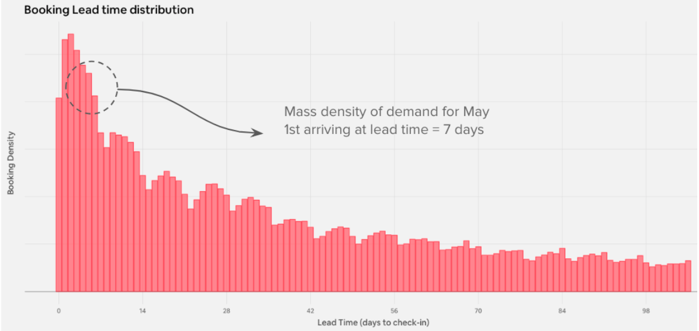

# Price_Dynamic_in_airbnb
* [中文翻譯 Airbnb 如何結合機器學習與結構模式分析來預測市場的動態變化](https://medium.com/@tengyuanchang/airbnb-%E5%A6%82%E4%BD%95%E7%B5%90%E5%90%88%E6%A9%9F%E5%99%A8%E5%AD%B8%E7%BF%92%E8%88%87%E7%B5%90%E6%A7%8B%E6%A8%A1%E5%9E%8B%E4%BE%86%E9%A0%90%E6%B8%AC%E5%B8%82%E5%A0%B4%E7%9A%84%E5%8B%95%E6%85%8B%E8%AE%8A%E5%8C%96-a326ff9c2f5c)
* [AirBnB blog Learning Market Dynamics for Optimal Pricing](https://medium.com/airbnb-engineering/learning-market-dynamics-for-optimal-pricing-97cffbcc53e3)

## Key Point

* 房型數過多 - 超過千種
* 預測平均leading time的資訊量太少 - 希望output 整個leading time的distribution

解法 : 透過統計分佈進行建模

</img>

1. exponential decay - 用Gamma分佈, 有兩個參數$\alpha$, $\beta$
2. seasonality - $\rho ~ sin(\omega t + \phi)$

</img>

3. maximum likehood, 使假設分佈和ground truth盡量接近
   1. max cross entropy
   2. Expectation Maximization (EM) Algorithm
   3. Any sampling method for Bayesian inference (E.g. MCMC) 

4. 結果

</img>