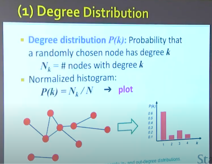

# Resource
* [[CS224W Machine Learning with Graphs] Properties of Networks and Random Graph Models
](https://www.youtube.com/watch?v=dD6LRgw_2mQ&list=PL1OaWjIc3zJ4xhom40qFY5jkZfyO5EDOZ&index=1)

# How can I describe a Graph?

</img>

# Degree Distribution
* Find the hub, and the outskirts!
* [degree - 一個頂點在圖中與相鄰頂點連接的數目](https://zh.wikipedia.org/wiki/%E5%BA%A6_(%E5%9B%BE%E8%AE%BA))
* degree distribution - 度分佈，where is the hub, where is the outskirs, or something like that.

</img>

* the plot - x axis degree $k$, y axis how many nodes / or normalized by total number of nodes
* only few hub, most have one or two degree - like exponential
* **two degree distribution if dierect graph**
  * in degree distribution
  * out degree distribution
* **indirected graph**
  * degree distribution

# Paths in a Graph
* A sequence of modes in which each node is linked to the next one!(no need must be shortest)

</img>

## Distance in a Graph
* Distance (shortest path, geodesic(測地線))
  * $h_{AX} = \infin$, $h_{BD}=2$
* 有向圖則需要跟著箭頭方向 - consequence distance
  * 不具有對稱性! $h_{BC} \neq h_{CB}$ 
  * 有時候我們僅僅只是把方向丟掉，因為我們不需要處理那麼複雜的有向網路
</img>

## Network Diameter
* Diameter = The max shortest path, which distance between any pair of nodes in a graph - the upper bound(it's ok but might too less information)
* Averafge path length - 
$$
\bar{h} = \frac{1}{2E_{max}}\sum_{i,~j \neq i}{h_{ij}}
$$

* $h_{ij}$ - is the distance from node $i$ to node $j$
* $E_{max}$ is the max number of edges(total number of node pairs) = $n(n-1)/2$
* 可忽略未被連結的點(如果這些點不是很多)

* 該測量和node connection有相依性

</img>

# Clustering Coefficient
* only defined in undirected graph
* idea comes from social science
* how connected are one nodes neibor to each other

</img>

* **Node $i$ with degree $k_{i}$**
* $C_{i} \in [0, 1]$
* $C_{i} = \frac{2e_{i}}{k_{i}(k_{i}-1)}$
* Average Clustering Coefficient $C = \frac{1}{N}\sum_{i}C_{i}$

another example
</img>

</img>

# Connectivity  
* Size of the largest connected component
</img>

# Summary : Key Network Properties

</img>

# Measurements in real world networks!

# MSN dataset an Overview
</img>

* where are the users come from?
</img>

* Message as a Multi-Graph

</img>
* vertice(nodes) as users
* Edges $(u, v$ if $u$ and $v$ exchanged at least one message.
* $N$ for nods, $E$ for edges

## degree distribution
</img>

* you must looked the histogram like that. it might br useless. XD

* try log-log scale :P

</img>
* majority people have small degree
* ultra less people, have so so many connections!

## Clustering Coefficient

</img>

* the small degree people. their neibor easily kmow each other!
* Check the average - about the 10% in MSN know each other.

## Connectivity

</img>
* it's a undirected graph. the word "weakly" might be a typo

* 99.1% the node are in the conponent (x axis $10^8$)
* 0.01% just talk to each other in a isolated network.
* Overall, it's a well-organized network.
* largest network is so so big than second!

## shortest path distribution

</img>

* hops -> 跳躍次數

## Key Properties of MSN networks!

</img>

# Random Graph Model

[TBD 24:41](https://www.youtube.com/watch?v=dD6LRgw_2mQ&list=PL1OaWjIc3zJ4xhom40qFY5jkZfyO5EDOZ&index=1)
