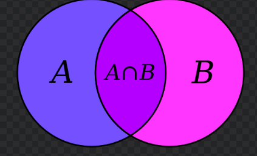
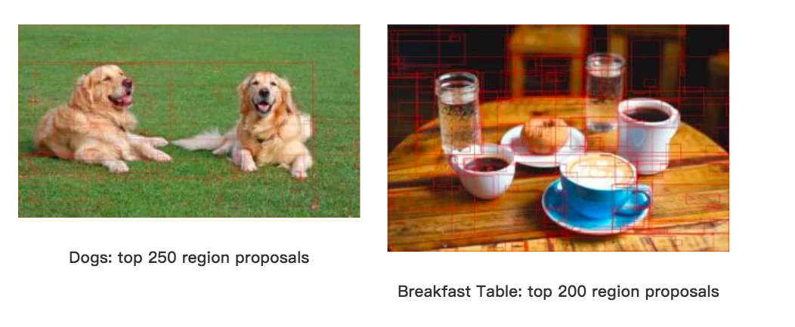

# Selective Search
* A better way to help localization than sliding window approach 
* one of the most popular "Regional Proposal algorithm"
* [Ref 1](https://www.learnopencv.com/selective-search-for-object-detection-cpp-python/?fbclid=IwAR06cddw09dOkBNGWdFLhsytqnjDtFNISjmGfrZGtGR08OjEwXG7jK4lqb4)
* [Ref 2](https://github.com/AlpacaDB/selectivesearch)
* [Efficient Graph-Based Image Segmentation](http://cs.brown.edu/people/pfelzens/papers/seg-ijcv.pdf)
  * TextBook 2004 International joural of computer vision 引用 6312次
* [Selective Search for Object Recognition](https://staff.fnwi.uva.nl/th.gevers/pub/GeversIJCV2013.pdf)
  * 2013, International joural of computer vision 引用3745次
* [Ref 3 理解Selective Search](https://zhuanlan.zhihu.com/p/39927488)
* [Ref 4 目標檢測 (1) - Selective Search](https://zhuanlan.zhihu.com/p/27467369)

* [Ref 5 Selective Search for Object Recognition 簡中翻譯](https://github.com/Mycenae/PaperWeekly/blob/master/Selective%20search%20for%20object%20recognition.md)
* 實作 : numpy, skimage, opencv

## 概念
sliding window很慢，考慮一個更聰明的搜尋方法，給一個base image，於是乎我們可以考慮顏色相似性，質地相似性，等等等等相似性，來選出與想要被辨識出來的image更有機會相似的候選image，可以表示成一個bounding box$(x, y, w, h)$
sub-regions 被稱為 patches
</img>

### Sliding window gif

### Region Proposal Algorithms
* 按照顏色相似性，質地相似性，等各種相似性來篩選，可以大幅減少搜尋次數
* 在亂選patches時，也容易有一些noise，例如框框大小都會不太一樣，也不知道框框要鎖多緊。
* 是否為正確的bounding box可以透過classification model來輸出confidence，這個clf可以是一個確定辨識A物體的SVM，或是一個Pattern Mathcher，例如單層CNN embeedding feature，或是PCA feature。
* 如果需要用訓練的方式來把bouding box**鎖緊**(tighten)，那麼就必須標記資料，做supervised learning，考量效能以及模型最簡原則的情況下，linear regression might be a great start。
* 不像是sliding window，從pixel level進行搜尋，region regional proposal algorithm通常把pixel groupby起來，例如類似顏色，類似質地，所以會比sliding window少更多次搜尋，不過在這樣的情況下，regional proposal algorithm通常會嘗試不同的長寬比
* regional proposal algorithm一個tricky的地方是，通常有很高的recall，因為通常很多框框都會包含到物體，而沒有被包含到的框框會被classifier拒絕。
</img>
* 幾種regional proposal algorithm方法已經被探討，以下舉出5種

1. Objectness
2. Constrained Parametric Min-Cuts for Automatic Object Segmentation
3. Category Independent Object Proposals
4. Randomized Prim
5. Selective Search
以上來說Selective Search很常被使用，因為快，而且有高的recall

### Selective Search
* Selective Search的設計使用以下的圖片資訊
  * 顏色
  * 質地
  * 大小
  * 形狀兼容性

1. Start from over-segmenting the image based on intensity of the pixel
2. 在各個segmented parts加入bounding box
3. 如果相似性佳，就groupby成一個大的sement parts
4. 回到第2步

這種一步一步組合起segmentation的方式就是Selective Search的核心，也被稱為階層式的segmentation，下左圖可以看成初始條件，然後往上走，經過了一輪，再往上走，又經過了一輪，是一種bottom-up approach

#### Similarity
* break down成4塊，顏色，質地，大小，形狀

##### Color
1個pixel有三個顏色通道，每個通道的值以RGB色彩空間舉例，有0-255，切分成25個bins，如此一來一個pixel可以用25*3=75維的向量來表示目前的顏色
$$
C_i = \{c_{i}^{1},c_{i}^{2}, ..., c_{i}^{n}\}
$$
其中$i$為第$i$個pixel，$C_{i}$為第$i$個pixel的Color vector，上標$k=\{1, 2, ...n\}$表示第1~75個color dimension。
經過L1-norm標準化之後，使用下式計算區域間的色彩相似度
$$
s_{colour}(r_i, r_j) = \sum_{k=1}^{n}min(c_{i}^{k}, c_{i}^{k})
$$
E.g.pixel $i$的顏色為純紅(255, 0, 0), pixel $j$的顏色為暗紅(15, 0, 0)，after bins -> (25, 0, 0), (2, 0, 0) -> normolize -> (1, 0, 0), (2/25, 0, 0), 相似度 (2/25, 0, 0)
具有各顏色通道的獨立性

##### Texture

論文採用SIFT-Like紋理萃取特徵，採用方差為1的高斯分佈對每個顏色通道的8個不同方向做梯度統計，然後將統計結果(尺寸與區域大小一致)以bins=10做直方圖，如此一來一個pixel會有240個為度的紋理特徵。
$$
T_i = \{t_{i}^{1},t_{i}^{2}, ..., t_{i}^{n}\}
$$
其中$i$為第$i$個pixel，$T_{i}$為第$i$個pixel的Texture vector，上標$k=\{1, 2, ...n\}$表示第1~240個color dimension。
並且使用下式計算紋理相似度
$$
s_{texture}(r_i, r_j) = \sum_{k=1}^{n}min(t_{i}^{k}, t_{i}^{k})
$$

##### Size
為了保證區域合併操作的尺度較為均勻，使用以下公式，使用尺寸相似度，**目的是盡量讓小的區域先合併**
$$
s_{size}(r_i, r_j) = 1 - \frac{size(r_{i}）+size(r_{j})}{size(im)}
$$
其中$size(im)$指的是整張圖片的尺寸，$size(r_{i}),size(r_{j})$分別表示$r_{i}, r_{j}$的尺寸大小，皆以pixel為單位

E.g.pixel $i$的size為20x40 $j$的size為10x20，整張圖的size為600x800，則$size(r_i, r_j) = 1 - \frac{800+200}{480000} ～0.997$
上述公式可以表達作者想要的想法，在一張圖片中，size小的區域會優先合併，因為尺寸相似度相近。
##### Shape Compatibility
這裡的形狀融合規則並不是基於相似性，而是基於兼容性，想法是這樣的，考慮$r_{i}$與$r_{j}$對彼此有多少的重合，如果重合的部分多，那就把它合併起來，怎麼做到這件事呢，考慮一個$r_{i}$與$r_{j}$的bounding box:
$$
fill(r_i, r_j) = 1 - \frac{size(BB_{ij})-size(r_{i})-size(r_{j})}{size(im)}
$$

E.g. $r_{A}$為40x40, $r_{B}$為40x40, $size(B_iB_j)$為80*50，整張圖片為600x800
</img>

則$fill(r_i, r_j) = 1 - \frac{4000-1600-1600}{480000}～0.998$
由上述例子可以看到如果$r_{i}$與$r_{j}$有重疊部分，那麼很容易使得$BB_{ij}$較小，則$fill(r_i, r_j)$較大，而中間如果沒有重疊部分，則$BB_{ij}$較大，使得$fill(r_i, r_j)$較小
並且可以看到分母有整個image的size來做normolize。
註 : 我們可以直接將分子用IOU來計算得到類似的效果。

##### All mash-up
同時考慮這4件事來進行合併，我們用一個線性組合來表達兩個區域的相似性，我們可以總結說，透過顏色與質地的相似性，接著考慮較小的物體先合併，互相有重疊的物體先合併，則我們有:

$$
s(r_i, r_j) = a_{1}s_{colour}(r_i, r_j) + a_{2}s_{texture}(r_i, r_j) \\ + a_{3}s_{size}(r_i, r_j) + a_{4}s_{fill}(r_i, r_j)
$$
其中$a_i \in\{0, 1\}$，讓user可以調整目前需要多關注哪一個factor

##### 打分

pass

### Result
</img>

### 論文其他內容
* 其他採樣策略(Other Sampling Strategies)
* 多樣性策略(Diversification Strategies)
  * 使用各種互補的色彩空間
  * 位置組合(Combining Locations)
* region合成之後的相似性計算
  * 應該不需要做到每個pixel重算，能夠更快
  * 翻譯可以check [here](https://blog.csdn.net/charwing/article/details/27180421)