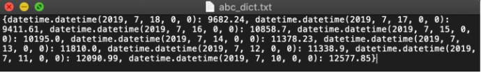

# Serialization_Encoding_Bytes_ByteArray(序列化與編碼)
* 我們為什麼需要序列化?
* 舉個例 : 不用數據序列化的方法，直接把dictionary存進文件

```
In [1]:save_file = "abc_dict.txt"
In [2]:with open(save_file, 'w') as file_to_write:
           file_to_write.write(str(abc_dict))
```
</img>
會有下列幾個問題 : 

* 一致性：保存在文件的是一个字符串，当你再次读取的时候，你需要再次做文件解析，并且没有任何保证解析出来的和保存的内容是一样的。
* 有效性：数据非常冗长，原本日期 7/18/2019 变成了 datetime.datetime(2019, 7, 18, 0, 0) 这么一个字符串。在跨平台使用时，占用了过多的内存和网络资源。
* 兼容性：文件是 .txt 格式，没有一个标准来定义该如何读取里面的内容。虽然在写入的时候是 Python 字典转化的，但是读取的程序如果不是 Python，或者不存入字典，就会出现 兼容性问题。

> 序列化指的是把程序中的一個類轉換成一個標準化格式，可以跨程序，跨平台，而且保有其原有的內容與規範

* 兩個常見方法

|方法|描述|優缺|
|---|----|---|
|JSON|通常用於網站後端和前端的交流，移動APP和雲端Server|跨語言!!(各種前端，JavaScript等))，只支援了基本的Python型態， str, int, flast, bool, None, list等，高等資料結構不支援，例如dataframe，datetime|
|Pickle|Python專屬序列化方案，可以轉換大部分資料型態，儲存方式是ByteCode(二進制)|保證了數據隱密性和高效性，直接支援python高級資料結構，可以用來存一般性的model|

# Base64編碼
* 計算機中的自結共有256個組合，對應的就是ascii碼，而asciii的128~255之間的值是**不可見字符**。而在網路上交換數據時，例如A到B，往往要經過多個路由設備，**由於不同設備對字符的處理方式有一些不同，這樣那些不可見字符就有可能被處理錯誤，這不利於傳輸，所以先做一個Base64編碼，如此一來大幅降低出錯的可能性**

> Base64編碼會將ascii 128-255之間的值變成可見字符，降低出錯的可能性

* 嚴格上來說base64不能算是一種加密，只能說是一種編碼轉換，使用base64的初衷，是為了方便把含有不可見字符串的訊息用可見字符串表示出來，方便複製貼上，不要誤用了，加密要特別找加密的方法，例如對稱加密算法`AES-128-CBC`，非對稱加密算法`RSA`

給幾個會用到的場景:
1. 一個xml中包含著另一個xml，不過事實上xml中的都是可見字符(0-127)，但是考慮到中文，就可以使用base64
2. http協議當中的key value字串
3. 需要使用網路跑來跑去的data，考慮到各路由可能對字串有不同的解析方式

# 字串，byte，bytearray

|文字字串|說明|
|-------|---|
|ASCII|1960年代定義，那時候電腦就和冰箱一樣大，電腦的基本儲存單元是位元組(byte)，它可以在8個位元(bit)中，儲存256個不同的值，基於各種原因，ASCII只使用了7個位元(128個不同值):26個英文大寫，26個英文小寫，10個數字，一些標點符號，一些空白字元，一些非輸出用的控制碼|
|Unicode|為每一個字元提供獨一無二的號碼，無論平台，程式，語言，`unicodedata`模組可以做雙向翻譯，當你和外界交換資料時，Python自動對每個Unicode字元做了手腳，使用uft-8編碼程式將unicode(文字)轉換成bytes，然後再解碼，`utf-8`就是這樣運作的|

## 二進位資料
* Python3使用下列8位元整數序列，他可以容納 0-255，分成兩種類型

|類型|解釋|
|---|----|
|byte|不可變的，就像tuple|
|byte array|可變的，就像list|

```
blist = [1,2,3,255]
the_bytes = bytes(blist)
the_byte_array = bytearray(blist)
```
你都會看到字串，所以代表可以slicing，但是當你想要修改bytes[2]時，就會失敗，用bytearray則可以被修改
`TypeError: 'bytes' object does not support item assignment`
各有優缺，為了穩定建議使用bytes，要方便以及可操控則使用bytearray

### 使用struct來轉換二進位資料
* 透過類似正則表達式的方式，我們也可以按照bytes的特有規則，對bytes資料進行操作，擷取我們有興趣的部分
* `struct`中的`unpack`以及`pack`方法就是處理這件事，例如
PNG檔案的長寬被規定要儲存在前24個bytes內
```
import struct
data = b'\x89PNG\r\n\xa\n.....'
width, height = struct.unpack('>LL', data[16:24])
```
其中第一個參數被稱為`Endian指定符`，有各式指定符，可google
還有其他二進位資料的操作模組 
google關鍵字 : python 二進位 資料 操作
`bitstring`, `construct`, `struct`, `binascii`

## Resource
[Python 基本功: 5. 数据序列化](https://zhuanlan.zhihu.com/p/87470851?fbclid=IwAR2Z9CuZyR59EryrkQree6CKDXyU28GRe6OCQG4IGItzLdGRmBrQjDwzoaA)
[为什么要使用base64编码，有哪些情景需求？](https://www.zhihu.com/question/36306744?fbclid=IwAR2w990I0qAJd7jKXuxL_aCj2vWQAVG3kfa8BoneP9rQFqbtQljkVezmHJE)
