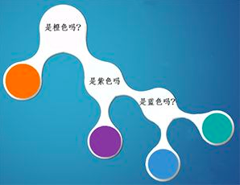

# 如何直觀理解交叉熵(Cross-Entropy)及相對熵(Relative Entropy)
## Outline
* 動機
* entropy
* self-information
* shnnon entropy
* cross entropy(次佳策略、最優策略)
* relative entropy a.k.a. KL divergnece
## 動機 : 
* 想要把entropy, self-information, shnnon entropy 一路到 relative entropy(KL-Divergence)複習一遍
* 而且在LDA的visualization也會用到 KL-Divergence
## 情境 : 
一個王者榮耀的例子，爸爸vs小明
爸 : 
我們倆玩猜球遊戲，我拿一顆球，你猜球的顏色，我可以回答你任何問題，你每猜一次，不管對或錯，你就一個星期不能玩王者榮耀，當然，猜對，遊戲就停止，否則就繼續猜，**當然，當答案只剩兩種選擇時，此次猜測結束後，無論猜錯或猜對都能100%確定答案，不需再猜，此時遊戲停止**

### 題目1 
爸爸拿了一個箱子，裡面有橙，紫，藍，青，四種顏色的小球任意個，各顏色小球佔比不清楚，現在我從中拿出一個球，你猜我手中的球是什麼顏色?
為了使被逞罰的時間最短，小明發揮出最強王者的智商，瞬間就想到了以**最小的代價猜出答案**，簡稱策略1

</img>

在什麼都不知道的情況下，只能認為4種顏色的球出線機率一樣，由圖所視，只要猜兩次，就一定能知道球的顏色，因此小明預期猜球的次數為:

H = 1/4 * 2 + 1/4 * 2 + 1/4 * 2 + 1/4 * 2 = 2 (次)

### 題目2
現在有另一個箱子，箱子內小球有任意個，但是其中1/2是橙色球，1/4是紫色球，1/8是藍色球，1/8是青色球，我現在拿出一顆球，是什麼顏色?

</img>

和題目1相比，小明所知道的資訊變多了，因此策略也可以隨之調整，讓猜球次數期望值在下降，根據策略2，1/2的機率是橙色，需要猜1次，1/4的機率是紫色，需要猜2次，1/8是藍色，青色，需要猜3次，因此小明預期猜球的次數為:

H = 1/2 * 1 + 1/4 * 2 + 1/8 * 2  = 1.75 (次)

### 題目3
其實爸爸只是想讓小明意識到自己的錯誤，並不是真的想罰他，所以拿來一個箱子，和小明說 : 裡面都是橙色，我拿出一顆，你猜我手中的球是什麼顏色?
絕對是橙色，不用猜

H = 0

### 次佳策略
補圖</img>
次佳策略(Cross-entropy)
* 在以上的情況下，我們擬定了一策略，這是基於爸爸已經告訴小名這些小球的**真實分布**，如果小明在真實分布為 $(1/2, 1/4, 1/8, 1/8)$ 的情況下採取了策略一(策略一假設真實分布為 $(1/4, 1/4, 1/4, 1/4)$ )，則小明認為的分布就是**非真實分布**，此時，小名猜中任何一種顏色的小球都需要猜2次 $ H = 2 $

* 很明顯的，針對題目2，使用策略1是一個壞的選擇，因為需要猜題的次數增加了，從 1.75 變成了2，因此，我們使用非真實分布的策略去消除系統的不確定性時，所需要付出的努力大小，就必須使用Cross-Entropy來衡量
我們有真實分布 $ p_k $，非真實分布 $ q_k $
所需要猜球的次數為 $$ C.E. = \sum_{k}^{N} p_k log_{2} \frac{1}{q_k}$$
在此例中 C.E = 2，比最優策略 1.75來的大

**因此，Cross-Entropy越低，這個次優策略就越好**
$ CE_{min} = H$ -->   $ p_k = q_k $

* **這也就是為什麼在機器學習的分類算法中，我們總是最小化C.E，因為C.E越低，就證明由算法產生的策略最接近最佳策略，也間接證明算法所算出來的非真實分布越接近真實分布**

### 次佳策略與最佳策略之間的差異?
* 我們如何衡量不同策略之間的差異? 我們定義相對熵(Relative Entropy，也稱作KL Divergence)
* 對於次佳策略以及最佳策略之間的差異、或是兩個取值為正的函數或是機率分佈之間的差異
$$
KL (p || q) = H(p, q) - H(p)= \sum_{k}^{N} p_k log_{2} \frac{1}{q_k} - \sum_{k}^{N} p_k log_{2} \frac{1}{p_k}= \sum_{k}^{N} p_k log_{2} \frac{p_k}{q_k}
$$
所以將策略1用於題目2，所產生的相對熵為 2 - 1.75 = 0.25
* 相對熵這樣的概念事實上並不符合距離的定義，因為 $ KL(p || q) != KL(q || p) $ 
## 要點 : 

1. 策略一中個顏色球機率分佈可表示為 $(1/4, 1/4, 1/4, 1/4)$ 離散機率分佈，在pandas code中 等價為 pd.Series.value_counts(normolize=True)，且所有機率加總 = 1
2. Hint，純機率問題，從最大機率那個開始猜(策略2)
3. 針對特定機率為 $p$ 的小球，需要猜球的次數為 $log_{2} \frac{1} {p}$ 這樣的物理量稱作為self-information，TFIDF中的IDF(逆向文件率) 可看作一種關鍵字的self-information
   3-2
   除了self-inforamtion之外，資訊量 $I(x) = -log P(x)$
   其代表的意義為，小機率事件發生之際，比一件常常發生的事帶有更多的資訊 
4. 針對整個系統，**有多個可能發生的事件**，期望猜球次數為 

$\sum_{k}^{N} p_{k} log_{2} \frac{1}{p_{k}} = \sum_{k}^{N} p_k I(k)$

此即為shannon-entropy

4-2. 
Q1 H = 2(非常不確定), Q2 H = 1.75(叫確定),  Q3 H = 0
     (非常確定)，從這個趨勢來看，H值可視為一種系統不確定性的度量
     該值越大，系統的不確定性越大，該值越小，系統的確定性越大，這基本上就是entropy (此即為shannon-entropy的物理意義)
4-3.
與seif-information比較

|quantity|hint|
|--------|----|
|self-inforamtion|衡量單一事件期望值|
|shannon-entropy|衡量一個系統的期望值|

4-4.
從統計的觀點 : 
每個系統都會有一個真實的機率分佈，我們稱為**預測分佈**
Q1 真實分佈 $(1/4, 1/4, 1/4, 1/4)$
Q2 真實分佈 $(1/2, 1/4, 1/8, 1/8)$
**根據真實分佈，我們能夠找到一個最佳策略，以最小的代價消除系統的不確定性我們為了要消除這個不確定性，所要付出的[最小努力][像是猜題次數，或是編碼長度等]的大小就是shannon-entropy**

1. 次佳策略(Cross-entropy)
* 有次佳策略及對應的機率分布，稱為**非真實分布**

* 此時衡量消除系統不確定性所需要的努力，使用Cross-Entropy

* $ CE_{min} = ShannonEntropy H, p_k = q_k $

* **這也就是為什麼在機器學習的分類算法中，我們總是最小化C.E，因為C.E越低，就證明由算法產生的策略最接近最佳策略，也間接證明算法所算出來的非真實分布越接近真實分布**

6. 次佳策略與最佳策略的差異衡量(KL-Divergence, Relative-entropy)
* $$KL (p || q) = H(p, q) - H(p) = \sum_{k}^{N} p_k log_{2} \frac{1}{q_k} - \sum_{k}^{N} p_k log_{2} \frac{1}{p_k} = \sum_{k}^{N} p_k log_{2} \frac{p_k}{q_k}$$
* $ KL (p || q) >= 0 , when KL(p || q) = 0 -> p = q$
* Relative Entropy不具有交換性 $ KL (q || p) $ 
  因此用距離來比擬Relative Entropy是比較不恰當的，更精準的說法是衡量一個分部相比另一個分部的訊息損失(information lost)，事實上，只要反過來說，也可以說是information gain(但和決策樹中的定義不同，原因在於分之後樣本數變得不同)
* 可以從Bayesian Thinking的觀點來看Relative Entropy，我們從先驗機率分佈q到後驗機率分佈p所帶來的訊息增益
* 在ML中我們為什麼最小化C.E而非KL-Divengence ? 
* 事實上是一樣的，最小化C.E的過程就是在最小化KL-Divengence，在給定groud-truth的情況下，$ H(p) $ 為 constant，並且我們可以從數學上證明 : 
$$
   max likelihood <-> min C.E <-> min K.L.(p || q) 
$$

1. 條件熵 (Conditional Entropy) 
* 可延伸出information-gain
TODO 
[Condnional Entropy](https://blog.csdn.net/qq_40587575/article/details/80219080)

8. 互訊息 
* 可補足 KL-Divengence的不足，滿足對稱性
$ I(x, y) = KL(p(x,)y || p(x)p(y))$
  
9. Gini index
* 計算速度非常快，因為不用取log，只要平方
* 實際上是Shannon Entropy對於 $ log \frac{1}{p_k} $ 取一階泰勒展開

$\sum_{k}^{N} p_k log_{e} \frac{1}{p_k}   ～  \sum_{k}^{N} p_k (1-p_k) ～  \sum_{k}^{N} 1- p_k^2 $

## 舉例

## Reference
[如何直觀理解交叉熵(Cross-Entropy)及相對熵(Relative Entropy)](https://www.zhihu.com/question/41252833)
[Latex](https://blog.csdn.net/u011974639/article/details/77118023)
[KL Divergnece Wiki](https://zh.wikipedia.org/wiki/%E7%9B%B8%E5%AF%B9%E7%86%B5)
[KL散度的理解](https://blog.csdn.net/ericcchen/article/details/72357411)
[機器學習各種熵：從入門到全面掌握](https://kknews.cc/zh-tw/news/rxxp9xv.html)
