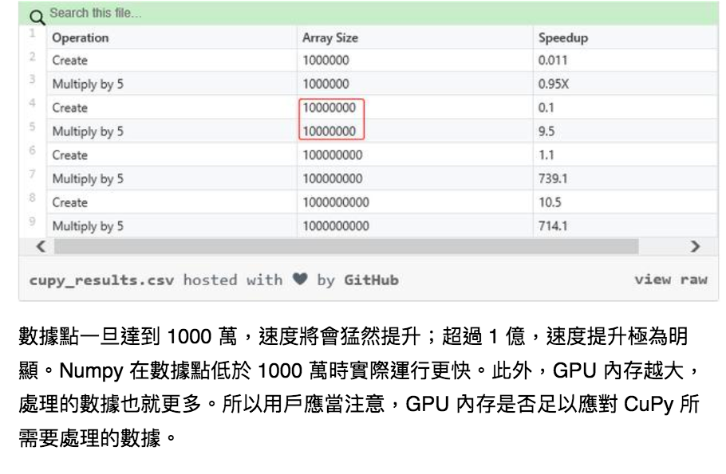

## SpeedUp Strategy
0. Profiling : time 直覺，最簡單，刪除也最麻煩，cPrifile : 很細個一個func一個func看，line_profile : 一行一行進行profiling，找出Bottle-neck，只有時間佔比，沒有絕對執行時間
1. Numbda : JIT(Just in time)推論輸入變數型態，快速進行編譯
   * TextBook : O'reilly : 高效能Python  
   * TextBook : 圖靈 : Python高性能(第二版)
   * [Numnda基本上拿來什麼時候用? for迴圈時，預編譯帶來的速度提升通常都可以是十倍到百倍](https://zhuanlan.zhihu.com/p/27152060)
   * 什麼是編譯? 為什麼會比較快?
2. Cupy : 把numpy數組拿進GPU來算，讓numpy加速700倍
   * [農場介紹文](https://kknews.cc/zh-tw/code/gma66z9.html)
   * [官方文件](https://docs-cupy.chainer.org/en/stable/#)
   * [GitHub](https://github.com/cupy/cupy)
   * [官方網站](https://cupy.chainer.org/?fbclid=IwAR1gyp98svCgtEYqQkgr0QFCTLxPISK8S_57siUiZCvgCviQQszrf3Kq7cw#hero)
  </img>
3. TensorRT : 重新調整Tensorflow計算圖，包含平行合併以及垂直合併，提供2x~20x效能優化，減少推論時間

[TensorRT highlight](TensorRT_highlight.md)