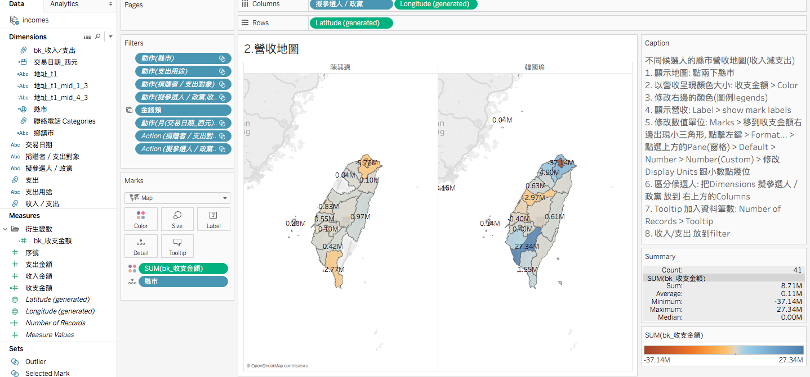
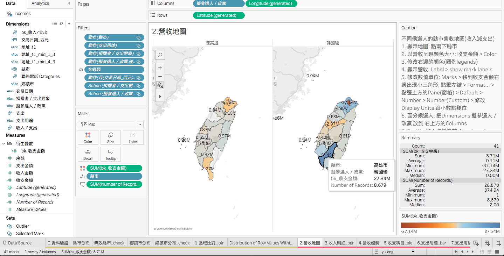

# Tableau Note
* 講者 : 台灣之星資深資料科學家 
* 聯絡 : 
* 信箱 :
# Tableau vs Excel vs PowerBI
* Excel 美觀程度一顆星, 100萬以上就掛了，最好學
* Tableau最美，最貴，靈活度Tableau最差，學習門檻中等
* PowerBI靈活度適中，靈美觀度適中，學習門檻最高，費用中等
* 如果在公司裡面，Tableau and PowerBI算起來價格會差不多，因為PowerBI的Server比較貴
# 如何設計DashBoard
</img>
* 分成解釋型(妳已經知道結果)，和探索型（還不知道要幹嘛）
* 設計草稿就是非常重要的一件事(避免自己迷失在探索之中)，同時也確認探索的方向
* z字型分析，DashBoard左上到右下，粗略到細緻(例如從兩候選人的營收趨勢到收入明細)
* 有確定要做的內容，就可以拉工時，例如我要做6個worksheet，一張要2-3小時這樣

# Dive in
## Work Sheet

* 左方工具欄中Dimension的衍生變數資料夾就是新的變數，通常會請工程師做給PM(或是你是一條龍XD)
* 可以選擇變數，右鍵然後create folder，塞到資料夾裡面
* Tableau Server就和GitHub Server一樣，如果是免費的就要公開上傳到雲端給大家看
* 也有的PM只是拿Tableau來join資料，就不用麻煩IT了，10萬以上的資料，Excel的VLookUp就掛了，Tableau則不會
* Tooltip : 滑鼠移過去會有資訊
* Calculated Field
* 先選一個變數 Create Group
* 地圖版本也可以拉category，就會變張兩張地圖
* </img>
* ToolTips會是很好用的幫手，關於互動解釋的時候
* </img>
* 在Markers的部分，變數可以進入format調整顯示單位設定
* 可以透過Pane調整內容單位，透過axis調整橫軸縱軸的單位
* 複製圖層(使用crtl)
* 兩張圖合併(圖型、右鍵 Dual axis)
* Label的部分可以重複疊dimension，可以顯示多個，沒有問題，會自己處理空格和padding
* Label可以直接點開，選 show mark label，你的圖上就會有資料明細
* WorkSheet可以直接duplicate(下方worksheet右鍵)，就可以完全複製，然後rename，不用自己重刻
## DashBoard
* 可以客製化解析度，或是選擇automatic
* 排版方面，單選一個worksheet可以在上方工具列選擇`Standard`, `FitHight`, `FitWidth`
* 單張workssheet可以隱藏x, y軸, 右鍵showHeader拿掉勾勾

## Resource
* 推薦書單 : Data Points 數據之美
* Google 必修圖表簡報術
