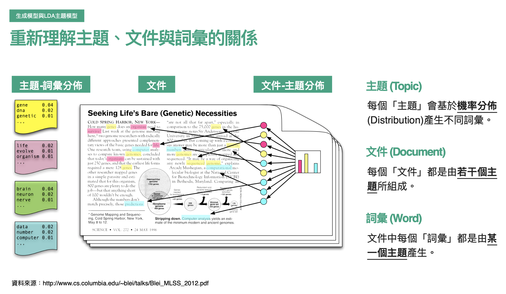
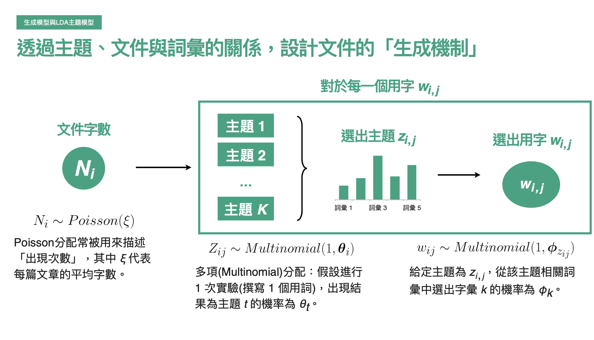

# Topic Modeling

* 方法其實很多，透過matrix factorlization(PCA, SVD, NMF) / embedding(NN) / LDA 方法都可以得到
* 還缺一個評估的方式
* LDA主要透過設計兩個**話題機率分佈**來進行解釋
* 而且LDA與人類寫作的邏輯相近，換句話說在表達的時候有比較好的解釋性

# Understanding First

</img>

* 假設 
  + : 文章(文件)內中的詞彙，是來自某個Topic，所以左邊我們可以看到，黃色Topic中，有著各式各樣的詞彙，有著各自出現的機率
  + 每個文章(文件)都是由若干個主題，所組成的
  + 總共有兩層關係 
    - 原本 : 文件 -> 詞彙
    - 模型假設的生成機制 文件 ->(文件-主題分佈)-> 若干個主題 -> (主題-詞彙分佈) -> 詞彙
  + 思考點 : 舉兩個詞彙並非從話題產生的例子來反駁吧 =)

# Math Second

</img>

* 文件字數使用Possion分佈
  + Possion分佈常常用來描述發生次數:
    - 每個小時的來客數
    - 每天特定16:00-20:00進店客數
    - 在公車站等1小時，總共會停靠的公車數
    - 寫一篇文章，總共會寫多少字
    - 一個時間區段，每個使用者所聽的歌曲數量(over 所有使用者)
* 對於每一個用字$w_{i, j}$，文件-主題分佈，主題-詞彙分佈採用Multinomial分佈
  + multinominal分佈被拿來描述多個cateogry時，且有多次試驗的情況下，各個category及試驗次數的的出現機率，在主題很多，詞彙很多的假設下，每次選字可是為不變動的分佈。

</img>

# Notations

----- document, words, topic ------

1. 文件 : $i = 1, ...M$
2. $i^{th}$ 文件中的用詞 : $j = 1, ... N_{i}$
3. $i^{th}$ 文件, $j^{th}$ 用詞 : $w_{ij}$
4. 主題 : $t = 1, ... K$
5. $i^{th}$ 文件, $j^{th}$ 用詞 所屬於的主題 : $z_{ij}$

--- distribution -----

1. 假設進行一次實驗(撰寫一個詞，該詞屬於主題$t$的機率為 $\theta_{t}$) - 主題$Z_{ij}$ ~ Multinominal $(1, \theta_{i})$

2. 假設進行一次實驗(選定一個主題，寫下一個詞，該詞屬於某個詞的機率$\phi_{k}$) $w_{i,j}$ ~ Multinominal ~ $(1, \phi(z_{ij}))$

Model : 

對於每個文件，其字數會符合 Possion 分佈，

選字時 - 

1. 先選出主題(MultiNominal distribution by topic)

2. 再從主題中選字

(Multinominal distribution by words in topic)

# Prior distribution

* 上述是模型假設，並非先驗分配的假設

</img>

* 先驗分配這裡取 Dirichlet distribution，這裡事實上可以針對我們對文字資料的了解選用符合的先驗分佈，例如exponential distribution。
* [TODO 為什麼先驗使用Dirichlet?]
  + 猜測 : 這個分佈在數學上能夠變成任何其他常見的分佈，可塑型強
* 然後就跑Bayesian, 這裡是採用Gibbs sampling的方式，而非MCMC的sampling方式，scikit-learn的Model中也有多個變種，論文是2011, 2013年

# Keywords:

Dirchlet distrubtion
1. https://zh.wikipedia.org/wiki/%E7%8B%84%E5%88%A9%E5%85%8B%E9%9B%B7%E5%88%86%E5%B8%83
2. https://blog.rosetta.ai/%E6%B7%B1%E5%85%A5%E6%8E%A2%E8%A8%8E-latent-dirichlet-allocation-lda-%E8%88%87%E5%9C%A8%E6%8E%A8%E8%96%A6%E7%B3%BB%E7%B5%B1%E4%B8%8A%E7%9A%84%E6%87%89%E7%94%A8-2441d57ecc8a
  
Gibbs sampling

# Result

* 就是兩個分佈的參數分佈，進入DataViz
* LDA的DataViz要說的事情稍微複雜

# DataViz

* Bar-plot 各Topic中有的LDA score
* bubble plot, LDA-viz
  + bubble plot 右邊扔然有bar-plot, 左邊則是Reduction的axis, 透過壓縮算法來計算各主兼之間的距離

# Evaluation

# Ref

[review Multinominal - distribution from note](https://github.com/YLTsai0609/DataScience_Note/blob/master/demo/graph/multinomial.png)

Reviewing Multinominal distribution

對於主題 $t$ 中有$q=1, ... Q$個用詞

令用詞集 $|Q| =\{今, 好, 今天, 天氣, 真好\}$

當選定主題$t$來進行寫作時，寫3個詞，那麼寫出

**今天天氣真好** 這個文本的機率，即可表示為 $P(w_{11} = 今天, w_{12} = 天氣, w_{13} = 真好)$