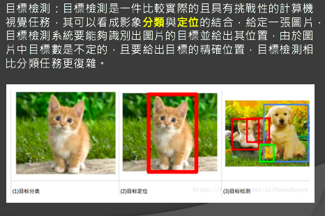
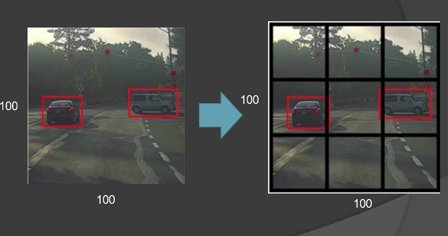
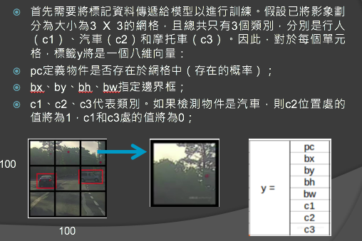
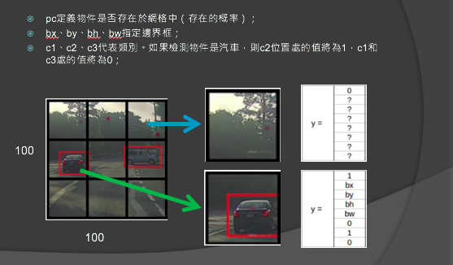
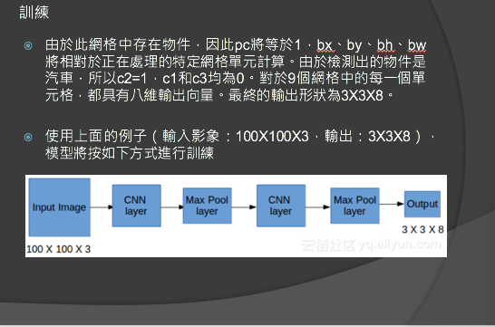
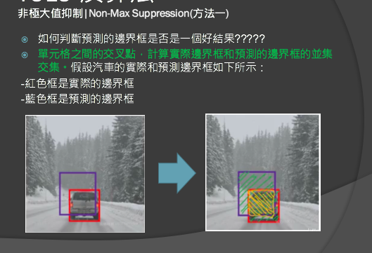
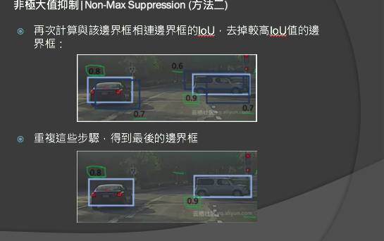

# WEJUMP YOLO report
</img>
* 有別於分類與定位分開做(例如classifier + sliding window, or classifier + selective search)，YOLO打算一次做到兩件事情，即分類(cliassification)+定位(locoalization)，如此一來在當時的歷史背景下，可以讓inference time降低非常多達到效能上的提高
* 怎麼做到? 將localization視為一個regression問題，並且在prediction中加入bounding box的預測$(x, y, w, h)$
* 優點 : 速度快，FPS - 45FPS
* 缺點 : 小物體預測效果較差

* Step1 - 先9宮格化
</img>
* 讓我們先關注如何將資料上標籤，畫出9宮格之後(或是任何$N\times N$)的方格，depends on your labeled data
</img>
* output的prediction / groud truth會是一個k dimension的vector，分成幾個部分
  * pc : 物件是否存在在網格中(存在的機率)
  * bx, by, bh, bw - bounding box info
  * c1, c2, c3, class label
* 其中c1, c2, c3是可以隨著要辨識的物體增加而增加
</img>
* Training, 其實就是CNN : 作者在第一版使用darknet，小型且快速
</img>
* 評斷?
* Non-Max Suppression
  * 其實也就是怎樣叫做好的偵測...
  * IoU
  * probability + IoU

</img>
</img>

# Questions
* 請問這個比較差，在v1, v2, v3是改善重點嗎?
* 單個網格，多個物件 / 單個物件，超過一個網格 - Anchor Box - 參數的一部分，處理多物件的偵測

# Non-Max Suppression
* 講白了，就是選框框
* 以下提供了三種選框框的numpy實作，其實就是選出機率最高的，那個一定要保留，其他的要殺掉，用IOU來比較要不要殺掉，當然一般來說過程中包含排序
* [淺談 NMS的多種實現 知乎 70+](https://zhuanlan.zhihu.com/p/64423753?fbclid=IwAR3asg3dzdH8H-sxlywd3FIspNPatlKFp0zqFBNO4cpRYRdimEDHlPZN-jI)

# Reference
https://mropengate.blogspot.com/2018/06/yolo-yolov3.html

https://www.itread01.com/content/1545103935.html

https://pjreddie.com/darknet/yolo/

https://github.com/pjreddie/darknet/wiki/YOLO:-Real-Time-Object-Detection
