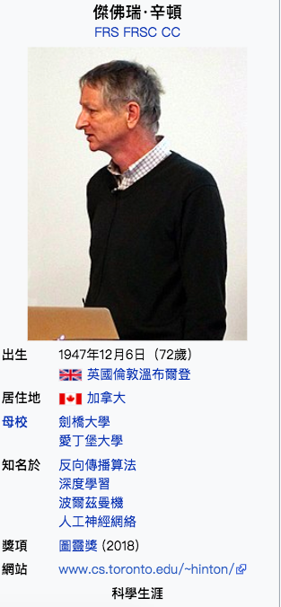

</img>

近期發表文章
* [Google scholar](https://scholar.google.com/citations?hl=zh-TW&user=JicYPdAAAAAJ&view_op=list_works&sortby=pubdate)
  * Stacked capsule autoencoders 膠囊網路 - 處理了CNN的viewpoint問題，提出robust for viewpoint的膠囊網路
  * Lookahead Optimizer: k steps forward, 1 step back - 優化器分為兩個部分，快與慢，文章重點在於提升訓練穩定性，知乎上有許多網友實測，效果與純用Adam差不多，倒是沒有太多人在意所謂穩定性
  * When does label smoothing help - 研究對target data做特殊處理的技術其中之一的文章
  * Visualizing data using t-SNE (2008) - 提出了一個非常好的高維度visualization方法