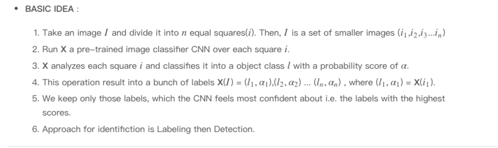

# Object Detection Techniques
Object Detection Techniques | Kaggle 重點節錄
* [Kaggle NoteBook](https://www.kaggle.com/infernop/object-detection-techniques)
* [講者 - AdamyaTripathi Vote : 33](https://www.kaggle.com/rtatman/kernels?sortBy=dateCreated&group=everyone&pageSize=20&userId=1162990)

# Hsitory (2001 - 2017)
1. The first efficient Face Detector (Viola-Jones Algorithm, 2001)
    * 可以即時辨識(real time)
    * 被實作在openCV中，稱作Viola and Jones algorithm.
    * 概念
      1. 拿一堆face data
      2. 硬幹一些臉部特徵(feature of a face)
      3. SVM
      4. 模型上線 
</img>
* 缺點 : 臉一但轉一下角度，往轉，下轉，或是wearing a mask, 就掛了
2. Much more efficient detection technique (Histograms of Oriented Gradients, 2005)
   * 同樣hardcode臉部特徵 
   * 對於每個pixel, 看他周圍的pixel, 去辨識該pixel周圍的pixel有多黑?
   * 往最黑的方向取一個gradient，當作此pixel的gradient
   * 對每個pixel都做這件事
   * 這樣的gradient可以展示出整張圖片亮暗之間的Flow
   * 這種特徵萃取方式稱作HOG(Histograms of Oriented Gradients)
</img>
* 缺點 : 或多或少減緩了Viola-Jones Algorithm, 2001的問題，但扔然是一種hardcode的方式，一但noise變大，或是背景東西一多，就分不好了
##  Deep Learning Era begins(2012)
1. CNN
  * 自從 Kriszhevsky 使用CNN搭建的ImageNet開始，CNN就開始變成標配
  </img>
  </img>
  * 而不論在單體辨識上，或是多物體辨識上，CNN都能夠有很好的表現
  </img>
2. R-CNN(Regions with CNN)
   * CNN都用相同的，小的窗口對原圖進行過濾(相似度測量)，現在先對原圖取出很多Region，在針對這些Region breakdown，進去做CNN
   * 這樣的做法稱作為 `Selective Search`
   * 這樣的做法，針對一張圖片中有很多需要辨識的物體，能夠做到更好的segmentation
   * 可想而知的，這樣鐵定計算量更大，但也更為準確
   > 原文 : R-CNN creates bouding boxes, or region proposals, using a process called Selective Search.
   At a high level, Selective Search looks at the image through windows of different sizes, and for each size tries to group together adjacent pixels by texture, color, or intensity to identify objects.
   * 一些更新版本 R-CNN, Fast R-Cnn, Faster R-CNN, Mask R-CNN
   * 同樣想要做物件辨識，YOLO採用了另一個完全不同的approach，他不訓練分類器!
3. YOLO
   * YoLO v1, v2, v3 
